# Práctica 1

> Alumno: Miguel Ángel Fernández Gutiérrez

## Objetivos

El objetivo principal de esta práctica es la configuración de dos servidores con un Ubuntu Server, OpenSSH y el stack LAMP.

En cuanto a la configuración de red, ambas máquinas estarán conectadas por una NAT llamada `SWAPNetwork`. Por otra interfaz se conectarán a una Host-Only, para que podamos conectarnos desde nuestro ordenador a las máquinas virtuales.

`SWAPNetwork` es una red CIDR 192.168.0.0/24, mientras que la red CIDR de las conexiones Host-Only es 192.168.13.0/24. Podríamos habilitar un servidor DHCP, pero hemos preferido configurarlas estáticamente.

En resumen, tenemos las máquinas con los siguientes parámetros:

| Nombre de VM | SWAP1 | SWAP2 |
| --- | --- | --- |
| Hostname | `m1-mianfg` | `m2-mianfg` |
| IP `enp0s3` (NAT) | 192.168.0.3/24 | 192.168.0.4/24 |
| IP `enp0s8` (Host-Only) | 192.168.13.10/24 | 192.168.13.20/24 |
| Nombre usuario | `mianfg` | `mianfg` |
| Contraseña | `Swap1234` | `Swap1234` |

## Instalación de Ubuntu Server

La instalación de Ubuntu Server es bastante directa. Simplemente debemos crear una máquina virtual en VirtualBox que ejecute la última imagen de Ubuntu Server. Al ejecutarla por primera vez, nos mostrará el asistente de configuración de Ubuntu Server. Usaremos todos los parámetros por defecto. Algunos aspectos reseñables que comentaremos son los siguientes:

1. **Profile setup.** Seguiremos la configuración mencionada en el guion, y destacada anteriormente.

    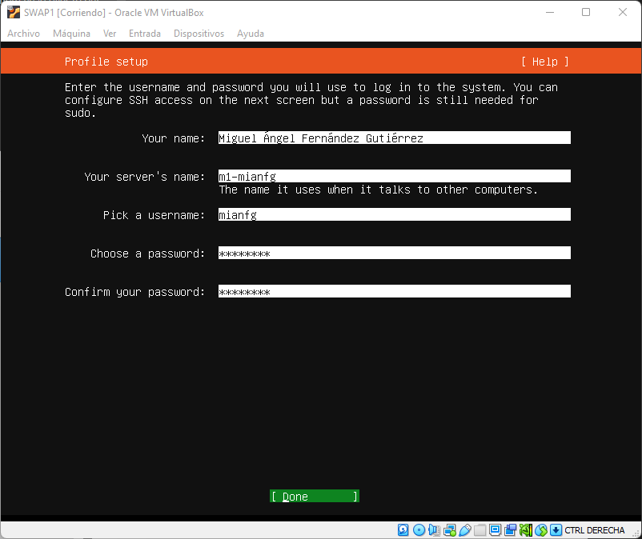

2. **OpenSSH.** Instalamos el servidor OpenSSH en este momento.

    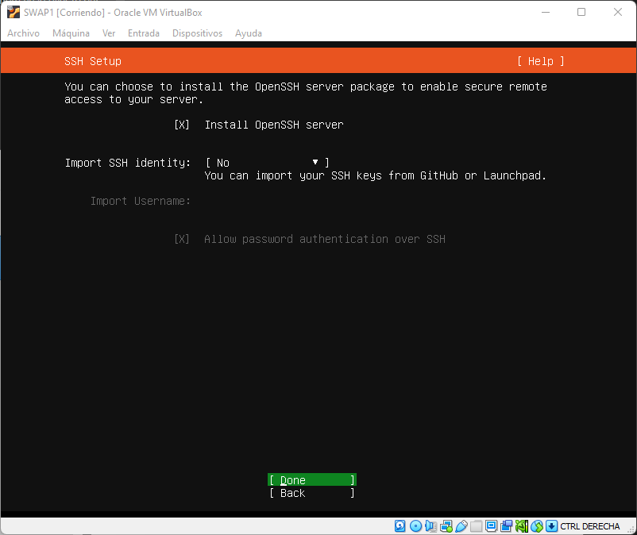

La instalación de **SWAP2**, la segunda máquina virtual, se realizará clonando la máquina virtual SWAP1. Una vez tengamos las configuraciones realizadas (que se explicarán más adelante), simplemente basta con pulsar en **Clonar** (`Ctrl+O`), y modificar:

* La configuración de red
* El hostname (modificar el archivo `/etc/hostname`).

De este modo ahorramos mucho tiempo de duplicar configuraciones.

> NOTA. De aquí en adelante, explicaremos cómo configurar una de las máquinas virtuales, dado que la configuración de la otra es análoga. En el momento en el que haya que realizar configuraciones diferentes, se explicará convenientemente.

## Configuración de red

> En este apartado:
>
> * Añadir y configurar adaptadores de red
> * Adaptador NAT, Host-Only
> * Configuración de IP estáticas tanto en NAT como en Host-Only
> * Configuración de servidor DHCP y _default gateway_ en adaptador NAT

Por defecto, la máquina virtual de VirtualBox establece un adaptador NAT. Para poder conectarnos con Internet, debemos de crear tal adaptador en la configuración de VirtualBox, en _Archivo > Preferencias > Red_. Pulsamos en el botón de _Agrega nueva red NAT_ e insertamos los parámetros convenientes.

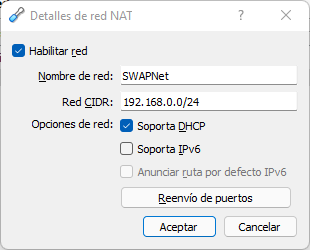

A continuación, añadimos un adaptador Host-Only desde la configuración de la máquina virtual, en el apartado _Red_. Pulsamos en _Adaptador 2_ y seleccionamos _Adaptador sólo-anfitrión_. Guardamos la configuración.

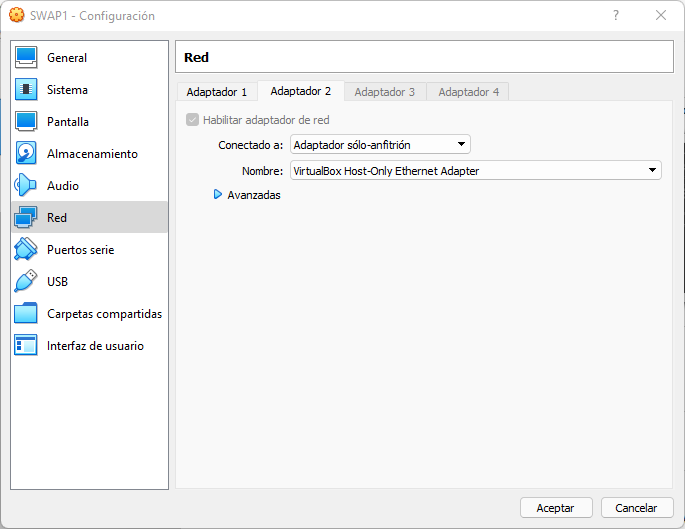

Finalmente, debemos de asignar las IP a cada interfaz de la máquina virtual de forma estática. Para ello, modificamos el archivo YAML de `netplan` situado en `/etc/netplan/00-installer-config.yaml`, e insertamos la siguiente configuración:

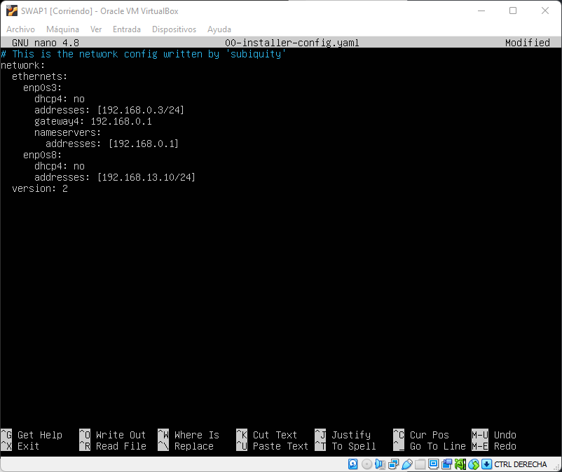

> Para SWAP2, insertaremos los parámetros de red adecuados.

A continuación simplemente debemos hacer:

```
mianfg@m1-mianfg$ sudo netplan apply
```

Mostrando las interfaces, vemos que la configuración ha sido aplicada (nótese que hay que instalar `net-tools` para ejecutar este comando):

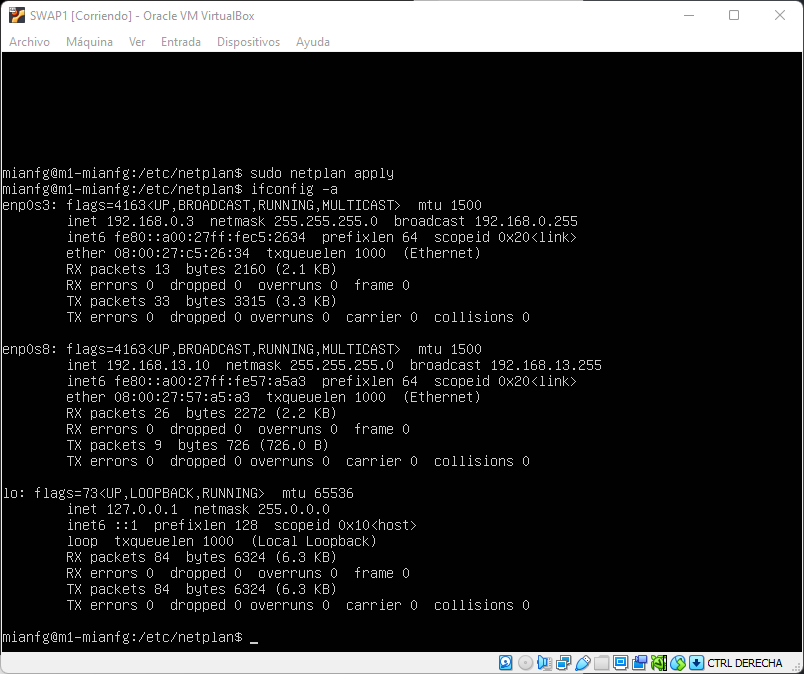

Para probar que funciona, haremos `ping` de una máquina a otra. Vemos que el resultado es satisfactorio.

|  | 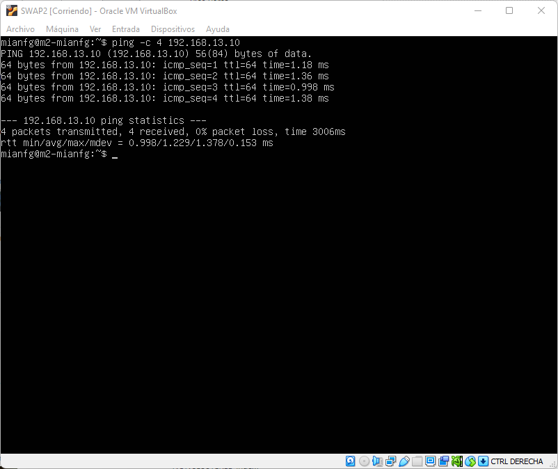 |
| --- | --- |
| `ping` de SWAP1 a SWAP2 | `ping` de SWAP2 a SWAP1 |

## Configuración de SSH

> En este apartado:
>
> * Acceso por SSH de una máquina a otra
> * Configuración de un _alias_
> * Acceso sin contraseña
> * Cambio del puerto de SSH
> * Comandos avanzados del cliente SSH

Dado que instalamos OpenSSH al instalar Ubuntu Server, tendremos todo lo necesario para realizar una conexión SSH de una máquina a otra.

Una configuración preliminar interesante es insertar un _alias_. Para ello, creamos el archivo `~/.ssh/config` con la siguiente configuración:

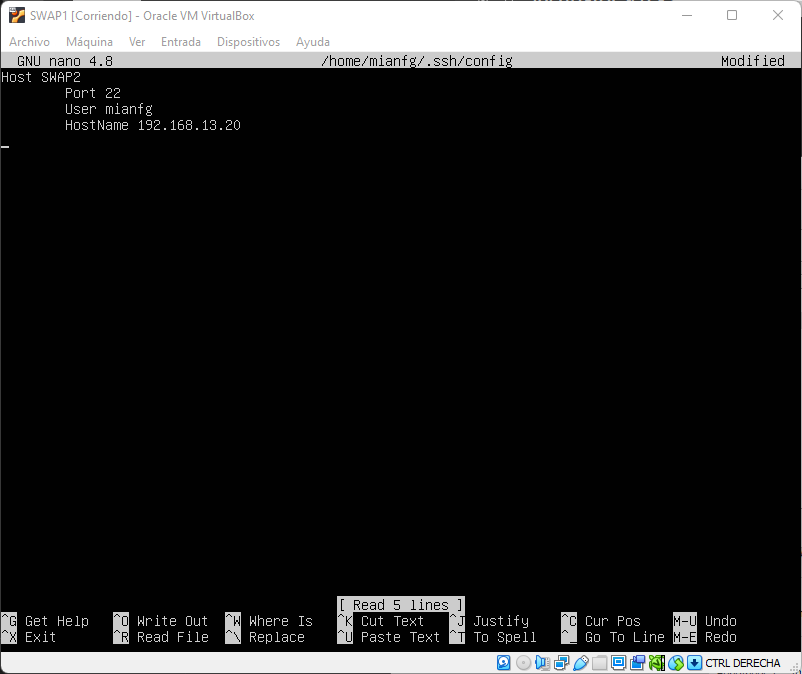

> Evidentemente, habría que realizar la misma configuración en SWAP2 con los parámetros de red de SWAP1.

Ahora podemos hacer `ssh mianfg@192.168.13.20` desde SWAP1 para acceder a SWAP2 o, sencillamente:

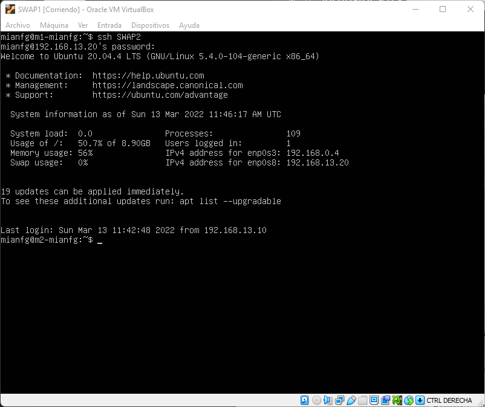

### Configuración adicional

#### Acceso sin contraseña

El procedimiento es sencillo. En primer lugar, genereamos una nueva clave con `ssh-keygen`.

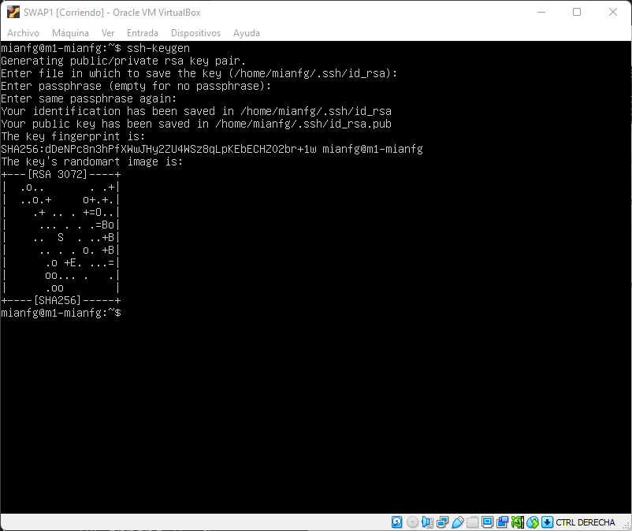

A continación, modificamos los ajustes de SSH en el archivo `/etc/ssh/sshd_config` (configuración del _daemon_) y especificamos `PermitRootLogin yes`.

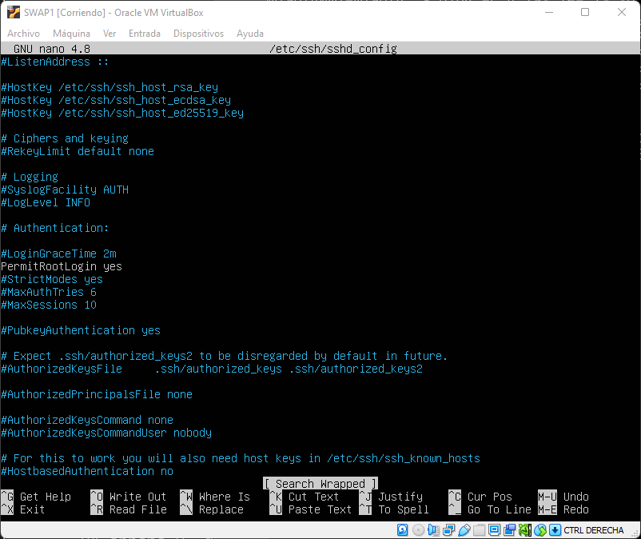

Ya solo debemos ejecutar `ssh-copy-id` para copiar a la máquina nuestra información y de este modo permitir el inicio de sesión sin contraseña. Vemos a continuación cómo, desde SWAP1, hacemos `ssh-copy-id` a SWAP2. En efecto, una vez hecho esto, podemos iniciar sesión sin contraseña.

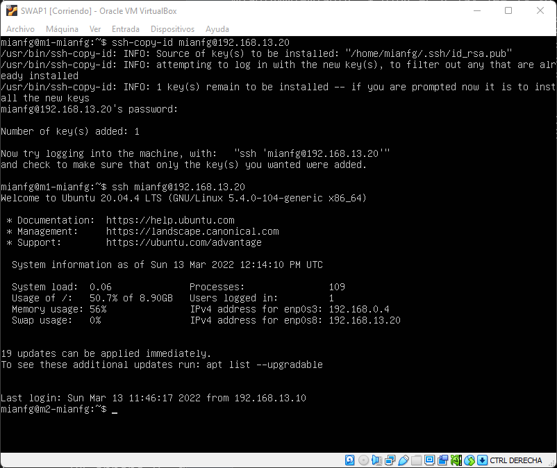

#### Cambio de puerto

> Esta configuración ha sido realizada para probar. Al finalizar, eliminamos tal configuración, volviendo a conectarnos mediante el puerto `22`.

Puede ser una medida de seguridad cambiar el puerto mediante el cual accedemos por SSH a una máquina. Cambiaremos el puerto del `22` al `2222`. Para ello, sólo tenemos que modificar el archivo `/etc/ssh/sshd_config`, descomentando y reemplazando la línea `Port 22` por `Port 2222`.

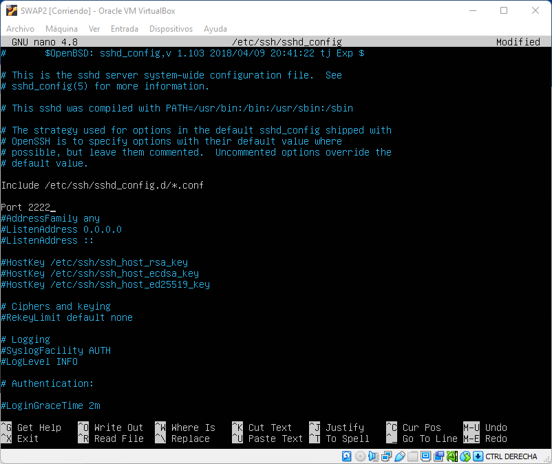

Finalmente reiniciamos el servicio.

```
mianfg@m2-mianfg: sudo service ssh restart
```

Ahora, para conectarnos debemos especificar tal puerto.

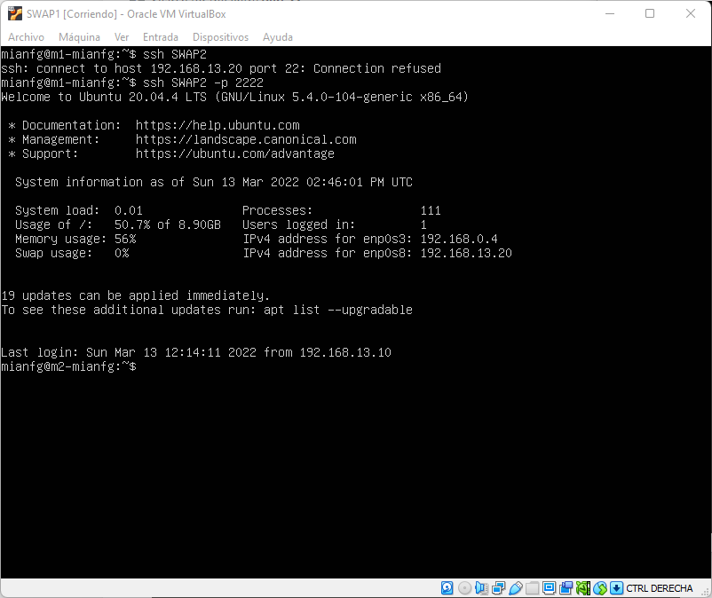

> Nótese que podríamos modificar el _alias_ para que, con hacer `ssh SWAP2`, se conecte mediante tal puerto.

#### Comandos avanzados de `ssh`

Consulando el `man` (entrada de manual) de `ssh` vemos opciones avanzadas. Probaremos una de ellas, `-G`, que nos muestra la configuración de SSH tras haber realizado la conexión. Dado que tiene mucho _output_ usaremos `less`.

```
mianfg@m2-mianfg: ssh SWAP2 -G | less
```

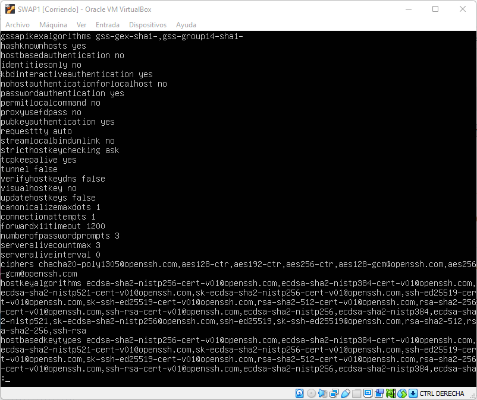

En este _output_ vemos cosas muy interesantes, como los algoritmos de encriptación que se usan en la comunicación, en el intercambio de claves, etc.


## Stack LAMP

> En este apartado:
> 
> * Instalación del stack
> * `curl` de una máquina a otra
> * `curl` con cookies
> * `curl` a otro puerto
> * Cambio de directorio de Apache
> * Cambio de puertos de Apache
> * Redirección en Apache mediante archivo `.htaccess`

Para instalar el stack LAMP, simplemente debemos instalar los paquetes siguientes:

```
mianfg@m1-mianfg: sudo apt-get install apache2 mysql-server mysql-client
```

Nótese que estamos instalando **MariaDB**. Hecho esto, probaremos que Apache ha sido correctamente instalado. Vemos que hemos instalado la versión 2.4.41, y que el _daemon_ está activo y ejecutándose.

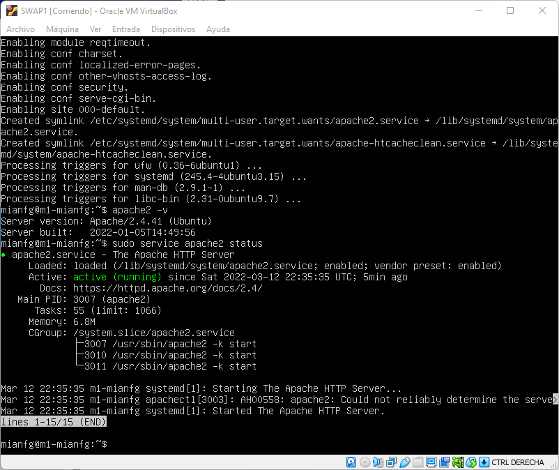

Crearemos una web básica llamada `swap.html` en ambas máquinas virtuales, que nos dirán en qué máquina están. Apache está configurado por defecto para mostrar los archivos del directorio `/var/www/html` en la IP del servidor (esto es, `http://<ip-servidor>/<archivo-html>` devuelve el archivo HTML de `/var/www/html/<archivo-html>`). Crearemos el archivo `/var/www/html/swap.html`, muy básico:

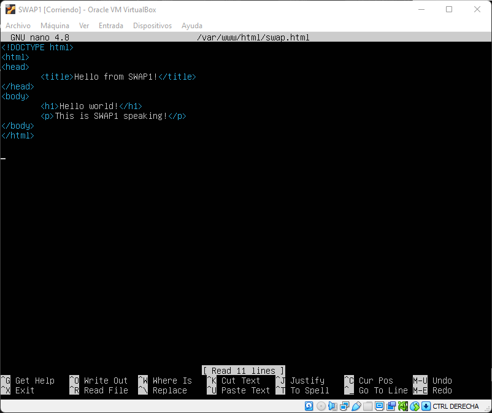

Una vez tenemos los archivos en ambos servidores, hacemos `curl` y vemos cómo obtenemos la página HTML.

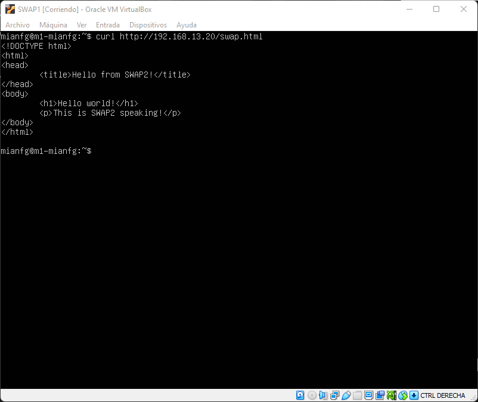

### Opciones avanzadas de `curl`

#### `curl` con cookies

Para hacer `curl` con cookies, basta especificar la opción `--cookie <cookie>`. Realizaremos una prueba con `-v` para ver las cabeceras de HTML.

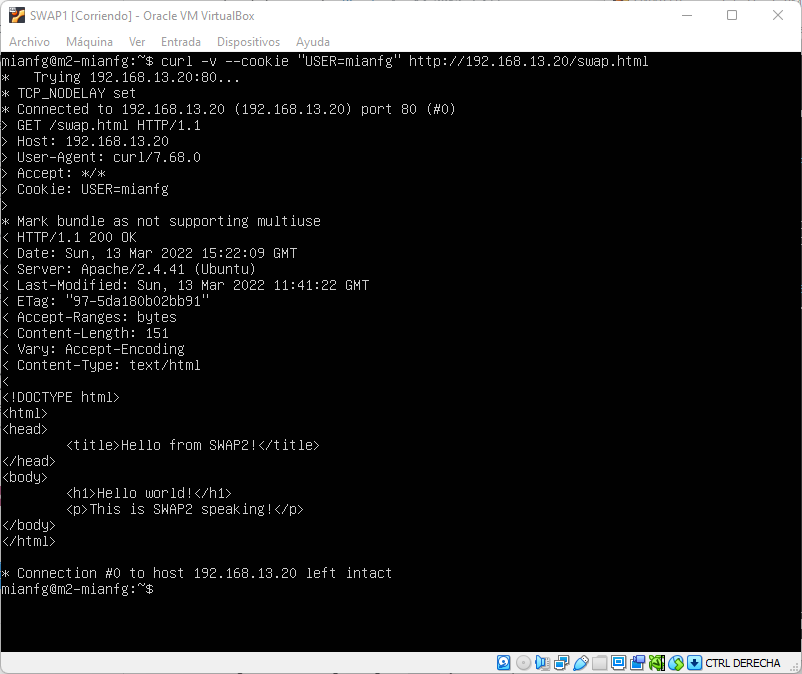

Vemos que, en efecto, las cookies aparecen en la petición.

#### `curl` a otro puerto

Por defecto, las peticiones HTTP se dirigen al puerto `80`. Añadiendo un `:<port-number>` al final de la IP podremos dirigir la petición a otro puerto, por ejemplo:

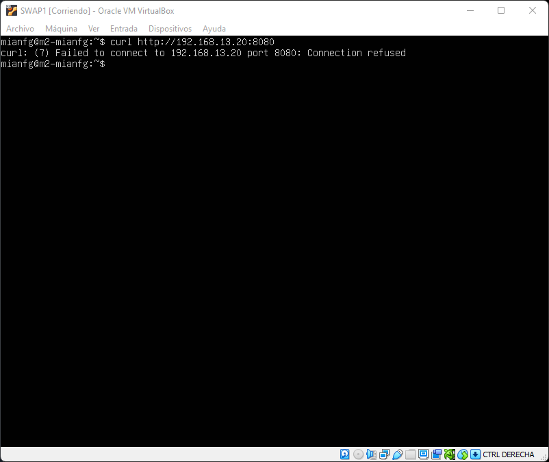

Vemos cómo la conexión es rechazada, dado que no servimos nada en ese puerto. A continuación veremos cómo servir nuestra web en el `8080`.

### Configuración adicional de Apache

> La configuración que se muestra a continuación ha sido realizada para probar. Tras aplicar cada configuración, volvimos a la configuración por defecto en ambas máquinas.

#### Cambio de directorio `/var/www/html`

La configuración por defecto que mencionamos está en `/etc/apache2/sites-available/000-default.conf`. Podemos modificar `DocumentRoot` y cambiarlo por `/home/mianfg/swap`.

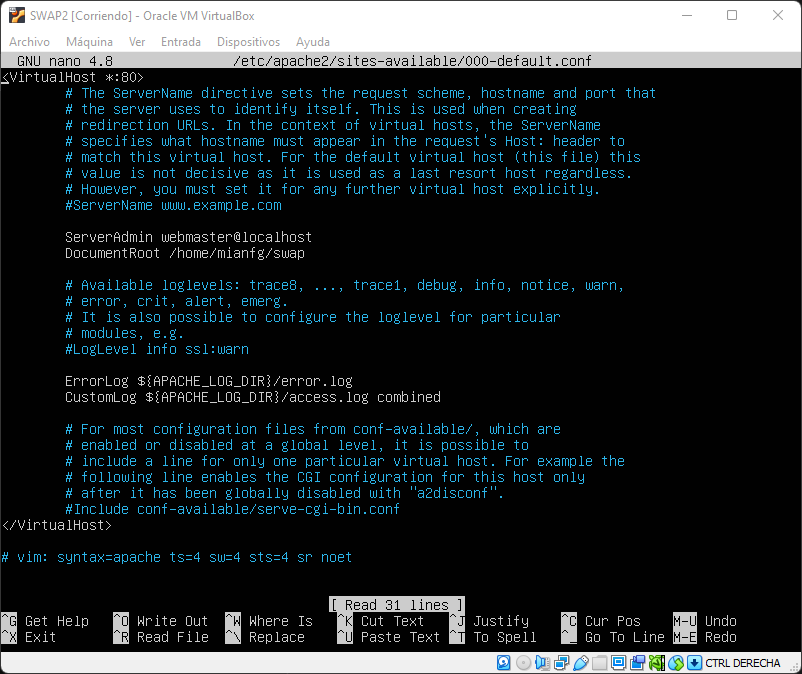

Si copiamos de este modo:

```
mianfg@m1-mianfg$ cp /var/www/html/swap.html ~/swap
```

Podremos hacer `curl` y tendremos el mismo resultado.

#### Cambio de puertos

Supongamos que queremos servir la página desde el puerto `8080`. Para ello, sólo es necesario realizar dos configuraciones.

En primer lugar, añadimos el puerto a `/etc/apache2/ports.conf`, como sigue:

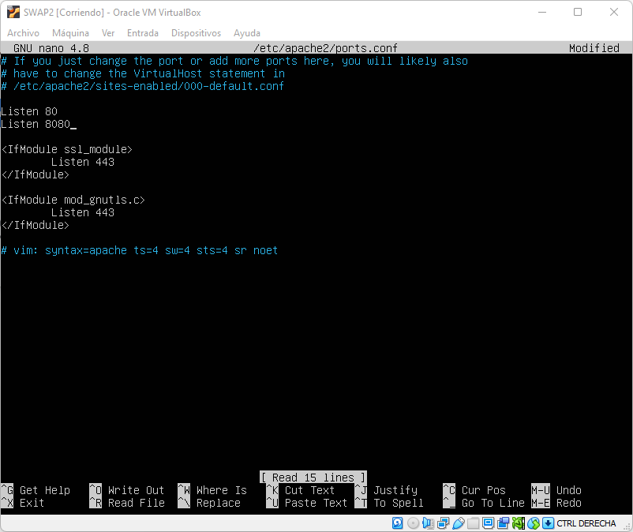

Finalmente, cambiamos `/etc/apache2/sites-available/000-default.conf`, modificando `*:80` por `*:8080` en la primera línea del archivo.


Dado que hemos modificado la configuración, hacemos:

```
mianfg@m2-mianfg:$ sudo service apache2 restart
```

Solo nos queda hacer `curl` especificando el nuevo puerto.

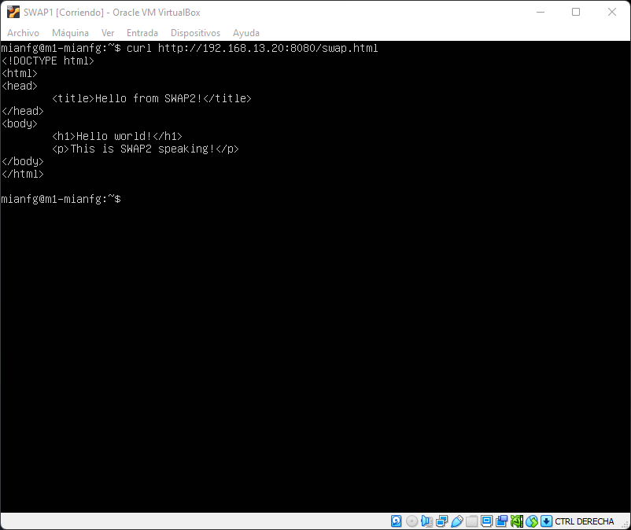

#### Redirección

> Recordamos que en cada uno de estos apartados comenzamos con la configuración como si no se hubiese aplicado cambio alguno (es decir, sin cambio de puertos ni de carpeta, etc).

Vamos a servir las páginas sin necesidad de especificar la extensión `.html`. Es decir, nuestro objetivo es poder servir la página `http://<ip-servidor>/swap`. Para ello, primero habilitamos `mod_rewrite`.

```
mianfg@m2-mianfg:$ sudo a2enmod rewrite
mianfg@m2-mianfg:$ sudo apachectl restart
```

Hay muchas formas diferentes de reactivar Apache como hemos visto. Otra sería usando `systemctl`.

A continuación configureremos un archivo `.htaccess`. En primer lugar, modificamos `/etc/apache2/sites-available/000-default.conf`, e insertamos el bloque `<Directory>` que aparece a continuación:

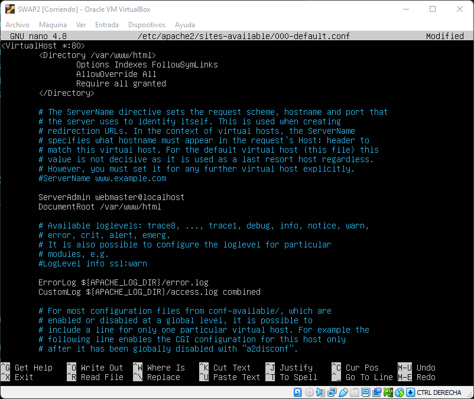

Volvemos a reiniciar el servicio.

```
mianfg@m2-mianfg:$ sudo apachectl restart
```

Ahora añadimos el archivo `.htaccess` en la carpeta `/var/www/html` con el siguiente contenido:

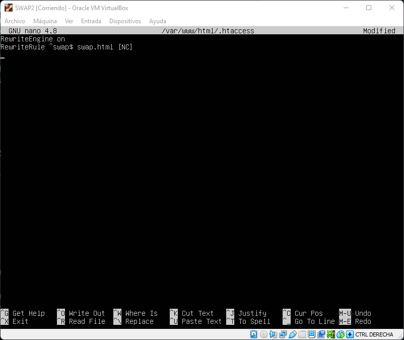

La directiva `[NC]` hace que la consulta no sea sensible a mayúsculas. Vemos cómo ahora podemos hacer `curl` sin necesidad de especificar la extensión, y con cualquier combinación de mayúsculas y minúsculas:

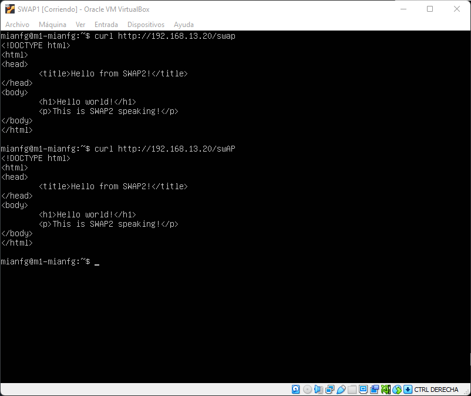
