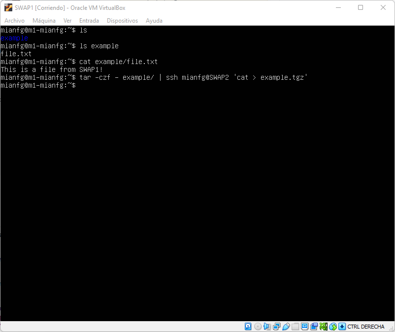
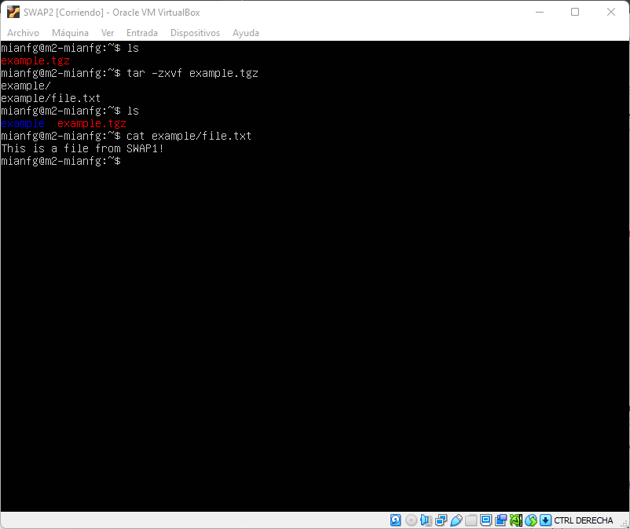
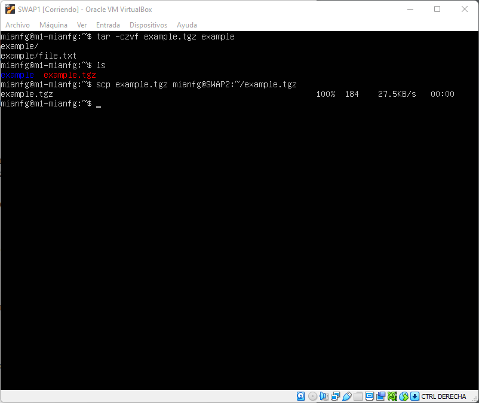
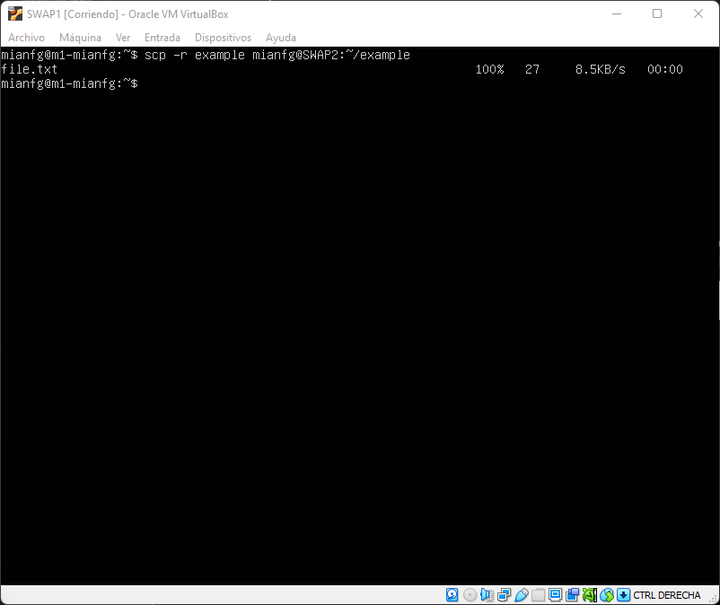
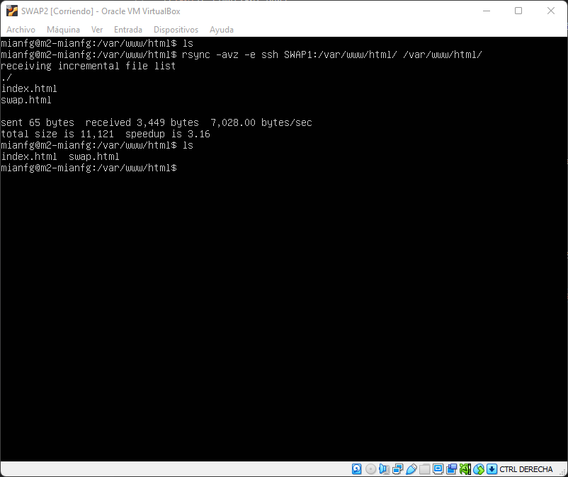
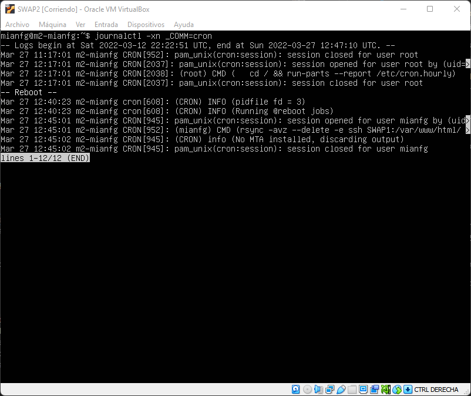

# Práctica 2. Clonar la información de un sitio web

> Alumno: Miguel Ángel Fernández Gutiérrez

## Objetivos

En esta práctica, realizaremos la configuración para sincronizar las carpetas `/var/www/html` de las máquinas. Supongamos que la máquina que actúa de servidor principal es SWAP1, y que tenemos SWAP2 como servidor de reserva (esta elección es arbitraria). Dado que SWAP2 es la máquina que tiene menor uso de los recursos, será la que efectuará la sincronización.

Recordamos la configuración de red a continuación.

| Nombre de VM | SWAP1 | SWAP2 |
| --- | --- | --- |
| Hostname | `m1-mianfg` | `m2-mianfg` |
| IP `enp0s3` (NAT) | 192.168.0.3/24 | 192.168.0.4/24 |
| IP `enp0s8` (Host-Only) | 192.168.13.10/24 | 192.168.13.20/24 |
| Nombre usuario | `mianfg` | `mianfg` |
| Contraseña | `Swap1234` | `Swap1234` |

## Preliminares

Haremos que nuestro usuario sea el propietario de las carpetas `/var/www/html` en ambas máquinas mediante

```
sudo chown mianfg:mianfg -R /var/www/html
```

## Uso de `tar` y `scp`

> En este apartado:
>
> * Copiar archivos locales en equipos remotos con `tar`
> * Copiar archivos locales en equipos remotos con `tar` y `scp`
> * Copiar archivos locales en equipos remotos con `scp`

En una primera aproximación, usaremos `tar` para sincronizar las carpetas. Simplemente ejecutaremos el comando que aparece a continuación, que usa el flujo de archivos para enviarlo a SWAP2 mediante SSH.



Vemos cómo, en efecto, tenemos en SWAP2 todos los archivos. Basta descomprimir el `.tgz`.



Equivalentemente, podríamos comprimir el archivo en la máquina SWAP1 y enviarlo mediante `scp`.



Podríamos también haber hecho uso de `scp` directamente, mediante el siguiente comando.



## Inicio de sesión sin contraseña

> En este apartado:
>
> * Configurar SSH para evitar introducir contraseña con ssh-keygen y copia de clave de manera manual

En la [Práctica 1](./p1.md) ya configuramos el inicio de sesión mediante SSH sin contraseña. Mencionaremos aquí una alternativa a `ssh-copy-id`.

Lo que hace `ssh-copy-id` en esencia es copiar el contenido de `.ssh/id_rsa.pub` en el archivo `.ssh/authorized_keys` de la máquina remota. Sería equivalente a

```
mianfg@m1-mianfg$ ssh-copy-id SWAP2
```

el comando

```
mianfg@m1-mianfg$ cat ~/.ssh/id_rsa.pub | ssh mianfg@SWAP2 'cat >> ~/.ssh/authorized_keys
```

Nótese que el comando `scp ~/.ssh/id_rsa.pub mianfg@SWAP2:~/.ssh/authorized_keys` sobreescribiría el archivo `authorized_keys`, por lo que preferimos usar `ssh`.

## Uso de `rsync`

> En este apartado:
>
> * Utilizar `rsync` para sincronizar carpetas entre dispositivos
> * Utilizar `rsync` para sincronizar eliminación de archivos

En Ubuntu Server 20.04 LTS tenemos ya instalado `rsync` por defecto. Procederemos a demostrar su uso con el siguiente comando:



Vemos cómo hemos logrado copiar el contenido de SWAP1 en SWAP2. Previamente vemos cómo no hay ningún archivo al hacer `ls`, y tras `rsync` vemos que hemos copiado el contenido de `/var/www/html` de SWAP1 al directorio homónimo de SWAP2.

Veamos a continación el uso de la opción `--delete`. Si eliminamos en SWAP1 el archivo `index.html` y ejecutamos el mismo comando anterior con la opción `--delete`, vemos cómo el archivo se elimina de SWAP2.

## Uso de `crontab`

> En este apartado:
>
> * Utilizar `crontab` de usuario para ejecutar un comando de `rsync`
> * Utilizar temporización de `crontab` con `/`

Para sincronizar ambas máquinas en este momento, deberíamos de ejecutar el comando de `rsync` manualmente. Haremos uso de `crontab` para automatizar este comando.

Modificaremos el `crontab` de nuestro usuario en lugar del de `/etc/crontab`, dado que nuestro usuario tiene todos los permisos necesarios. Para ello, basta ejecutar el comando:

```
mianfg@m2-mianfg$ crontab -e
```

Seleccionamos `nano` como editor (por ejemplo) y modificamos el archivo para incluir la siguiente línea de `crontab`:

```
# m h  dom mon dow  command
*/5 *  *   *   *    rsnc -avz --delete -e ssh SWAP1:/var/www/html/ /var/www/html/
```

Esta línea ejecutará el comando _cada quinto minuto_, es decir, cada vez que el minuto del reloj de nuestra máquina sea múltiplo de 5, lo cual de forma efectiva nos dice que el comando se ejecutará cada cinco minutos. Lo guardamos y pasado un tiempo comprobamos si se ha ejecutado (hemos creado un archivo nuevo en SWAP1 para demostrar cómo, en efecto, `rsync` hace su trabajo).



## Conclusiones

Tenemos dos servidores con las carpetas `/var/www/html` sincronizadas. Sin embargo, hemos de tener en cuenta que la sincronización ocurre de SWAP1 a SWAP2 (algo que tiene sentido si queremos usar SWAP2 como _backup_). Si SWAP1 dejase de funcionar, `rsync` debería ser detenido pues no podría efectuar las copias correctamente.
