# Práctica 3. Balanceo de carga en un sitio web

> Alumno: Miguel Ángel Fernández Gutiérrez

> 😊 Puedes ver mejor este archivo [en GitHub](https://github.com/mianfg/DGIIM-SWAP/blob/main/Pr%C3%A1cticas/P3.md) junto con los [archivos y scripts de resultados](https://github.com/mianfg/DGIIM-SWAP/tree/main/Pr%C3%A1cticas/results/P3).

## Objetivos

En esta práctica, configuraremos SWAP3, un nuevo servidor, como balanceador de carga de los servidores SWAP1 y SWAP2. Por tanto, deberemos realizar las peticiones a SWAP3, pues es la encargada de repartir el tráfico. De este modo conseguimos servir más peticiones en conjunto, y de forma más eficiente. Analizaremos diversas formas de balanceo con diversos balanceadores, así como si el balanceo es útil (si, en efecto, mejora las prestaciones de nuestro cluster).

Introducimos la configuración de red de SWAP3.

| Nombre de VM | SWAP1 | SWAP2 | SWAP3 |
| --- | --- | --- | --- |
| Hostname | `m1-mianfg` | `m2-mianfg` | `m3-mianfg` |
| IP `enp0s3` (NAT) | 192.168.0.3/24 | 192.168.0.4/24 | 192.168.0.5/24 |
| IP `enp0s8` (Host-Only) | 192.168.13.10/24 | 192.168.13.20/24 | 192.168.13.30/24 |
| Nombre usuario | `mianfg` | `mianfg` | `mianfg` |
| Contraseña | `Swap1234` | `Swap1234` | `Swap1234` |

## Preliminares

Vamos a clonar cualquiera de las dos máquinas para crear SWAP3, con los parámetros que aparecen antes (modificar `/etc/hostname` y cambiar la configuración de red con `netplan`). Finalmente, desactivamos Apache mediante los comandos:

```
mianfg@m3-mianfg$ sudo systemctl stop apache2
mianfg@m3-mianfg$ sudo systemctl disable apache2
```

## Configuración de balanceadores

### Nginx

> En este apartado:
>
> * Configuración de un balanceador de carga con Nginx
> * Tipos de balanceo: round-robin, round-robin con ponderación, hash IP, marcar un servidor en _down_ (sin balanceo), keepalive timeout...

Comenzamos instalando y activando Nginx. Basta hacer:

```
mianfg@m3-mianfg$ sudo apt-get install nginx
mianfg@m3-mianfg$ sudo service nginx start
mianfg@m3-mianfg$ sudo service nginx status
```

Vemos con `status` que Nginx está activo:

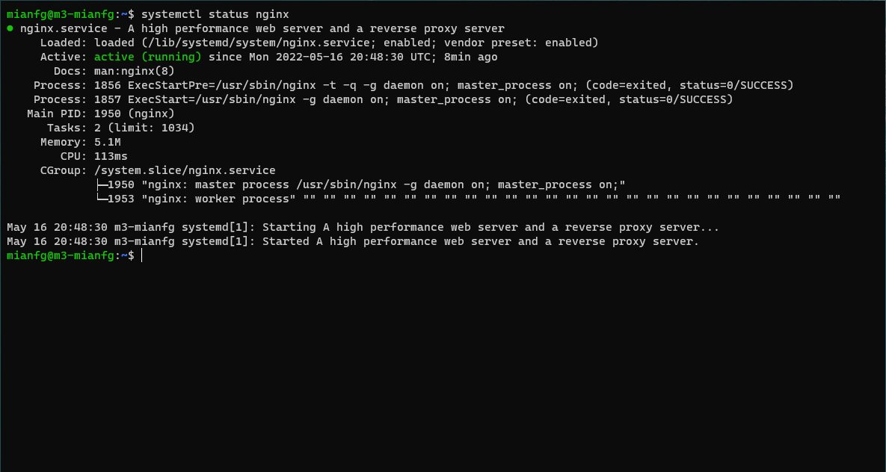

Por defecto, Nginx está configurado para funcionar como servidor web. Para ello, basta editar el archivo `/etc/nginx/nginx.conf` y comentar la línea

```
include /etc/nginx/sites-enabled/*;
```

Lo vemos en la captura a continuación:

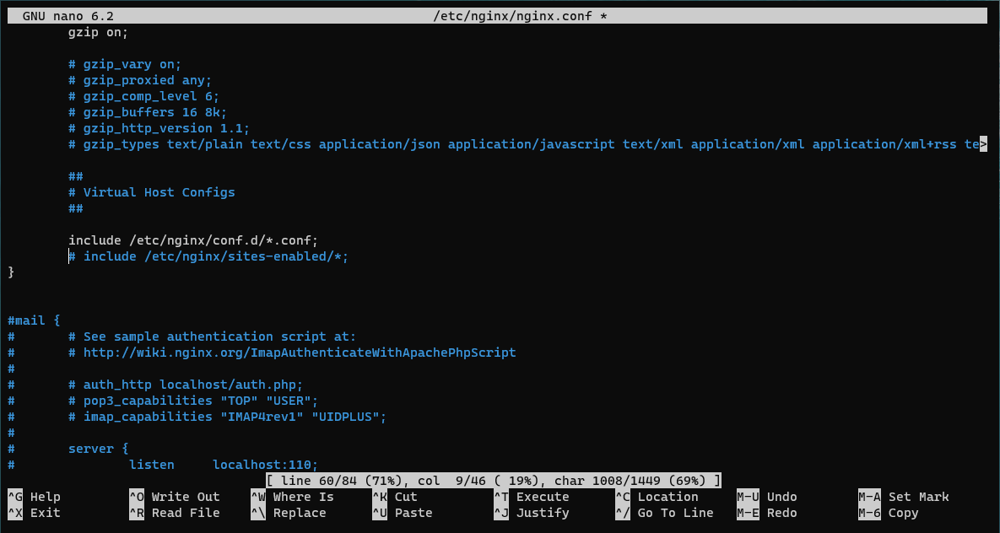

Modificamos la configuración para añadir los ajustes del balanceador. Basta crear el archivo `/etc/nginx/conf.d/default.conf` con el siguiente contenido:

```
upstream balanceo_mianfg {
    server 192.168.13.10;
    server 192.168.13.20;
}

server {
    listen 80;
    server_name balanceador_mianfg;
  
    access_log /var/log/nginx/balanceador_mianfg.access.log;
    error_log /var/log/nginx/balanceador_mianfg.error.log;
    root /var/www/;
    
    location / {
        proxy_pass http://balanceo_mianfg;
        proxy_set_header Host $host;
        proxy_set_header X-Real-IP $remote_addr;
        proxy_set_header X-Forwarded-For $proxy_add_x_forwarded_for;
        proxy_http_version 1.1;
        proxy_set_header Connection "";
    }
}
```

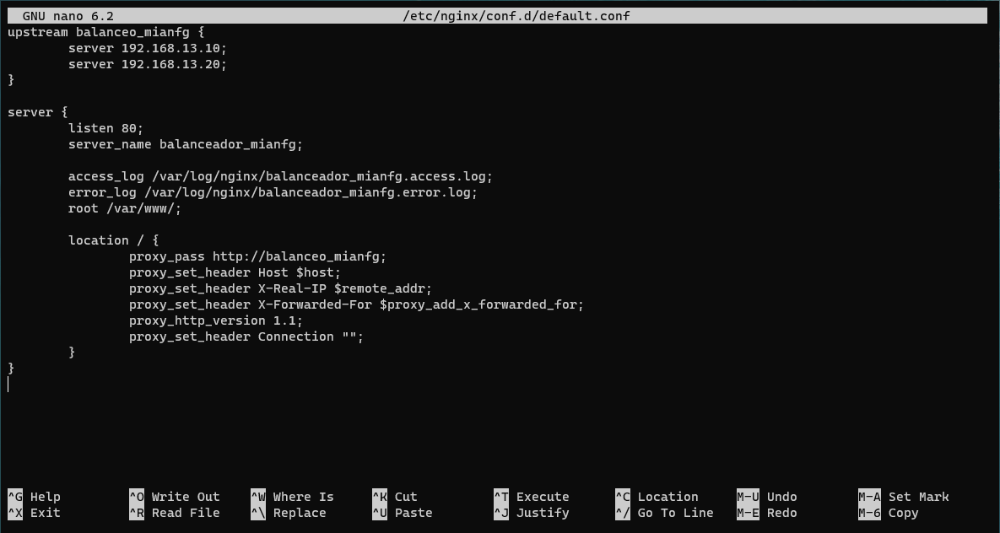

Para aplicar los cambios, reiniciamos el servicio `nginx` con `service`. Antes de hacer esto, podemos hacer uso del comando `nginx -t` (con privilegios _sudo_) para comprobar que no hay ningún fallo en la configuración. Esto es especialmente útil si queremos disminuir al máximo el _downtime_.

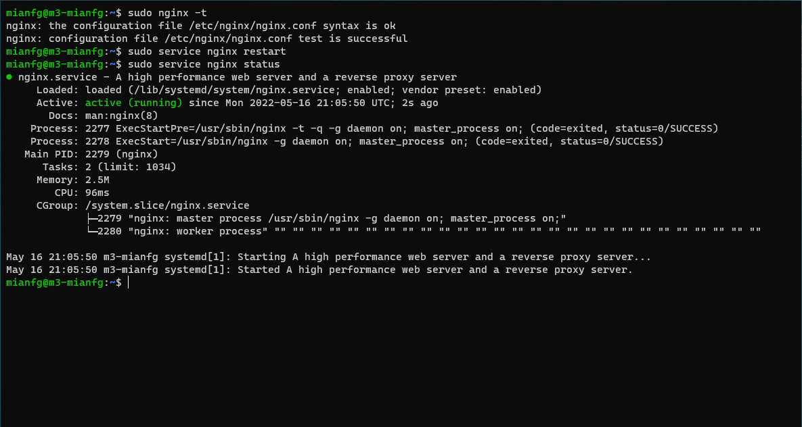

Una vez hecho esto, podemos hacer `curl` desde el host para comprobar que, en efecto, el balanceo está teniendo lugar:

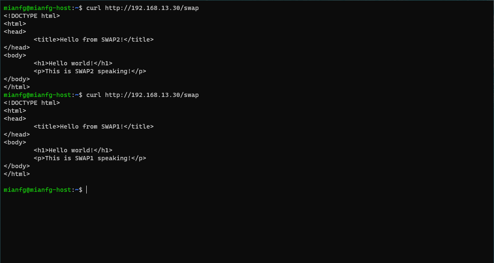

Veamos a continuación otras formas de balancear el tráfico. Para poder modificar la configuración, en todos los casos necesitamos modificar el archivo `/etc/nginx/conf.d/default.conf` y reiniciar `nginx` (pudiendo ejecutar `nginx -t` para realizar comprobaciones). Omitimos esto para no ser repetitivos en cada apartado.

> Todos los ajustes se encuentran en la documentación de Nginx, en [este enlace](http://nginx.org/en/docs/http/ngx_http_upstream_module.html).

#### Round-robin

La configuración por defecto de Nginx (lo que justo hemos configurado) es _round-robin_, es decir, comenzamos por el primer elemento y vamos hasta el último, volviendo luego a comenzar por el primero. En nuestro caso, el servidor alternará entre SWAP1 y SWAP2 al recibir las peticiones.

#### Round-robin con ponderación

Podemos ponderar cada uno de los servidores a la hora de realizar el _round-robin_. Si tenemos $n$ servidores, cada uno con ponderación $P_i$, las peticiones se dirigirán al servidor $i$-ésimo $P_i$ de cada $\sum_{i=1}^n P_i$ veces.

La configuración en Nginx pasa por añadir el parámetro `weight` al lado de cada servidor. Haremos que SWAP1 tenga un peso de 1 y SWAP2 tenga un peso de 2. De cada 3 peticiones, 1 irá a SWAP1 y 2 irán a SWAP2.

```
upstream balanceo_mianfg {
    server 192.168.13.10 weight=1;
    server 192.168.13.20 weight=2;
}

# ...
```

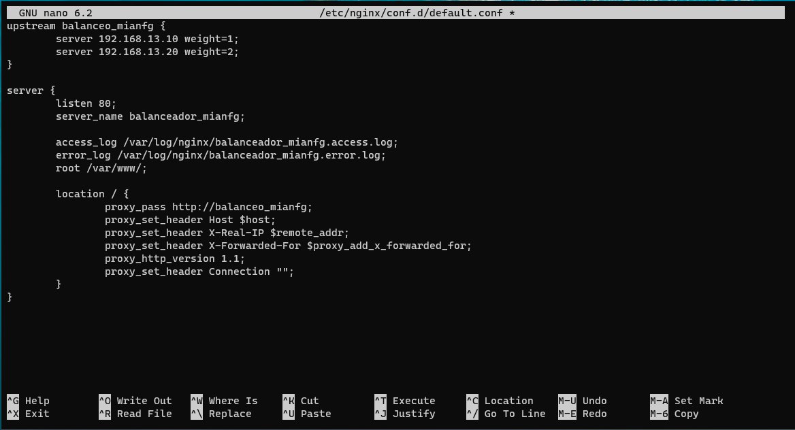

#### IP hashing

Otra alternativa es hacer que una IP siempre vaya a parar al mismo servidor. Esto se logra con _hashing_, y se configura de forma sencilla.

```
upstream balanceo_mianfg {
    ip_hash;
    server 192.168.13.10;
    server 192.168.13.20;
}

# ...
```


Dado que nuestro host tiene la misma IP, vemos que al hacer `curl` siempre recibimos las peticiones del mismo servidor.

#### Keepalive timeout

Mediante el uso de la directiva `keepalive_timeout`, indicamos cuánto debe esperar el servidor para recibir peticiones del cliente; en otras palabras, indicamos el número de segundos que una conexión se mantendrá abierta. La recomendación de los desarrolladores de Nginx es mantenerlas abiertas entre 6 y 10 segundos. Si este valor es demasiado alto, el servidor puede congestionarse fácilmente y agotar la RAM. Configuraremos un _keepalive timeout_ de 6s.

```
upstream balanceo_mianfg {
    server 192.168.13.10;
    server 192.168.13.20;
    keepalive_timeout 6;
}

# ...
```

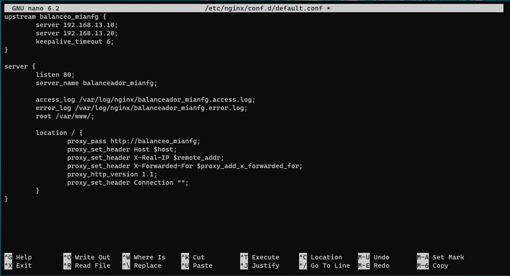

Nótese que estamos volviendo a realizar _round-robin_ (por defecto).

#### Marcar servidor como `down`

En caso de que queramos realizar mantenimiento, podemos marcar un servidor como _down_ (inactivo). De este modo, las peticiones se dirigirán al resto de servidores. En nuestro caso, al tener solo dos, todas las peticiones irán a SWAP1 (marcamos SWAP2 como _down_).

```
upstream balanceo_mianfg {
    server 192.168.13.10;
    server 192.168.13.20 down;
}

# ...
```

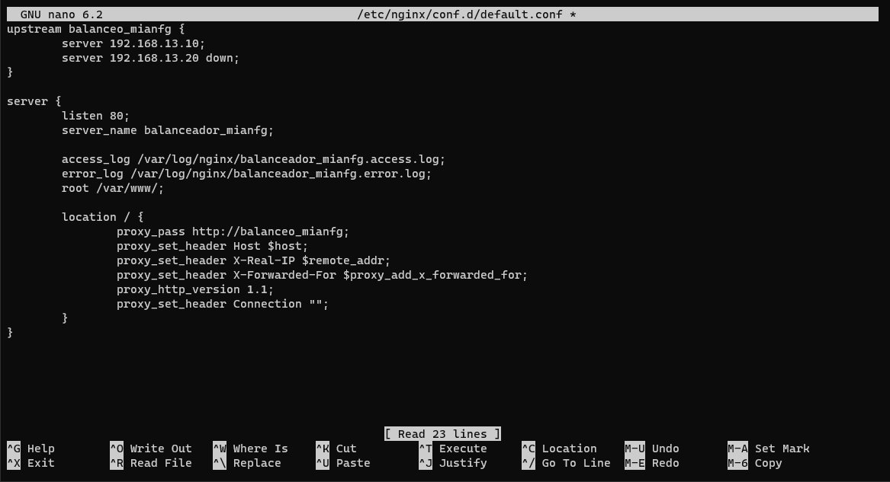

#### Una configuración más compleja

Veamos un ejemplo más complejo de uso. Supongamos que tenemos un servidor SWAP4 cuya interfaz `enp0s8` tiene IP 192.168.13.40/24. SWAP3 tiene la siguiente configuración de balanceador:

```
upstream balanceo_mianfg {
    least_conn;
    server 192.168.13.10 max_fails=7;
    server 192.168.13.20;
    server 192.168.13.40 backup;
    sticky cookie srv_id expires=1h;
}

# ...
```

* `least_conn` indica que la petición será enviada al servidor con el menor número de conexiones activas.
* `max_fails` configura el número máximo de intentos fallidos de comunicación con el servidor antes de considerarlo inactivo por un periodo específico de tiempo. En concreto, si el servidor recibe al menos `max_fails` peticiones incorrectas en `fail_timeout` segundos, se mantendrá inactivo durante `fail_timeout` segundos. Dado que hemos configurado SWAP1 con `max_fails=7` y que por defecto es `fail_timeout=10`, SWAP1 se mantendrá inactivo durante 10s si recibe al menos 7 peticiones fallidas en 10s.
* `backup` configura un servidor _backup_, que se mantendrá inactivo hasta que los servidores principales no estén disponibles.
* `sticky cookie` añade una cookie de sesión a la primera respuesta que identifica el servidor que ha respondido. La siguiente petición al balanceador incluirá tal cookie y Nginx responderá con el mismo servidor. La cookie se llamará `srv_id` y tendrá un tiempo de expiración de 1h. Este es el método de persistencia más simple.

### HAProxy

> En este apartado:
>
> * Configuración de un balanceador de carga con Nginx
> * Tipos de balanceo: round-robin, round-robin con ponderación, hash IP, marcar un servidor en _down_ (sin balanceo), keepalive timeout...

Para configurar HAProxy, primero procederemos a desactivar el servicio `nginx` para luego instalar y activar `haproxy`.


```
mianfg@m3-mianfg$ sudo service nginx stop
mianfg@m3-mianfg$ sudo systemctl disable nginx
mianfg@m3-mianfg$ sudo apt-get install haproxy
mianfg@m3-mianfg$ sudo service haproxy start
mianfg@m3-mianfg$ sudo service haproxy status
```

Vemos con `status` que `haproxy` está activo:

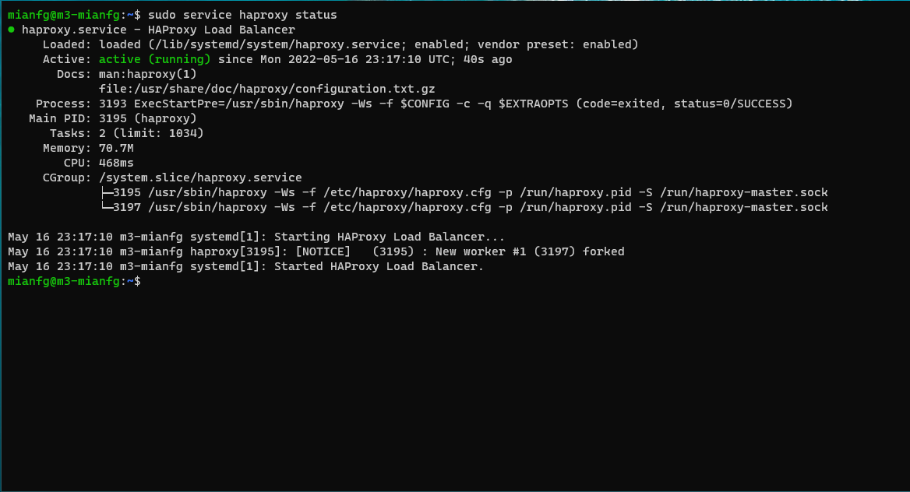

Procedemos a la primera configuración. Para ello, modificamos el archivo `/etc/haproxy/haproxy.cfg` e insertamos:

```
frontend http-in
    bind *:80
    default_backend balanceo_mianfg

backend balanceo_mianfg
    server m1    192.168.13.10:80
    server m2    192.168.13.20:80
```

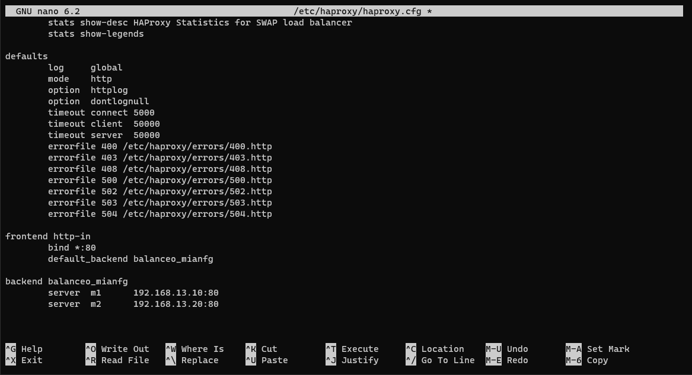

Veamos qué hemos hecho, y adentrémonos en las configuraciones de HAProxy. Procederemos como con Nginx: realizaremos unas configuraciones básicas (las mismas que con Nginx) y terminaremos con una configuración un tanto más compleja. En todos los casos, ha de modificarse el archivo `/etc/haproxy/haproxy.cfg` y ha de reiniciarse el servicio con `service haproxy restart` para que los cambios surtan efecto.

#### Round-robin

La configuración anterior realiza el balanceo de carga con _round-robin_ (es la configuración por defecto, al igual que en el caso de Nginx).

#### Round-robin con ponderación

```
# ...

frontend http-in
    bind *:80
    default_backend balanceo_mianfg

backend balanceo_mianfg
    balance source
    hash-type consistent
    server m1    192.168.13.10:80    weight 1
    server m2    192.168.13.20:80    weight 2
```


#### IP hashing

```
# ...

frontend http-in
    bind *:80
    default_backend balanceo_mianfg

backend balanceo_mianfg
    balance source
    hash-type consistent
    server m1    192.168.13.10:80
    server m2    192.168.13.20:80
```

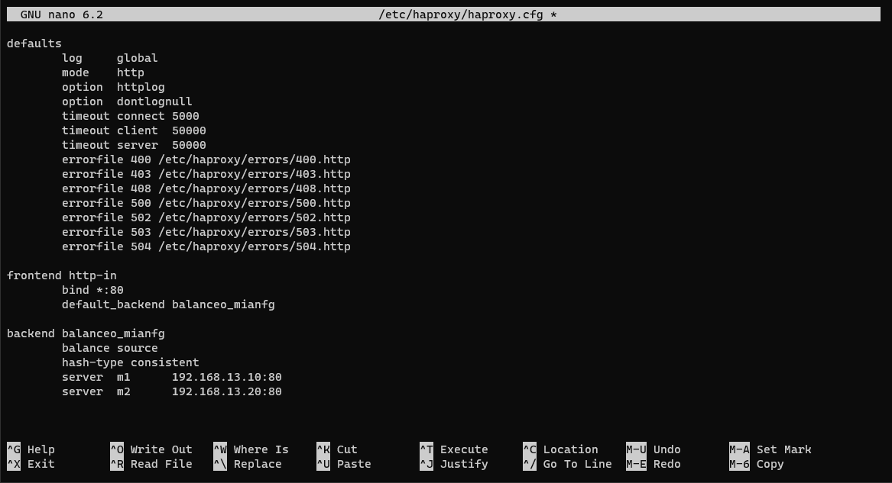

#### Keepalive timeout

Por defecto, HAProxy tiene configurado un timeout de acuerdo al protocolo HTTP. Más información en [este enlace](https://www.haproxy.com/blog/http-keep-alive-pipelining-multiplexing-and-connection-pooling/).

#### Marcar servidor como `disabled`

Marcamos como inactivo de nuevo a `m2` (SWAP2).

```
# ...

frontend http-in
    bind *:80
    default_backend balanceo_mianfg

backend balanceo_mianfg
    server m1    192.168.13.10:80
    server m2    192.168.13.20:80    disabled
```


#### Una configuración más compleja

```
# ...

frontend http-in
    bind *:80
    default_backend balanceo_mianfg

backend balanceo_mianfg
    balance source
    hash-type consistent
    server m1    192.168.13.10:80    maxconn 32
    server m2    192.168.13.20:80    maxconn 32
    stick-table  type ip  size 1m  expire 1h
    stick on src
```


* `maxconn` indica el número máximo de conexiones simultáneas, 32 tanto para SWAP1 como para SWAP2.
* `balance source` y `hash-type consistent` indican que estamos realizando IP hashing.
* Las dos últimas líneas de la configuración crearán una tabla en la memoria del balanceador de carga que mapea las direcciones IP con los servidores que las sirven. Es otra forma de ganar persistencia por IP. Los gastos de memoria son, sin embargo, muy bajos: 40MB por un millón de direcciones IPv4. `type ip` indica que se almacenarán las direcciones IP, `size 1m` indica que podrá almacenar un millón de direcciones, y `expire 1h` indica que la entrada expira tras 1h en memoria. `stick on src` indica que la asociación ocurrirá en el origen (_source_).

### Estadísticas de HAProxy

HAProxy tiene integrado un panel de estadísticas que puede ser visualizado mediante una interfaz web. Para habilitarlo, basta añadir la siguiente configuración a `/etc/haproxy/haproxy.cfg`:

```
global
    # ...
    stats socket /var/lib/haproxy/stats

listen stats
    bind *:1313
    mode http
    stats enable
    stats uri /stats
    stats realm HAProxy\ Statistics
    stats auth mianfg:password
```

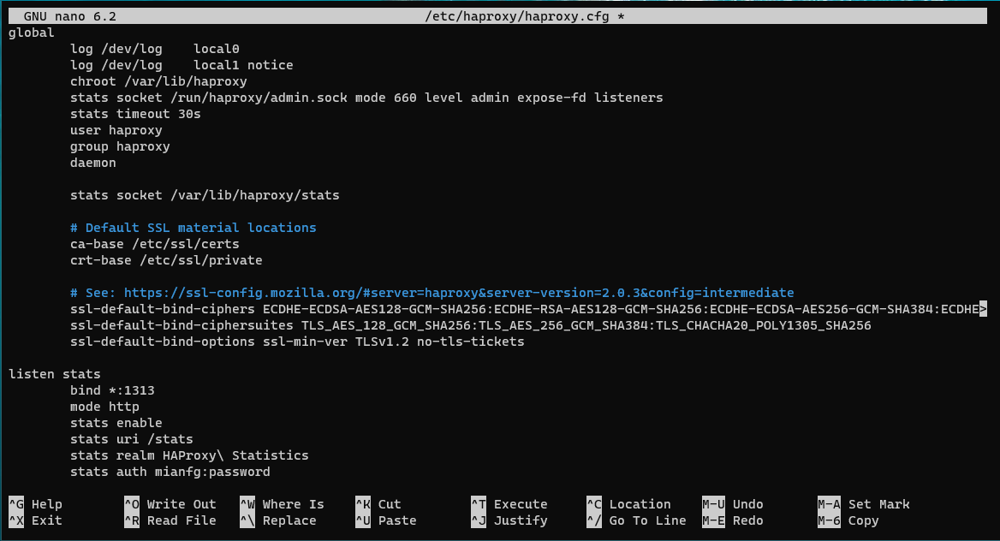

Reiniciamos el servicio y tendremos accesible el panel en `http://192.168.13.30/swap`. Deberemos introducir el usuario `mianfg` y la contraseña `password` para acceder.

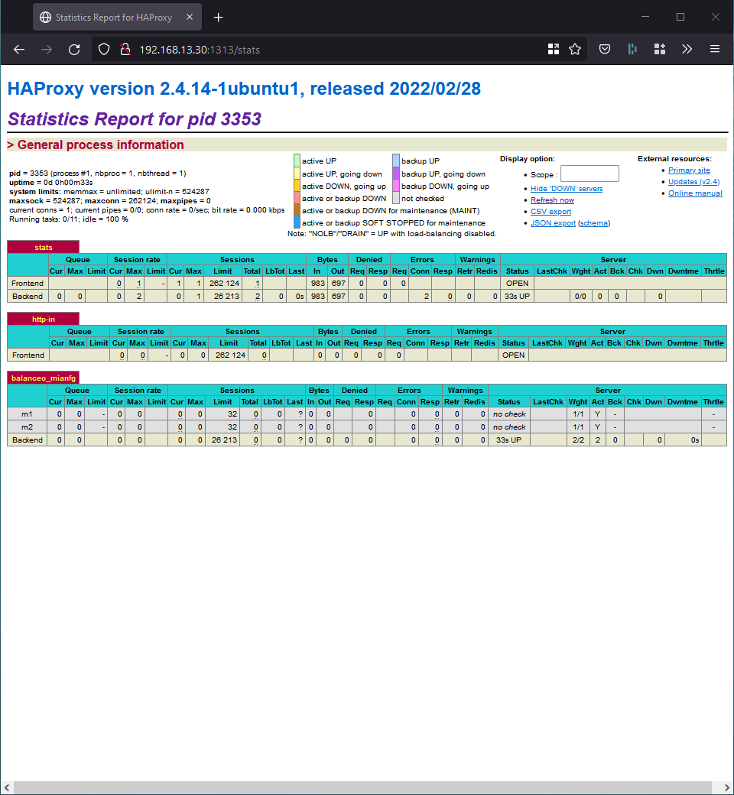

Vemos que todavía no hemos realizado ninguna petición (al reiniciar el servicio para aplicar la configuración se resetea la información).

#### Un primer vistazo

Vamos a echar un primer vistazo a las estadísticas, viendo el resultado de ejecutar `ab` con diversas configuraciones.

> Entraremos en profundidad en `ab` más adelante, pero me ha resultado interesante visualizar las estadísticas del panel en este momento.

Realizamos una serie de peticiones desde el host con `ab`, en concreto, usando:

```
mianfg@mianfg-msi$ ab -n 10000 -c 10 http://192.168.13.30/swap
```

Veremos qué ocurre con cada configuración de HAProxy.

##### Round-robin

Vemos cómo el reparto es perfecto: de las 10k peticiones, cada servidor recibe 5k.

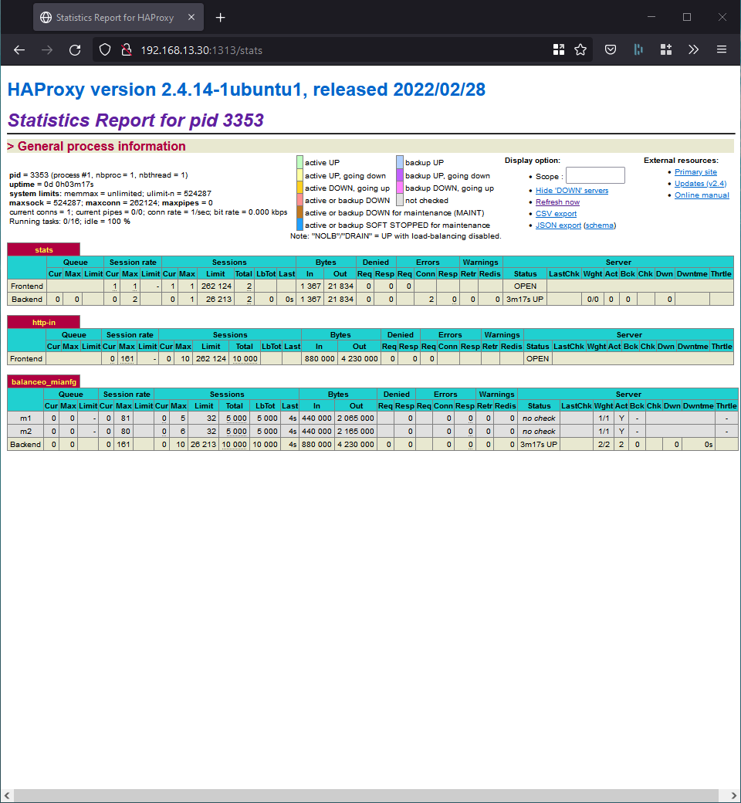

##### Round-robin con ponderación

Al darle una ponderación de 1 a SWAP1 (`m1`) y de 2 a SWAP2 (`m2`), vemos que 1/3 de las peticiones van a SWAP1 mientras que los 2/3 restantes van a SWAP2.

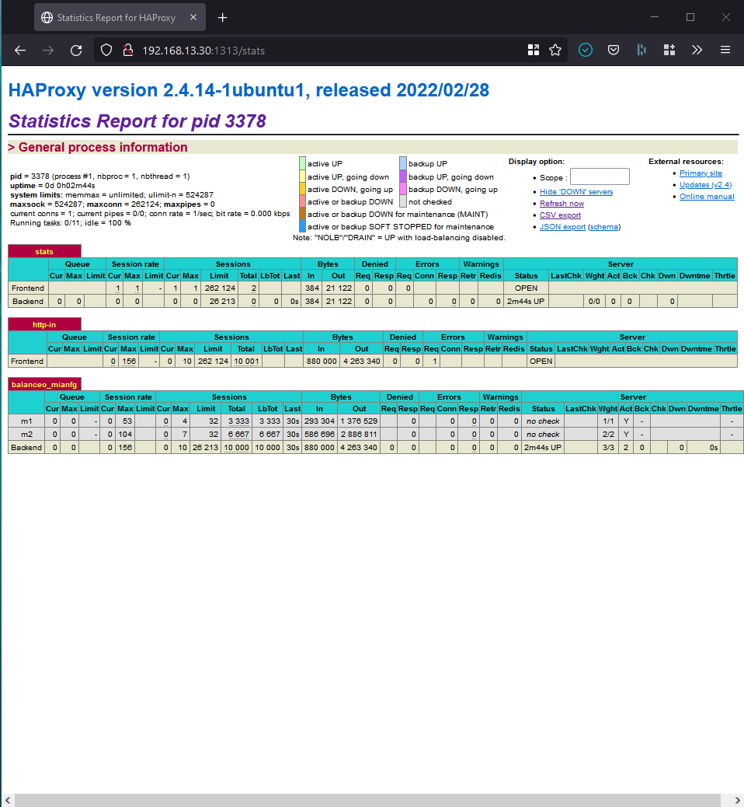

##### IP hashing

Como el host tiene la misma IP, al realizar hashing por IP todas las peticiones se dirigirán a un mismo servidor, en nuestro caso, a SWAP1 (`m1`).

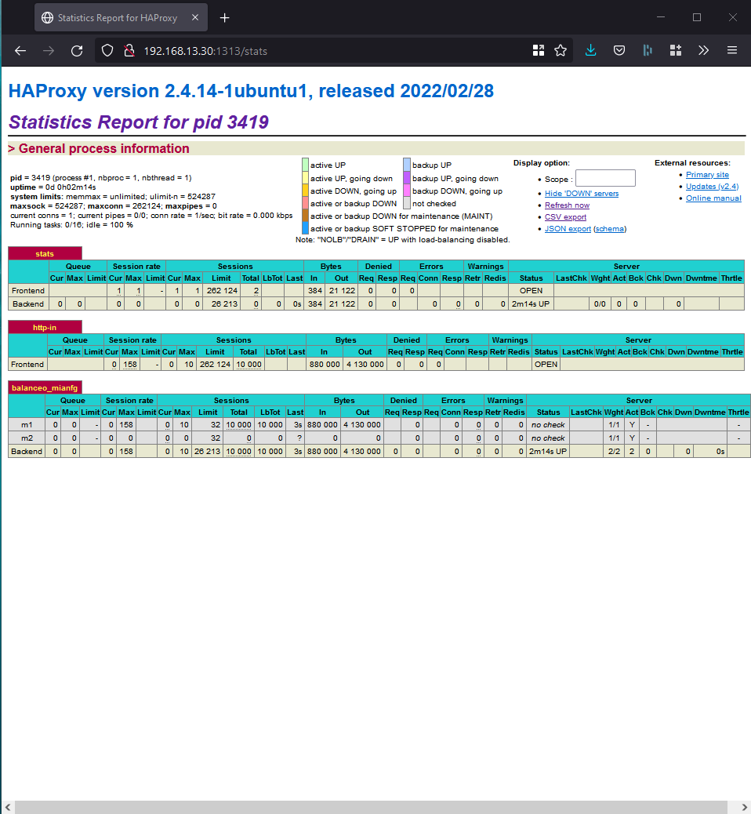

##### Marcar un servidor como `disabled`

Vamos a realizar un experimento adicional: marcaremos un servidor como `disabled` (desactivaremos SWAP1, `m1`) **junto a** IP hashing. Vemos que el hashing se realiza entre las máquinas que están activas, dado que todas las peticiones van dirigidas al único servidor disponible. Además, vemos cómo la interfaz nos aclara que el servidor se encuentra en mantenimiento, tanto en la columna **Status** como coloreando la fila correspondiente.

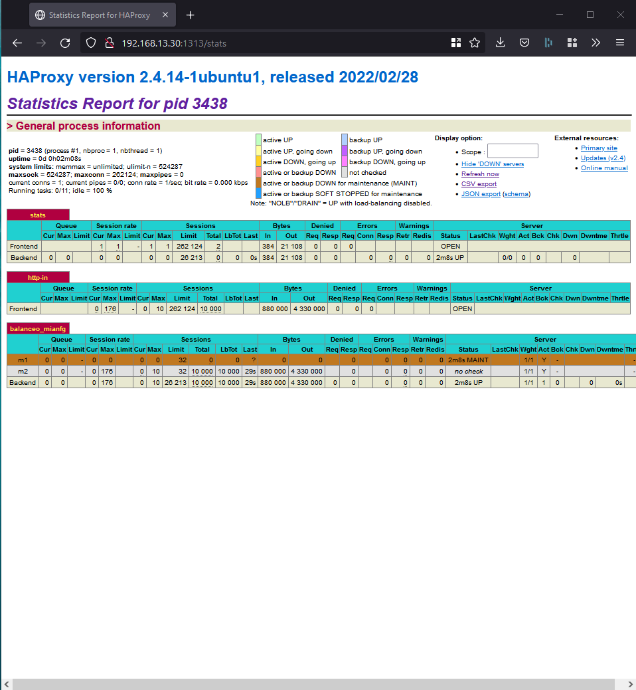

#### Configuración avanzada

Podemos introducir más parámetros en `/etc/haproxy/haproxy.cfg` para modificar las funcionalidades de la interfaz de estadísticas. Sea la configuración:

```
# ...

listen stats
    bind *:1313
    mode http
    stats enable
    stats uri /stats
    stats realm HAProxy\ Statistics
    stats auth mianfg:password
    stats hide-version
    stats refresh 5
    stats show-desc HAProxy Statistics for SWAP load balancer
    stats show-legends
    stats timeout 30

# ...
```


Incluimos las siguientes líneas:

* `stats hide-version`: oculta la versión de HAProxy en el report.
* `stats refresh 5`: actualiza automáticamente la página de estadísticas cada 5 segundos.
* `stats show-desc HAProxy Statistics for SWAP load balancer`: incluye una descripción.
* `stats show-legends`: añade información adicional al report.
* `stats timeout 30`: añade un timeout de 30 segundos.

Podemos ver a continuación cómo cambia el aspecto de las estadísticas tras aplicar estas configuraciones.

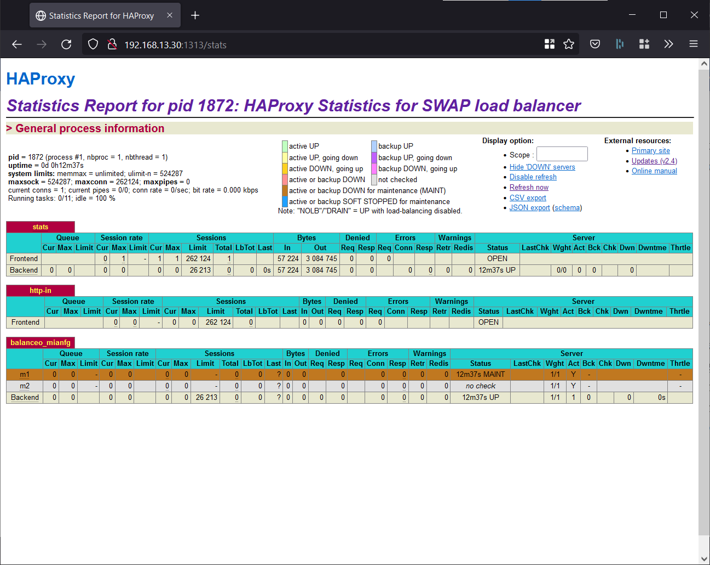

### gobetween

> En este apartado:
>
> * Configuración de un balanceador de carga con gobetween
> * Tipos de balanceo: round-robin, round-robin con ponderación, hash IP, marcar un servidor en _down_ (sin balanceo), keepalive timeout

En primer lugar, desactivamos HAProxy, como hicimos con Nginx.


```
mianfg@m3-mianfg$ sudo service haproxy stop
mianfg@m3-mianfg$ sudo systemctl disable haproxy
```

A continuación, procedemos con la instalación de gobetween, ejecutando los siguientes comandos:

```
mianfg@m3-mianfg:~$ mkdir gobetween
mianfg@m3-mianfg:~$ cd gobetween
mianfg@m3-mianfg:~/gobetween$ curl -s https://api.github.com/repos/yyyar/gobetween/releases | grep browser_download_url | grep linux_amd64 | cut -d '"' -f 4 | head -n 1 | wget -i -
mianfg@m3-mianfg:~/gobetween$ tar -zxvf *.tar.gz
```

Ahora vamos a modificar la configuración:

```
mianfg@m3-mianfg:~/gobetween$ nano config/gobetween.toml
```

Modificamos `metrics` y ponemos el valor a `true`.

```toml
# ...
[metrics]
enabled = true # false | true
bind = ":9284"  # "host:port"
# ...
```

Y configuramos los servidores a balancear. Eliminamos `[servers.tcpsample]` y `[servers.udpsample]` e insertamos la configuración necesaria:

```toml
# ...

[servers]

[servers.balanceo_mianfg]
bind = "192.168.13.30:80"
protocol = "tcp"
# balance = "weight"

    [servers.balanceo_mianfg.discovery]
    kind = "static"
    static_list = [
        "192.168.13.10:80",
        "192.168.13.20:80"
    ]

# ...
```


Esta configuración, de acuerdo a la documentación de gobetween, usa el tipo de balancing `weight` (podemos colocar `balance = "weight"` en `[servers.balanceo_mianfg]`, como hemos especificado al comentar tal línea), que hace que se sirva contenido de forma aleatoria por cada servidor, ponderando las probabilidades de acuerdo a los pesos de cada servidor (por defecto, son 1 ambos). En este caso, tenemos un 50% de probabilidades de que la petición la devuelva SWAP1 y la misma probabilidad de que lo haga SWAP2.

Con esto tenemos la configuración básica. A continuación, ejecutamos el comando:

```
mianfg@m3-mianfg:~/gobetween$ sudo ./gobetween -c config/gobetween.toml
```

Que ejecuta gobetween. Vemos cómo, en efecto, el balanceador se ha iniciado.

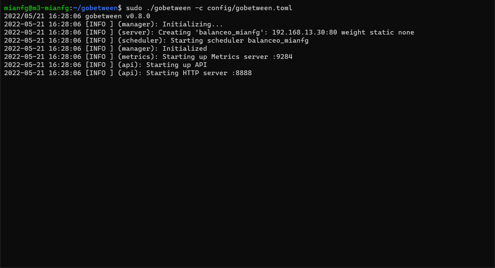

Haciendo `curl` podremos ver cómo la máquina está balanceando carga. Si salimos del comando (`Ctrl + C`), pararemos gobetween. En cada uno de los siguientes apartados, especificamos cómo modificar la configuración para balancear carga de cada forma. Una vez que modificamos `gobetween.toml`, basta volver a ejecutar el comando anterior para probarlo.

#### Round-robin

```toml
# ...

[servers]

[servers.balanceo_mianfg]
bind = "192.168.13.30:80"
protocol = "tcp"
balance = "roundrobin"

    [servers.balanceo_mianfg.discovery]
    kind = "static"
    static_list = [
        "192.168.13.10:80",
        "192.168.13.20:80"
    ]

# ...
```

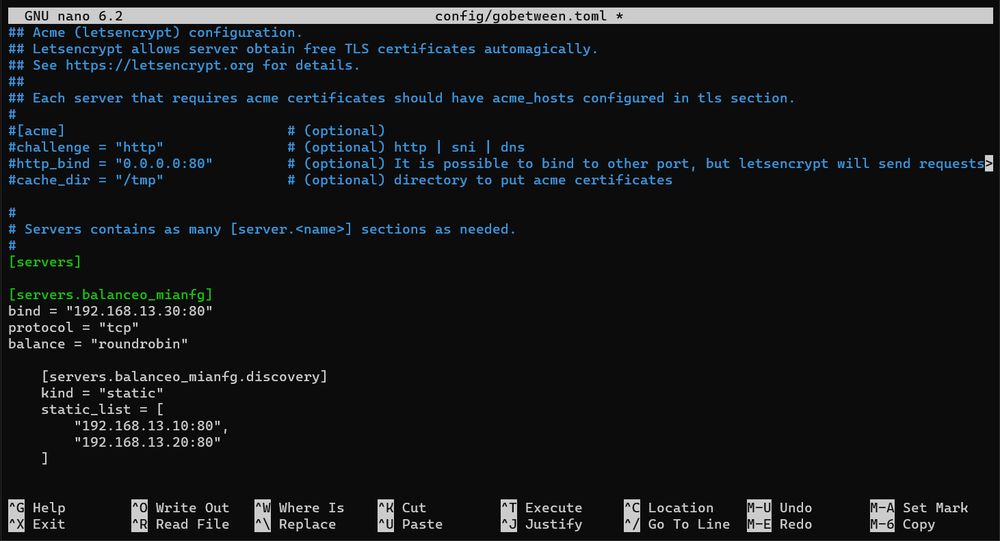

#### Round-robin con ponderación

```toml
# ...

[servers]

[servers.balanceo_mianfg]
bind = "192.168.13.30:80"
protocol = "tcp"
balance = "roundrobin"

    [servers.balanceo_mianfg.discovery]
    kind = "static"
    static_list = [
        "192.168.13.10:80 weight=1",
        "192.168.13.20:80 weight=2"
    ]

# ...
```

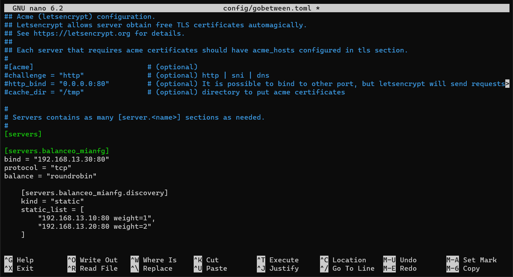

#### IP hashing

```toml
# ...

[servers]

[servers.balanceo_mianfg]
bind = "192.168.13.30:80"
protocol = "tcp"
balance = "iphash1"

    [servers.balanceo_mianfg.discovery]
    kind = "static"
    static_list = [
        "192.168.13.10:80",
        "192.168.13.20:80"
    ]

# ...
```

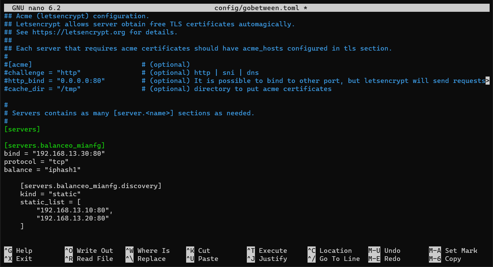

#### Keepalive timeout

```toml
# ...

[servers]

[servers.balanceo_mianfg]
bind = "192.168.13.30:80"
protocol = "tcp"
balance = "iphash1"

    [servers.balanceo_mianfg.discovery]
    kind = "static"
    timeout = "6s"
    static_list = [
        "192.168.13.10:80",
        "192.168.13.20:80"
    ]

# ...
```

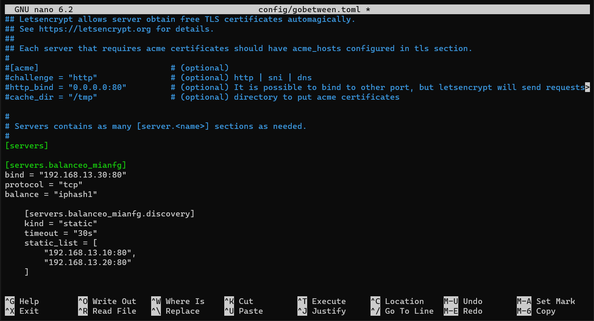

#### Marcar servidor como _down_

No he encontrado en la documentación de gobetween nada parecido. Probé primero con poner `weight=0`, pero conseguí el efecto contarrio (hacía que todas las peticiones se dirigiesen a tal servidor). Por tanto, pensé en sencillamente comentar el servidor que queramos poner en mantenimiento.

```toml
# ...

[servers]

[servers.balanceo_mianfg]
bind = "192.168.13.30:80"
protocol = "tcp"

    [servers.balanceo_mianfg.discovery]
    kind = "static"
    timeout = "6s"
    static_list = [
        "192.168.13.10:80",
        # "192.168.13.20:80"
    ]

# ...
```

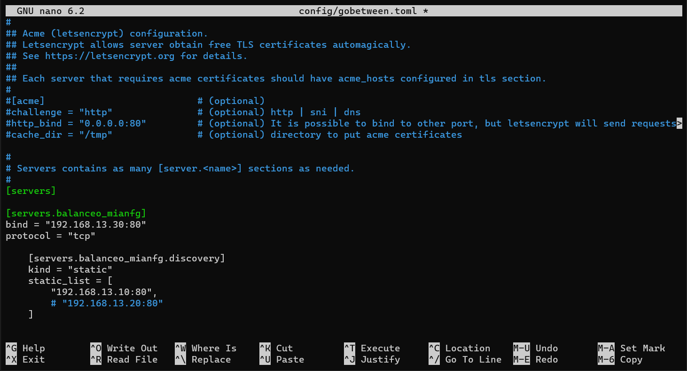

### Zevenet

> En este apartado:
>
> * Configuración de un balanceador de carga con Zevenet
> * Tipos de balanceo: round-robin, round-robin con ponderación, hash IP, marcar un servidor en _down_ (sin balanceo), keepalive timeout

Vamos a instalar Zevenet. Para ello, usaremos la distribución ISO proporcionada y la instalaremos en una nueva máquina virtual (de tipo Debian 64-bit y con los mismos adaptadores de red con igual configuración que las otras VM), que llamaremos SWAP3zev, con la siguiente configuración de red:

| Nombre de VM | SWAP3zev |
| --- | --- |
| Hostname | `m3zev-mianfg` |
| IP `eth0` (NAT) | 192.168.0.51/24 |
| IP `eth1` (Host-Only) | 192.168.13.31/24 |
| Nombre usuario | `mianfg` |
| Contraseña | `Swap1234` |

Configuraremos `eth0` en la instalación de Zevenet, especificando la IP de la interfaz y `192.168.0.1` como default gateway y nameserver. Una vez se haya instalado, podremos entrar en el SO:

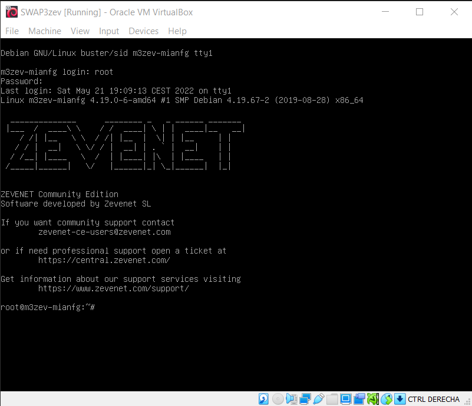

Una vez que se haya instalado, procederemos a incorporar la configuración de `eth1` mediante `netplan` (análogo a la primera práctica). Vemos la configuración ya aplicada:

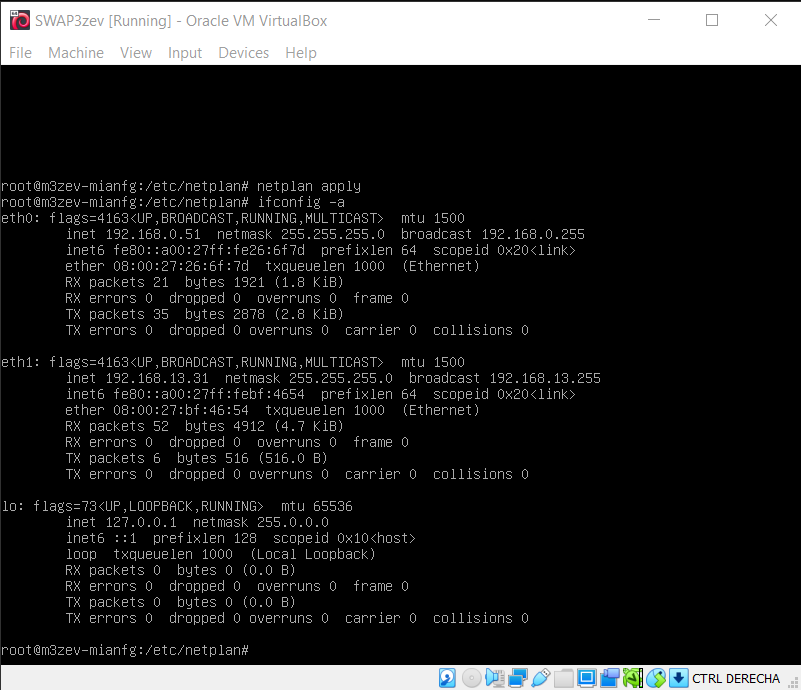

Una vez hecho esto, iniciamos sesión al panel de control de Zevenet, ingresando en la URL `https://192.168.13.31:444/`. Usaremos las credenciales de `root` de la VM.

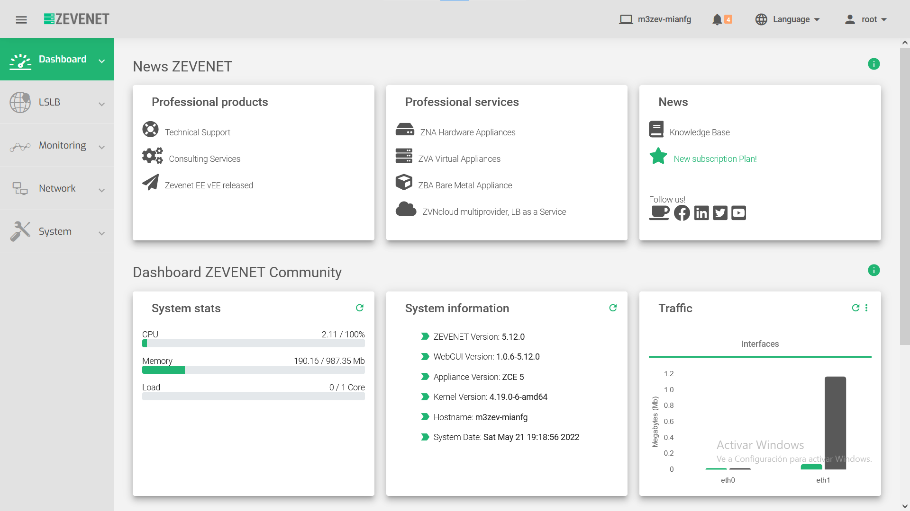

Ajustamos la configuración de red para que Zevenet tenga `eth1` bien configurado. Entramos en _Network > NIC_ y editamos _eth1_, insertando la información de red y pulsando en _Apply_.

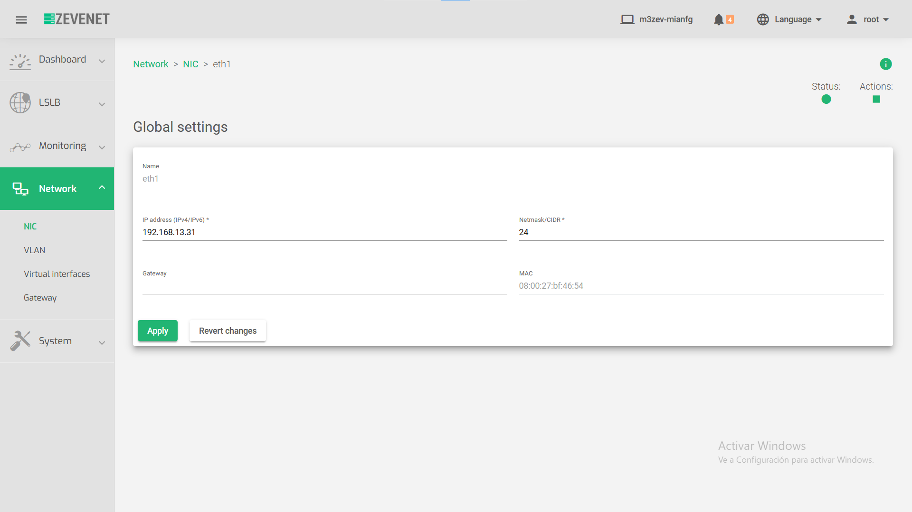

Procederemos a continuación a configurar el balanceador. Lo haremos a través de _LSLB > Farms > Create farm_.

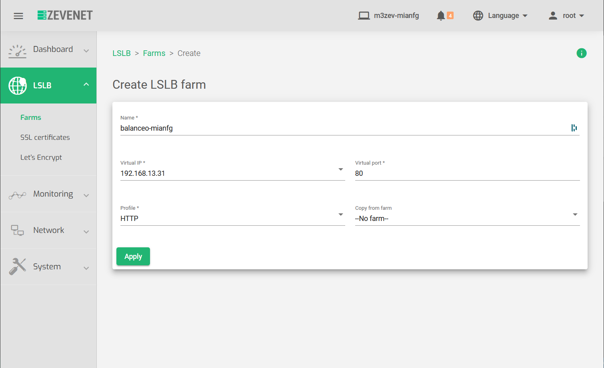

Luego, vamos a la pestaña _Services_, y creamos un nuevo servicio, que llamaremos _balanceador_. Pulsamos en él y nos vamos a la sección _Backends_, donde insertaremos los servidores que vamos a balancear (SWAP1 y SWAP2). Vemos que, al insertarlos, nos aparecen opciones ya conocidas (_timeout, weight, ..._).

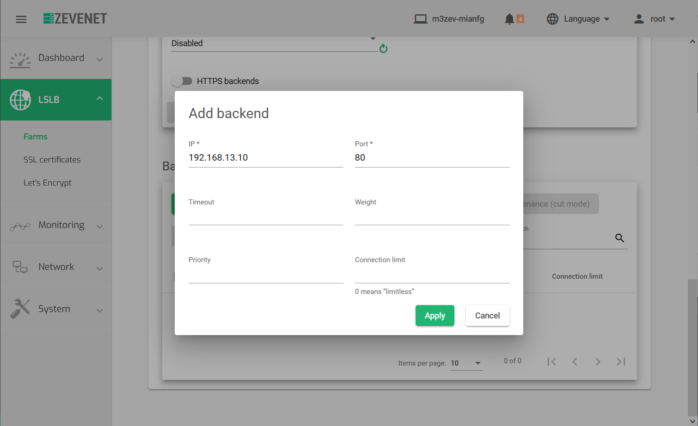

Por ahora, dejamos todas estas opciones en blanco y nos limitamos a añadir los servidores. El resultado será parecido al siguiente:


Si hacemos `curl` a `http://192.168.13.31/swap`, veremos cómo el balanceador está funcionando.

Veremos cómo realizar las configuraciones que queremos. Todas ellas se hacen a través del panel del servicio que justo hemos creado.

#### Round-robin

El algoritmo por defecto de Zevenet es round-robin, que es justo lo que hemos configurado.

#### Round-robin con ponderación

Basta añadir el parámetro _Weight_ a cada _backend_. Quedaría algo así:

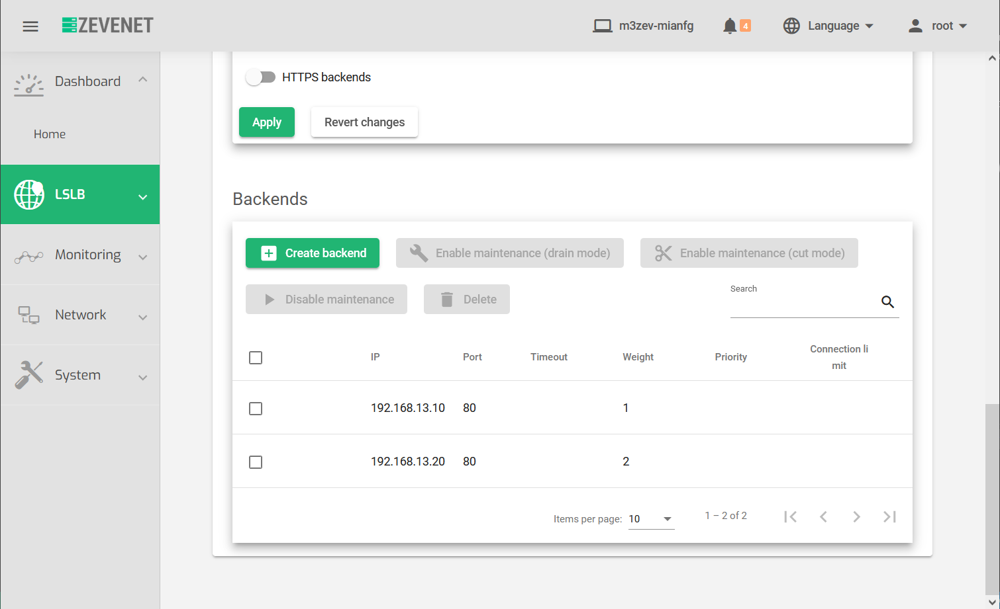

#### IP hashing

En el panel no aparece una forma de modificar el algoritmo, pero podemos implementar persistencia mediante la sección _Persistence_. Implementando persistencia por IP, obtendremos un resultado similar al IP hashing.

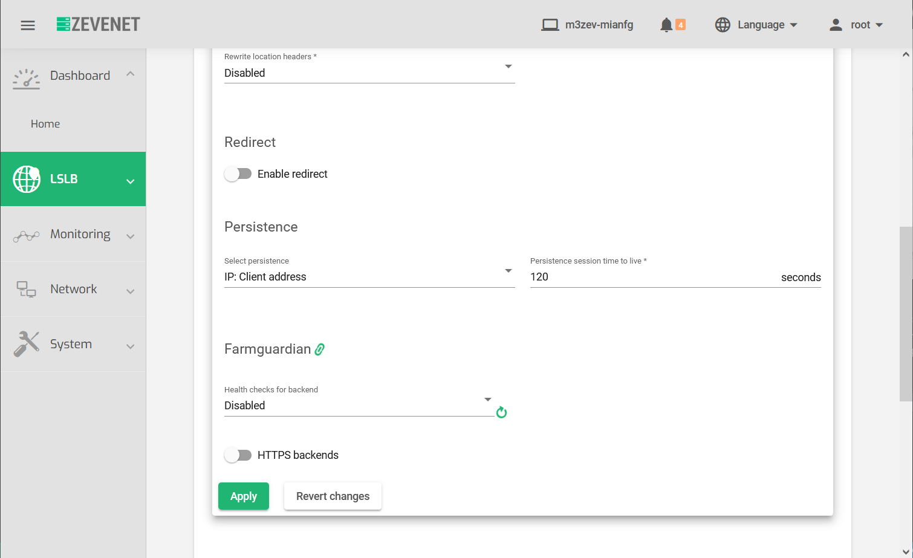

#### Keepalive timeout

Añadimos el parámetro _Timeout_ a cada _backend_, en segundos.


#### Marcar servidor como _down_

Podemos marcar el servidor como _down_ mediante el modo mantenimiento (_Enable maintenance_). Hay dos modos disponibles:

* ***Drain mode.*** Mantiene las conexiones establecidas (si se ha habilitado persistencia), pero no admite conexiones nuevas.
* ***Cut mode.*** Directamente corta todas las conexiones.

Usaremos el modo _cut_ para desactivar SWAP2.

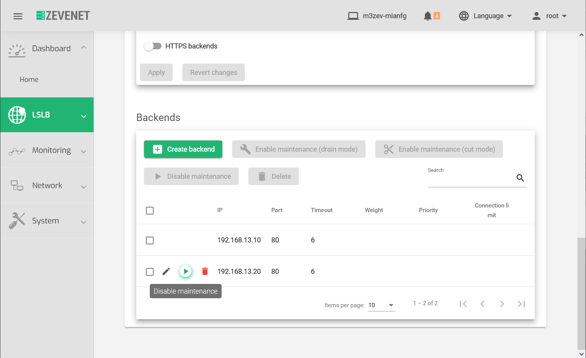

### Pound

> En este apartado:
>
> * Configuración de un balanceador de carga con Pound
> * Tipos de balanceo: configuración por defecto, añadir más _threads_, marcar un servidor como _down_

Finalmente, instalaremos Pound. Dado que gobetween se desactivaba al parar el comando (no tenemos ningún balanceador activo en SWAP3), procederemos directamente a la instalación.

Basta con usar `apt-get`:

```
mianfg@m3-mianfg$ sudo apt-get install -y pound
```

Ahora insertamos la siguiente configuración en `/etc/pound/pound.yaml`.

```yaml
Global:
  User:         "root"
  Group:        "root"
  #RootJail     "/chroot/pound"

Backends:
  - &swap1
    Address: 192.168.13.10
    Port: 80
  - &swap2
    Address: 192.168.13.20
    Port: 80

# This section must exist, but may be empty.
HTTPListeners:
  - Address: 192.168.13.30
    Port: 80
    Services:
      - Backends:
        - *swap1
        - *swap2

# This section must exist, but may be empty.
HTTPSListeners:

```

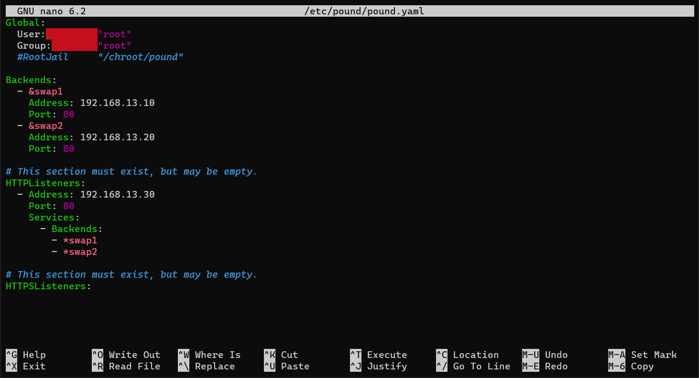

> Nótese que he modificado el usuario y grupo a `root`. Lo he hecho dado que si no lo hacía no podía establecer la conexión en el puerto 80.

Cada vez que cambiemos la configuración basta reiniciar el servicio:

```
mianfg@m3-mianfg$ sudo service pound restart
```

En la documentación de `pound` (`man pound`) no he logrado encontrar mucha información sobre los algoritmos que utiliza. Así que vamos a remitirnos a insertar las configuraciones que he visto en el manual.

### Configuración por defecto

Al hacer `curl`, parece ser que Pound no realiza round-robin, ya que la forma en la que se devuelven las peticiones es un tanto aleatoria, y no cíclica.

### Modificar número de _threads_

Por defecto, el número de _threads_ reservado a cada _backend_ es de 8. Vamos a duplicar el número de _threads_ de SWAP2, lo cual hará que se establezcan el doble de conexiones con tal servidor. Modificamos el `yaml`:

```yaml
Global:
  User:         "root"
  Group:        "root"
  #RootJail     "/chroot/pound"

Backends:
  - &swap1
    Address: 192.168.13.10
    Port: 80
    Threads: 16
  - &swap2
    Address: 192.168.13.20
    Port: 80
    Threads: 24

# This section must exist, but may be empty.
HTTPListeners:
  - Address: 192.168.13.30
    Port: 80
    Threads: 40
    Services:
      - Backends:
        - *swap1
        - *swap2

# This section must exist, but may be empty.
HTTPSListeners:

```

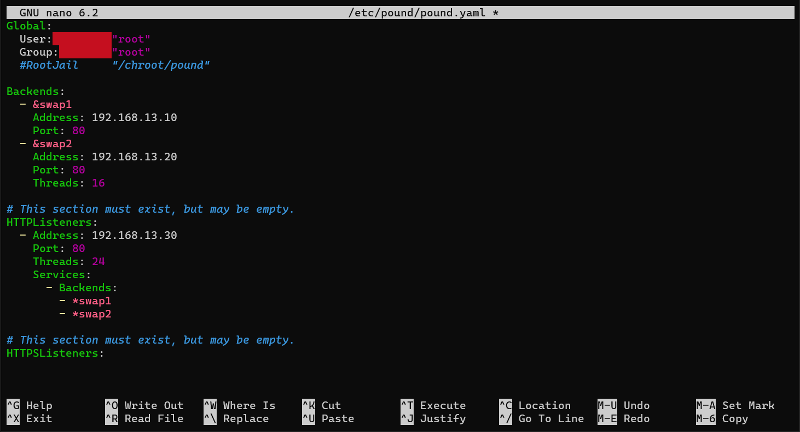

### Marcar un servidor como _down_

Haremos el mismo "truco" que con gobetween, y simplemente comentaremos a SWAP2 en `HTTPListeners`, para que siempre responda SWAP1 (supongamos que SWAP2 está en mantenimiento).

```yaml
Global:
  User:         "root"
  Group:        "root"
  #RootJail     "/chroot/pound"

Backends:
  - &swap1
    Address: 192.168.13.10
    Port: 80
  - &swap2
    Address: 192.168.13.20
    Port: 80

# This section must exist, but may be empty.
HTTPListeners:
  - Address: 192.168.13.30
    Port: 80
    Services:
      - Backends:
        - *swap1
        # - *swap2

```

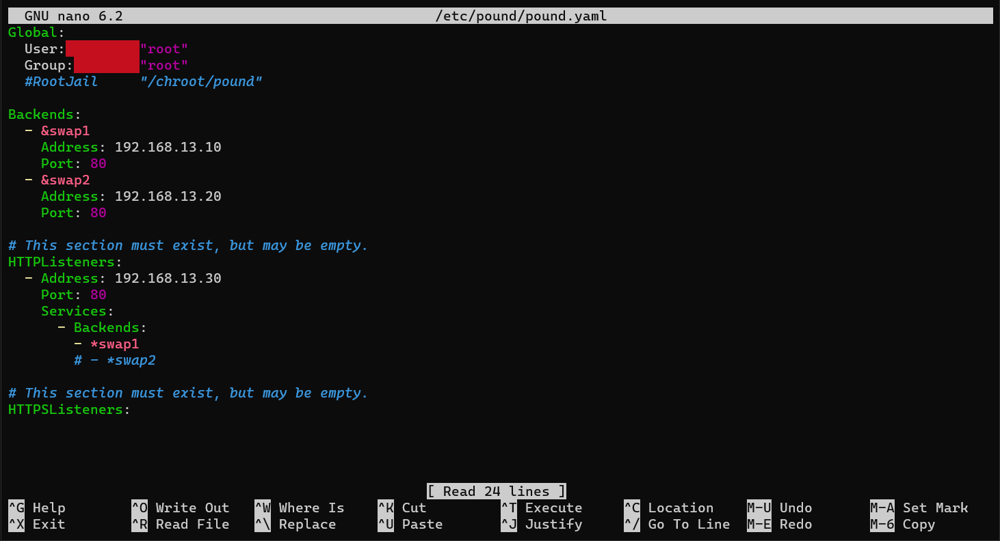

## Carga a la granja web con `ab`

En este apartado, usaremos Apache Benchmark para someter a SWAP3 a carga, y ver lo que tarda en responder a nuestras peticiones. De esta forma, podremos valorar el rendimiento de los distintos balanceadores que hemos configurado.

> Realizamos las peticiones desde `mianfg-msi`, el _host_. En nuestro caso, usamos WSL (Windows Subsystem for Linux), dado que es el que nos permite usar `ab` de la forma más rápida y práctica.

Ejecutaremos el siguiente script de bash por cada configuración (lo guardamos en `abtest.sh`):

```sh
#!/bin/bash
ITERS=3
SLEEP=60

for i in $(seq 1 $ITERS)
do
        echo "Executing iteration ${i} of ${ITERS}..."
        ab -n 10000 -c 10 -g g_${i}.csv -e e_${i}.csv http://192.168.13.30/swap 2>&1 | tee output_${i}
        echo "Sleeping for ${SLEEP} seconds..."
        sleep $SLEEP
done
```

Lo que estamos haciendo es ejecutar el comando:

```
ab -n 10000 -c 10 -g <graphics_file> -e <percentages_file>
```

y guardar la salida tanto estándar como de error en un archivo `output`. Veamos qué significa cada opción:

* `-n 10000` indica que se realizarán 10000 peticiones.
* `-c 10` indica que se harán 10 peticiones a la misma vez.
* `-g <graphics_file>` guarda los resultados en un archivo para `gnuplot`.
* `-e <percentages_file>` guarda en un archivo, por cada porcentaje (de 1% a 100%) el tiempo (en milisegundos) que tardó el servidor en responder a ese porcentaje de las peticiones.

Realizamos `ITERS=3` iteraciones para poder hacer las medias, y esperamos `SLEEP=60` segundos entre iteración e iteración, para que los servidores dejen de estar sobrecargados.

> **Nota:** para Zevenet debemos modificar el script para que haga el benchmark contra `http://192.168.13.31`.

Conseguí que funcionasen todos los benchmark excepto los de Pound, que con `curl` funcionan perfectamente pero no soporta `ab`, en ninguna de las configuraciones. En todas ellas devolvía el error:

```
Benchmarking 192.168.13.30 (be patient)
apr_socket_recv: Connection refused (111)
```

Al aumentar el timeout obteníamos otro error:

```
Benchmarking 192.168.13.30 (be patient)
apr_socket_recv: Connection reset by peer (104)
```

Podemos encontrar una explicación a este error en [este enlace](https://es.stackoverflow.com/questions/1531/significado-de-error-connection-reset-by-peer-en-conexi%C3%B3n-tcp).

Por tanto, realizaremos las comparaciones sin tener en cuenta a Pound.

### Datos obtenidos

##### **Tabla 1.** Todos los intentos

| Balanceador | Tipo                  | Intento | Requests per second [#/sec] (mean) | Time per request [ms] (mean) | Time per request [ms] (mean, cr*) | Transfer rate [Kbytes/sec] received |
|-------------|-----------------------|---------|------------------------------------|------------------------------|-----------------------------------|-------------------------------------|
| Nginx       | Round-robin           | 1       | 186,45                             | 53,635                       | 5,363                             | 78,29                               |
| Nginx       | Round-robin           | 2       | 212,14                             | 47,140                       | 4,714                             | 89,08                               |
| Nginx       | Round-robin           | 3       | 192,48                             | 51,952                       | 5,195                             | 80,83                               |
| Nginx       | Round-robin           | Media   | 197,02                             | 50,909                       | 5,091                             | 82,73                               |
| Nginx       | Round-robin con pesos | 1       | 221,88                             | 45,070                       | 4,507                             | 93,89                               |
| Nginx       | Round-robin con pesos | 2       | 200,41                             | 49,889                       | 4,990                             | 84,81                               |
| Nginx       | Round-robin con pesos | 3       | 196,23                             | 50,961                       | 5,096                             | 83,04                               |
| Nginx       | Round-robin con pesos | Media   | 206,17                             | 48,640                       | 4,864                             | 87,25                               |
| Nginx       | IP hashing            | 1       | 200,49                             | 49,878                       | 4,988                             | 82,23                               |
| Nginx       | IP hashing            | 2       | 199,86                             | 50,035                       | 5,003                             | 81,97                               |
| Nginx       | IP hashing            | 3       | 207,88                             | 48,106                       | 4,811                             | 85,26                               |
| Nginx       | IP hashing            | Media   | 202,74                             | 49,340                       | 4,934                             | 83,15                               |
| Nginx       | SWAP2 down            | 1       | 189,10                             | 52,882                       | 5,288                             | 77,56                               |
| Nginx       | SWAP2 down            | 2       | 197,35                             | 50,671                       | 5,067                             | 80,94                               |
| Nginx       | SWAP2 down            | 3       | 195,33                             | 51,197                       | 5,120                             | 80,11                               |
| Nginx       | SWAP2 down            | Media   | 193,93                             | 51,583                       | 5,158                             | 79,54                               |
| HAProxy     | Round-robin           | 1       | 178,28                             | 56,092                       | 5,609                             | 80,61                               |
| HAProxy     | Round-robin           | 2       | 175,43                             | 57,003                       | 5,700                             | 79,32                               |
| HAProxy     | Round-robin           | 3       | 163,75                             | 61,068                       | 6,107                             | 74,04                               |
| HAProxy     | Round-robin           | Media   | 172,49                             | 58,054                       | 5,805                             | 77,99                               |
| HAProxy     | Round-robin con pesos | 1       | 171,01                             | 58,476                       | 5,848                             | 77,88                               |
| HAProxy     | Round-robin con pesos | 2       | 146,01                             | 68,486                       | 6,849                             | 66,50                               |
| HAProxy     | Round-robin con pesos | 3       | 141,44                             | 70,702                       | 7,070                             | 64,41                               |
| HAProxy     | Round-robin con pesos | Media   | 152,82                             | 65,888                       | 6,589                             | 69,60                               |
| HAProxy     | IP hashing            | 1       | 172,84                             | 57,856                       | 5,786                             | 76,46                               |
| HAProxy     | IP hashing            | 2       | 167,19                             | 59,813                       | 5,981                             | 73,96                               |
| HAProxy     | IP hashing            | 3       | 169,79                             | 58,897                       | 5,890                             | 75,11                               |
| HAProxy     | IP hashing            | Media   | 169,94                             | 58,855                       | 5,886                             | 75,18                               |
| HAProxy     | SWAP2 down            | 1       | 170,39                             | 58,691                       | 5,869                             | 75,38                               |
| HAProxy     | SWAP2 down            | 2       | 168,80                             | 59,242                       | 5,924                             | 74,67                               |
| HAProxy     | SWAP2 down            | 3       | 168,10                             | 59,489                       | 5,949                             | 74,36                               |
| HAProxy     | SWAP2 down            | Media   | 169,10                             | 59,141                       | 5,914                             | 74,80                               |
| gobetween   | Round-robin           | 1       | 171,99                             | 58,142                       | 5,814                             | 72,39                               |
| gobetween   | Round-robin           | 2       | 180,25                             | 55,478                       | 5,548                             | 75,87                               |
| gobetween   | Round-robin           | 3       | 178,42                             | 56,048                       | 5,605                             | 75,10                               |
| gobetween   | Round-robin           | Media   | 176,89                             | 56,556                       | 5,656                             | 74,45                               |
| gobetween   | Round-robin con pesos | 1       | 171,55                             | 58,294                       | 5,829                             | 72,20                               |
| gobetween   | Round-robin con pesos | 2       | 168,58                             | 59,320                       | 5,932                             | 70,95                               |
| gobetween   | Round-robin con pesos | 3       | 180,08                             | 55,530                       | 5,553                             | 75,80                               |
| gobetween   | Round-robin con pesos | Media   | 173,40                             | 57,715                       | 5,771                             | 72,98                               |
| gobetween   | IP hashing            | 1       | 180,22                             | 55,488                       | 5,549                             | 77,61                               |
| gobetween   | IP hashing            | 2       | 172,73                             | 57,893                       | 5,789                             | 74,39                               |
| gobetween   | IP hashing            | 3       | 175,21                             | 57,074                       | 5,707                             | 75,46                               |
| gobetween   | IP hashing            | Media   | 176,05                             | 56,818                       | 5,682                             | 75,82                               |
| gobetween   | SWAP2 down            | 1       | 174,43                             | 57,330                       | 5,733                             | 71,71                               |
| gobetween   | SWAP2 down            | 2       | 176,64                             | 56,579                       | 5,658                             | 72,67                               |
| gobetween   | SWAP2 down            | 3       | 181,74                             | 55,023                       | 5,502                             | 74,72                               |
| gobetween   | SWAP2 down            | Media   | 177,60                             | 56,311                       | 5,631                             | 73,03                               |
| Zevenet     | Round-robin           | 1       | 390,75                             | 25,592                       | 2,559                             | 164,47                              |
| Zevenet     | Round-robin           | 2       | **                                 | **                           | **                                | **                                  |
| Zevenet     | Round-robin           | 3       | 390,41                             | 25,614                       | 2,561                             | 164,32                              |
| Zevenet     | Round-robin           | Media   | 390,58                             | 25,603                       | 2,560                             | 164,40                              |
| Zevenet     | Round-robin con pesos | 1       | 415,48                             | 25,069                       | 2,407                             | 176,23                              |
| Zevenet     | Round-robin con pesos | 2       | **                                 | **                           | **                                | **                                  |
| Zevenet     | Round-robin con pesos | 3       | 394,98                             | 25,318                       | 2,532                             | 167,53                              |
| Zevenet     | Round-robin con pesos | Media   | 405,23                             | 25,194                       | 2,470                             | 171,88                              |
| Zevenet     | Persistencia por IP   | 1       | 277,16                             | 36,081                       | 3,608                             | 119,36                              |
| Zevenet     | Persistencia por IP   | 2       | 184,69                             | 54,146                       | 5,415                             | 79,54                               |
| Zevenet     | Persistencia por IP   | 3       | 185,00                             | 54,053                       | 5,405                             | 79,67                               |
| Zevenet     | Persistencia por IP   | Media   | 215,62                             | 48,093                       | 4,809                             | 92,86                               |
| Zevenet     | SWAP2 down            | 1       | 321,72                             | 31,083                       | 3,108                             | 132,27                              |
| Zevenet     | SWAP2 down            | 2       | 168,26                             | 59,434                       | 5,943                             | 69,18                               |
| Zevenet     | SWAP2 down            | 3       | **                                 | **                           | **                                | **                                  |
| Zevenet     | SWAP2 down            | Media   | 244,99                             | 45,259                       | 4,526                             | 100,73                              |

\* across all concurrent requests

\*\* devolvió el error `apr_pollset_poll: The timeout specified has expired (70007)`; no se tiene en cuenta para media

##### **Tabla 2.** Sólo medias

| Balanceador | Tipo                  | Intento | Requests per second [#/sec] (mean) | Time per request [ms] (mean) | Time per request [ms] (mean, cr*) | Transfer rate [Kbytes/sec] received |
|-------------|-----------------------|---------|------------------------------------|------------------------------|-----------------------------------|-------------------------------------|
| Nginx       | Round-robin           | Media   | 197,02                             | 50,909                       | 5,091                             | 82,73                               |
| Nginx       | Round-robin con pesos | Media   | 206,17                             | 48,640                       | 4,864                             | 87,25                               |
| Nginx       | IP hashing            | Media   | 202,74                             | 49,340                       | 4,934                             | 83,15                               |
| Nginx       | SWAP2 down            | Media   | 193,93                             | 51,583                       | 5,158                             | 79,54                               |
| HAProxy     | Round-robin           | Media   | 172,49                             | 58,054                       | 5,805                             | 77,99                               |
| HAProxy     | Round-robin con pesos | Media   | 152,82                             | 65,888                       | 6,589                             | 69,60                               |
| HAProxy     | IP hashing            | Media   | 169,94                             | 58,855                       | 5,886                             | 75,18                               |
| HAProxy     | SWAP2 down            | Media   | 169,10                             | 59,141                       | 5,914                             | 74,80                               |
| gobetween   | Round-robin           | Media   | 176,89                             | 56,556                       | 5,656                             | 74,45                               |
| gobetween   | Round-robin con pesos | Media   | 173,40                             | 57,715                       | 5,771                             | 72,98                               |
| gobetween   | IP hashing            | Media   | 176,05                             | 56,818                       | 5,682                             | 75,82                               |
| gobetween   | SWAP2 down            | Media   | 177,60                             | 56,311                       | 5,631                             | 73,03                               |
| Zevenet     | Round-robin           | Media   | 390,58                             | 25,603                       | 2,560                             | 164,40                              |
| Zevenet     | Round-robin con pesos | Media   | 405,23                             | 25,194                       | 2,470                             | 171,88                              |
| Zevenet     | Persistencia por IP   | Media   | 215,62                             | 48,093                       | 4,809                             | 92,86                               |
| Zevenet     | SWAP2 down            | Media   | 244,99                             | 45,259                       | 4,526                             | 100,73                              |

##### **Gráfica 1.** Comparación de respuestas por segundo (RPS)

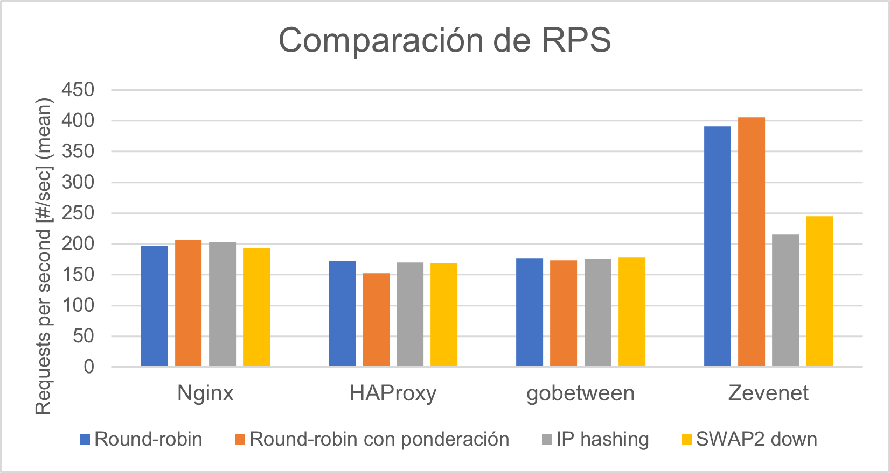

##### **Gráfica 2.** Tiempo de respuesta por porcentaje de requests (TRPR), round-robin

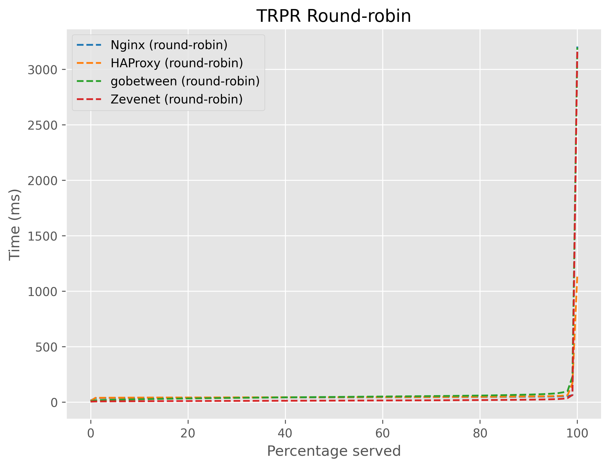

##### **Gráfica 3.** TRPR, Nginx

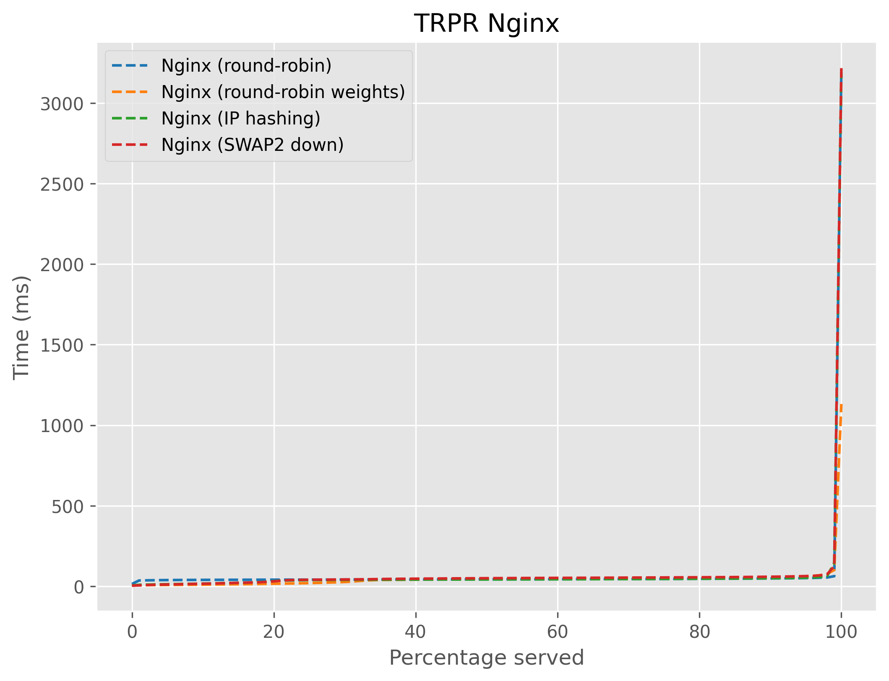

##### **Gráfica 4.** TRPR, HAProxy

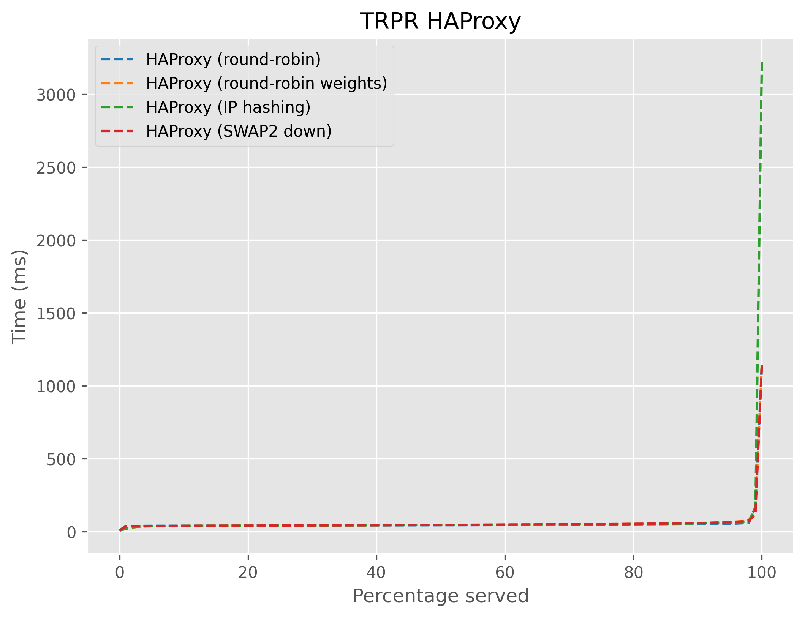

##### **Gráfica 5.** TRPR, gobetween

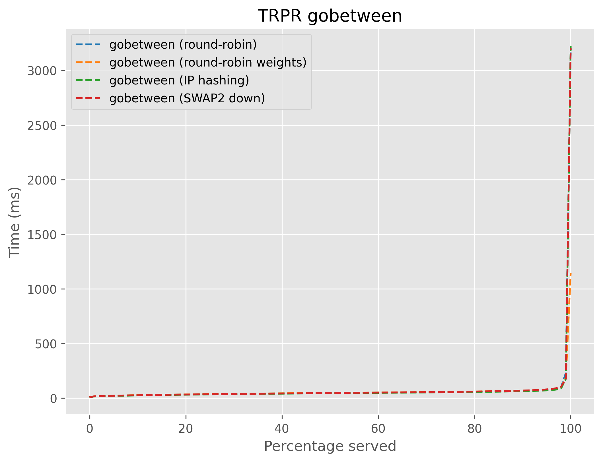

##### **Gráfica 6.** TRPR, zevenet

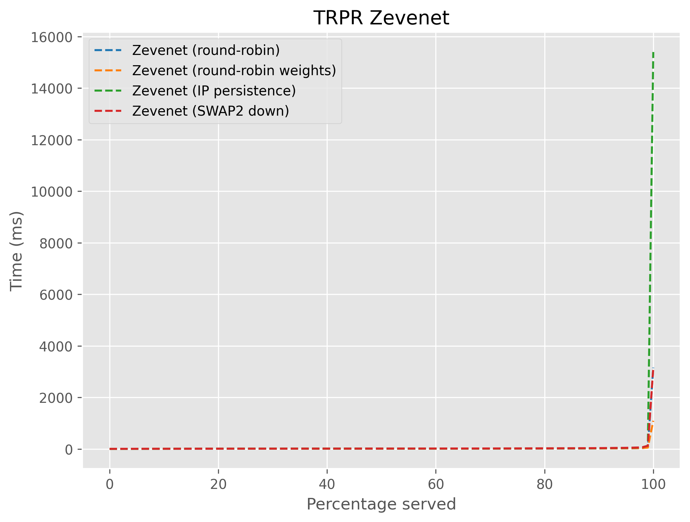

### Análisis de resultados

De las pruebas de `ab` podemos obtener las siguientes conclusiones:

* El mejor balanceador en cuanto a capacidad (peticiones por segundo) es Zevenet, de acuerdo con los resultados que muestra la **Tabla 1** y la **Tabla 2**, así como a la **Gráfica 1**, seguido (por lejos) de Nginx, y finalmente HAProxy y gobetween. Esto puede deberse a que Zevenet se encuentra alojada en su propia máquina virtual, teniendo un sistema operativo propio, por lo que posiblemente tal sistema esté optimizado para las funciones del balanceador de carga. El resto, sin embargo, corren sobre Ubuntu Sever, que ya de por sí ha de mantener muchos más servicios (aunque en nuestro caso no sean muchos).
* El balanceo de carga es útil y factible, como demuestran las gráficas por plataforma (**Gráficas 3-6**). En todas ellas vemos cómo las peticiones tardan más en completarse en los casos de IP hashing/IP persistence y SWAP2 down, dado que en estos casos no estamos realizando el balanceo de carga. La diferencia es notoria.
* En las diversas ejecuciones los resultados tienden a empeorar (ver **Tabla 1**), dado que el servidor tiene que recuperarse de una sobrecarga, pero esto es especialmente evidente en el caso de HAProxy, en el que en cada iteración se desciende capacidad (al contrario que el resto de plataformas).
* Los servidores más consistentes son Nginx y Zevenet, en el sentido de que el tiempo de respuesta no se altera especialmente (hasta llegar a los mayores porcentajes), como podemos ver en la **Gráfica 2**.
* En general, los resultados no son especialmente sorprendentes. El número de peticiones que se develve es bastante bajo, y esto puede ser debido a VirtualBox.

## Conclusiones

El balanceo de carga es una funcionalidad imprescindible hoy en día, especialmente para plataformas con una gran cantidad de peticiones. Un escueto análisis nos ha permitido ver qué plataformas son mejores, aunque dicho análisis posiblemente no sea muy fiable. Hemos también de tener en cuenta que las páginas que servimos ocupan muy poca memoria (son muy sencillas). Para obtener mejores resultados, deberíamos probar a balancear la carga de servicios que requieran más prestaciones (más archivos estáticos, páginas web más grandes, con peticiones que han de ejecutarse en el servidor, etc.).
