# Práctica 4. Asegurar la granja web

> Alumno: Miguel Ángel Fernández Gutiérrez

## Objetivos

En esta práctica, aseguraremos la granja web de dos maneras: primero, mediante la instalación
de un certificado SSL, y más adelante mediante la configuración de un cortafuegos.

Como siempre, recordamos la configuración de red de los diversos servidores.

| Nombre de VM | SWAP1 | SWAP2 | SWAP3 |
| --- | --- | --- | --- |
| Hostname | `m1-mianfg` | `m2-mianfg` | `m3-mianfg` |
| IP `enp0s3` (NAT) | 192.168.0.3/24 | 192.168.0.4/24 | 192.168.0.5/24 |
| IP `enp0s8` (Host-Only) | 192.168.13.10/24 | 192.168.13.20/24 | 192.168.13.30/24 |
| Nombre usuario | `mianfg` | `mianfg` | `mianfg` |
| Contraseña | `Swap1234` | `Swap1234` | `Swap1234` |

> Nota: ya no usaremos más la máquina SWAP3zev.

## Preliminares

Para comenzar esta práctica, activaremos el balanceador de carga Nginx, y desactivaremos el
resto de balanceadores que instalamos en la práctica anterior. La configuración que usaremos
es la básica (round-robin).

## Configuración de SSL

### Certificado autofirmado SSL

> En este apartado:
>
> * Creación de instalación de certificado autofirmado SSL
> * Creación especificando los valores en el comando
> * Creación usando un archivo de configuración de OpenSSL
> * Verificaciones: datos certificado, consistencia SSL, correspondencia entre certificado y clave

Vamos a generar el certificado mediante `openssl`. Desde SWAP1 ejecutamos el siguiente comando:

```
mianfg@m1-swap$ sudo openssl req -x509 -noenc -days 365 -newkey rsa:2048 -subj "/C=ES/ST=Granada/L=Granada/O=SWAP/OU=P4/CN=mianfg/emailAddress=mianfg@correo.ugr.es" -keyout ~/selfsigned_mianfg.key -out ~/selfsigned_mianfg.crt
```

Veamos qué significan cada una de las opciones del comando:

* `req` nos indica que administraremos una petición de firma de certificado (Certificate Signing Request, CSR) de tipo PKCS#10 X.509.
* `-x509` genera un certificado en lugar de una petición, lo cual normalmente se usa para generar certificados de prueba (como vamos a hacer ahora).
* `-noenc` (antes de OpenSSL 3.0, `-nodes`) hace que, al crear la clave privada, ésta no esté encriptada (bien para pruebas, pero no deberíamos hacer esto en entornos de producción).
* `-days 365` indica que el certificado será válido durante 365 días (por defecto son 30 días si no se especifica esta opción).
* `-newkey rsa:2048` genera una nueva clave privada RSA de 2048 bytes (que es el valor por defecto de RSA, sería equivalente a `-newkey rsa`). Hay otros algoritmos que podríamos usar, como `dsa`, `ec` o `gost2001`.
* `-keyout ~/selfsigned_mianfg.key` indica que la clave privada se escribirá en `~/selfsigned_mianfg.key`.
* `-out ~/selfsigned_mianfg.crt` indica que el certificado se escribirá en `~/selfsigned_mianfg.out`.
* `-subj` nos permite pasar las opciones del certificado. Las opciones se pasan de la forma `/type0=value0/type1=value1/type2=...`. Esto nos permite insertar las opciones inmediatamente, sin tener que escribirlas al ejecutar el comando. En la siguiente tabla aparece la correspondencia entre los _types_ y las opciones que aparecen en el asistente.

| Nombre en asistente | type | Valor proporcionado |
| --- | --- | --- |
| Country Name (2 letter code) | `/C` | ES |
| State or Province Name (full name) | `/ST` | Granada
| Locality Name (eg, city) | `/L` | Granada |
| Organization Name (eg, company) | `/O` | SWAP |
| Organizational Unit Name (eg, section) | `/OU` | P4 |
| Common Name (e.g. server FQDN or YOUR name) | `/CN` | mianfg |
| Email Address | `/emailAddress` | mianfg@correo.ugr.es |

Tenemos otra forma de generar el certificado, que es mediante un archivo de configuración, mediante el siguiente comando:

```
mianfg@m1-swap$ sudo openssl req -x509 -config ~/selfsigned_mianfg.conf -keyout ~/selfsigned_mianfg_conf.key -out ~/selfsigned_mianfg_conf.crt
```

Dicho archivo de configuración, que almacenaremos en `selfsigned_mianfg.conf`, es como sigue:

```toml
[req]
default_bits=2048
encrypt_key=no
days=365
distinguished_name=req_subj

[req_subj]
countryName="Country Name (2 letter code)"
stateOrProvinceName="State Name (full name)"
localityName="Locality Name (e.g., city)"
organizationName="Organization Name (e.g., company)"
organizationalUnitName="Organizational Unit Name (e.g., section)"
commonName="Fully Qualified Domain Name (FQDN)"
emailAddress="Administrative Email Address"

# modifica estos campos
countryName_default=ES
stateOrProvinceName_default=Granada
localityName_default=Granada
organizationName_default=SWAP
organizationalUnitName_default=P4
commonName_default=mianfg
emailAddress_default="mianfg@correo.ugr.es"
```

En este caso, será necesario pulsar Enter (dado que hemos establecido los valores por defecto) hasta que se genere el certificado.

Vamos a generar los certificados de ambas formas, para luego verificarlos con `openssl s_client`. Generaremos los certificados `selfsigned_mianfg` y `selfsigned_mianfg_conf`, que serán diferentes (luego eliminaremos `selfsigned_mianfg_conf` y usaremos `selfsigned_mianfg` de aquí en adelante):

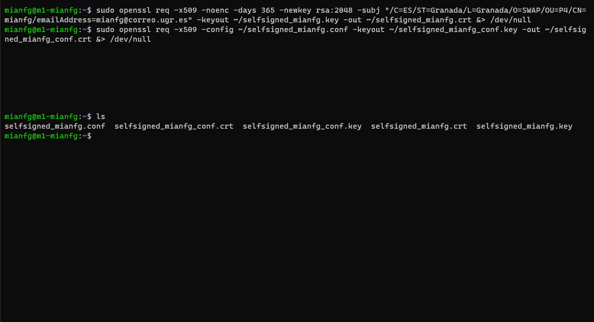

Ahora realizaremos diversas comprobaciones.

#### Ver datos del certificado

Podremos ver los datos del certificado con:

```
openssl x509 -in <certificado>.crt -text -noout
```

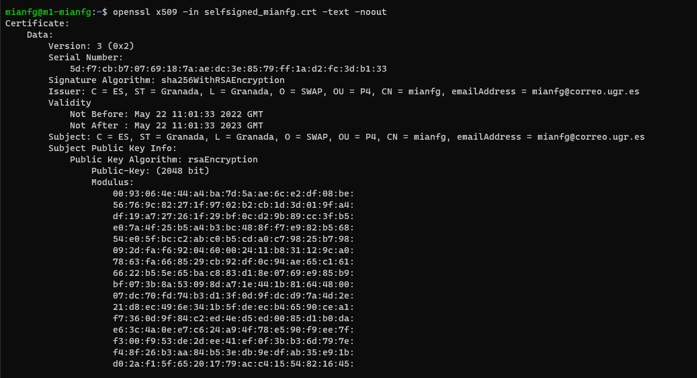
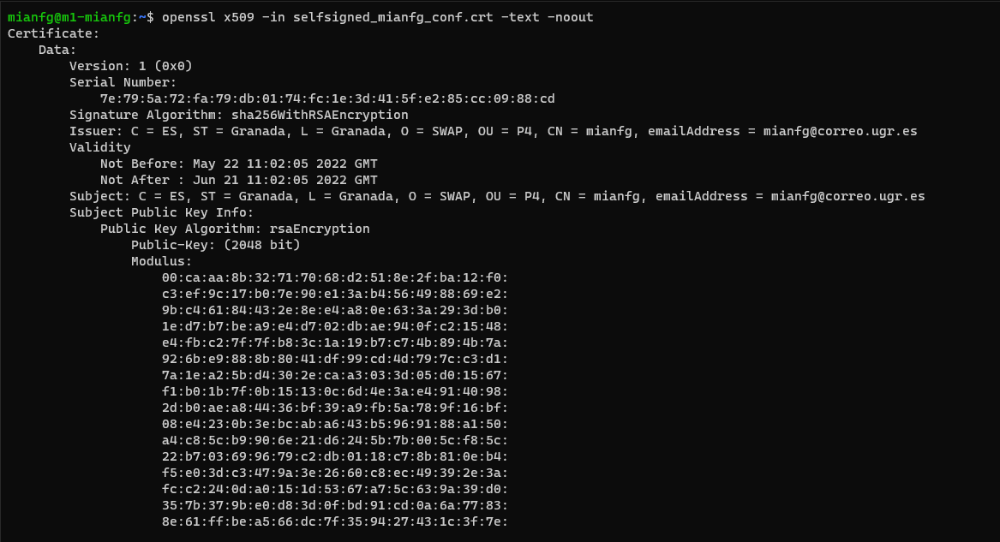

#### Verificar consistencia SSL

Para verificar la clave SSL y su consistencia hacemos:

```
sudo openssl rsa -in <certificado>.key -check
```

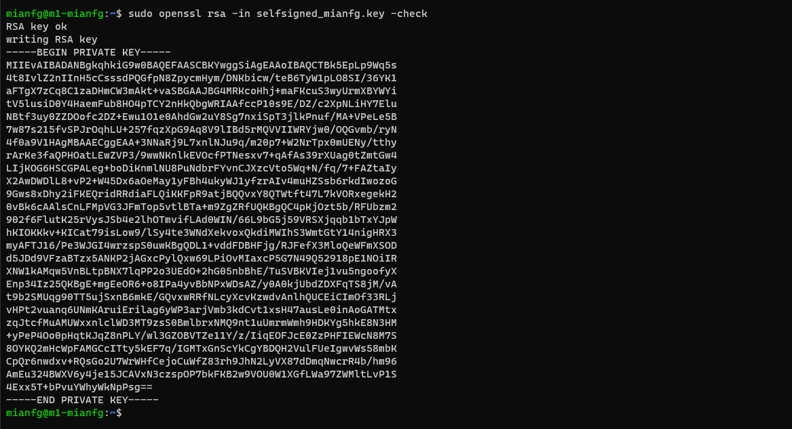
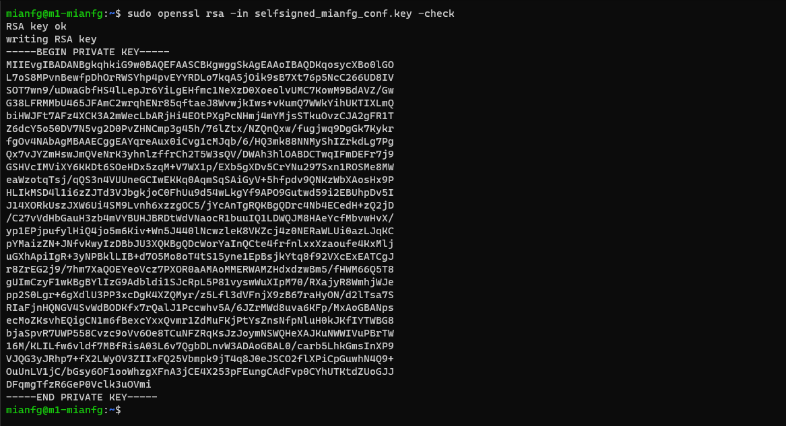

#### Verificar que coinciden certificado y clave

Para hacer esto debemos comparar dos _checksums_. Si coinciden, hemos verificado la correspondencia.

```
openssl x509 -noout -modulus -in <certificado>.crt | openssl md5
sudo openssl rsa -noout -modulus -in <certificado>.key | openssl md5
```

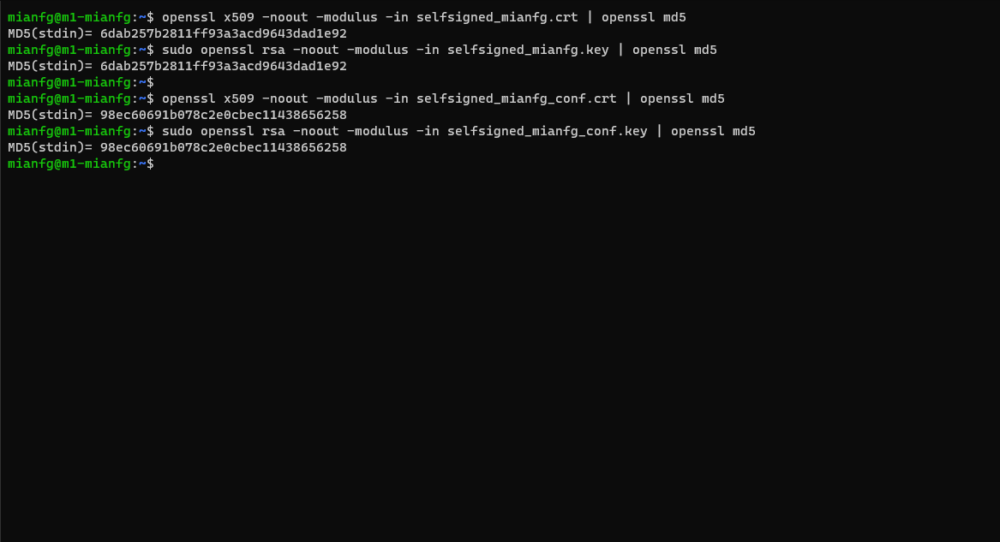

### Apache con certificado SSL

> En este apartado:
>
> * Instalación de certificado autofirmado SSL en Apache (SWAP1 y SWAP2)
> wip

Para instalar el certificado en Apache, primero habilitamos `ssl` con `a2enmod`, reiniciamos Apache y a continuación movemos el certificado `selfsigned_mianfg` a `/etc/apache2/ssl`.

```
mianfg@m1-mianfg$ sudo a2enmod ssl
mianfg@m1-mianfg$ sudo service apache2 restart
mianfg@m1-mianfg$ sudo mkdir /etc/apache2/ssl
mianfg@m1-mianfg$ sudo cp selfsigned_mianfg.* /etc/apache2/ssl/
```

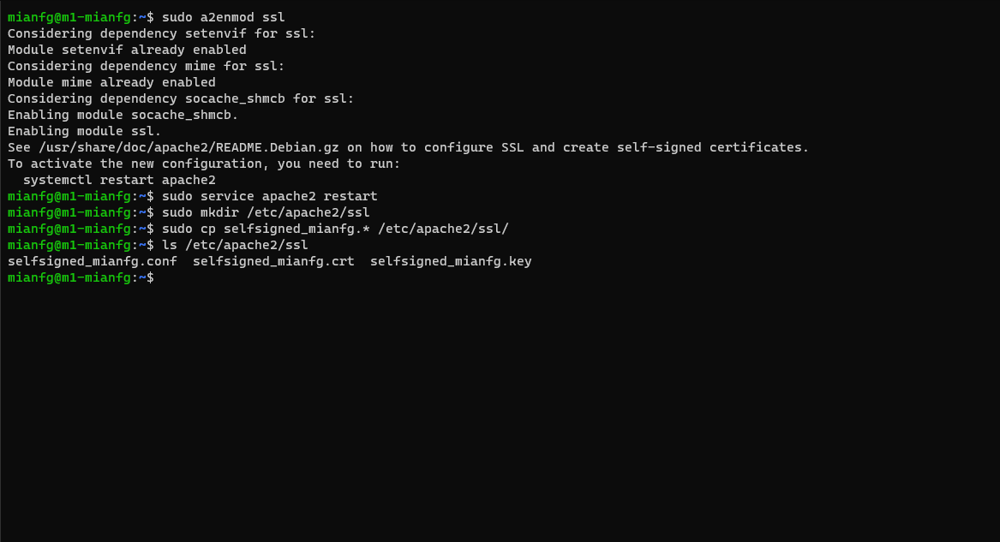

A continuación, modificamos el archivo de configuración `/etc/apache2/sites-available/default-ssl.conf` y, bajo `SSLEngine on` agregamos las rutas de los certificados:

```
SSLCertificateFile /etc/apache2/ssl/selfsigned_mianfg.crt
SSLCertificateKeyFile /etc/apache2/ssl/selfsigned_mianfg.key
```

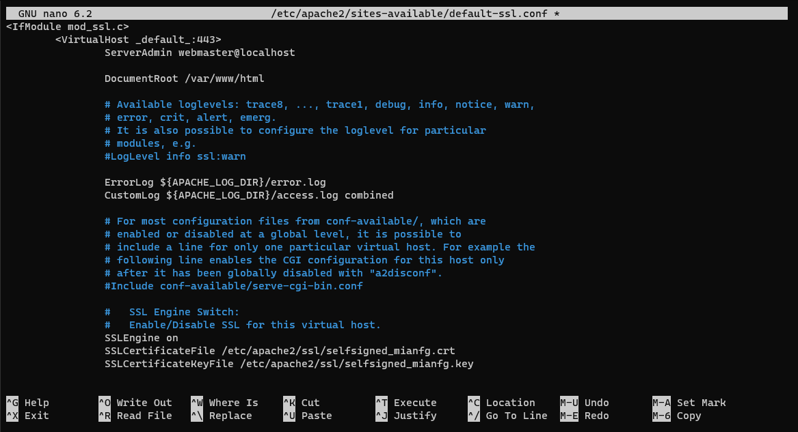

Activamos `default-ssl` y reiniciamos Apache:

```
mianfg@m1-swap$ sudo a2ensite default-ssl
mianfg@m1-swap$ sudo service apache2 reload
```

Ahora podremos entrar en `https://192.168.13.10/swap.html`, y veremos que el certificado no es de confianza. Esto es normal, dado que es un certificado que hemos creado nosotros (no está firmado por ninguna entidad de verificación).

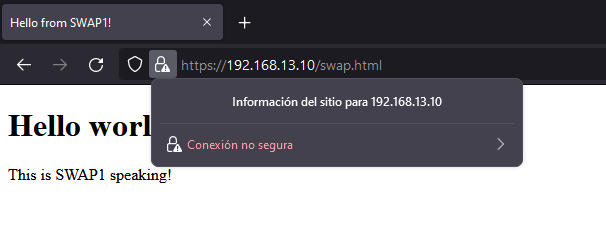

Más adelante veremos cómo crear un certificado válido, pero ahora nos encargaremos de cierta configuración avanzada.

#### RewriteEngine en HTTPS

Si nos remontamos a la primera práctica, conseguimos acceder al documento `swap.html` directamente sin necesidad de poner la URL completa `http://192.168.13.10/swap.html`, sino desde `http://192.168.13.10/swap`. Actualmente, esto no es posible.

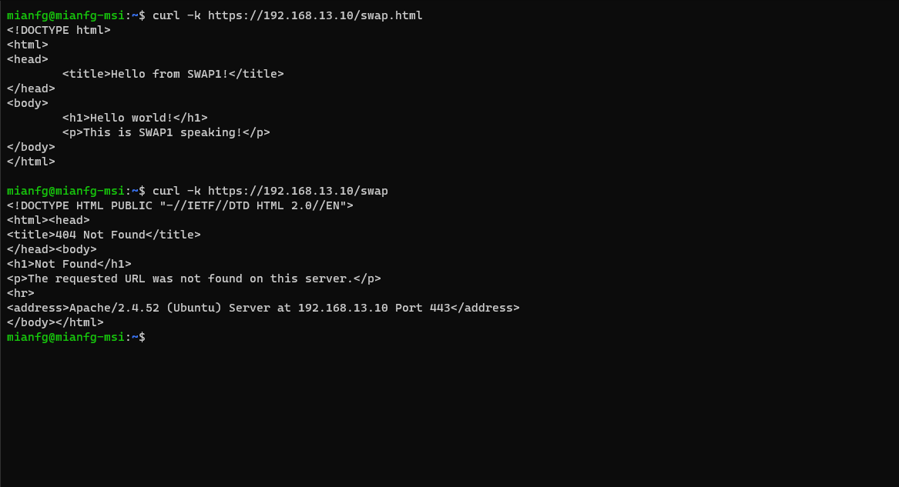

Para que esta redirección funcione, deberemos usar un certificado válido (la redirección sólo se hace después del _handshake_ de SSL). Más adelante, revisitaremos este punto al instalar Let's Encrype.

#### Redireccionar HTTP a HTTPS

Hay muchas formas de redirigir el tráfico de `http://192.168.13.10` a `https://192.168.13.10`. Una de ellas puede ser mediante la edición de `VirtualHost`. Sin embargo, aquí me remitiré a modificar el `.htaccess`. Modificamos el archivo `/var/www/html/.htaccess` para que contenga la siguiente configuración:

```apache
RewriteEngine on
RewriteRule ^swap$ swap.html [NC]
RewriteCond %{HTTPS} off
RewriteRule ^(.*)$ https://%{HTTP_HOST}%{REQUEST_URI} [R=301,L]
```

Veamos qué significan las dos reglas que hemos insertado:

* `RewriteCond %{HTTPS} off` nos indica que la siguiente regla se ejecutará si no usa el protocolo HTTPS.
* `RewriteRule ^(.*)$ https://%{HTTP_HOST}%{REQUEST_URI} [R=301,L]` realiza la redirección a `https`, concatenando `https://` con el host (`HTTP_HOST`) y la dirección (`REQUEST_URI`). Finalmente vemos las opciones `R=301` que indica que la petición devolverá el código HTTP **301 Moved Permanently** (es una redirección permanente), y `L` dice que si la regla coincide, no se usará ninguna de las reglas posteriores (en nuestro caso no hay más reglas, pero se suele colocar esta configuración para este tipo de redirecciones).

Si hacemos un `curl` con las opciones `-k` (realiza la petición incluso si el certificado es inseguro), `-i` (incluye las cabeceras HTTP en la salida) y `-L` (sigue la redirección), podemos ver cómo la configuración ha sido satisfactoria:

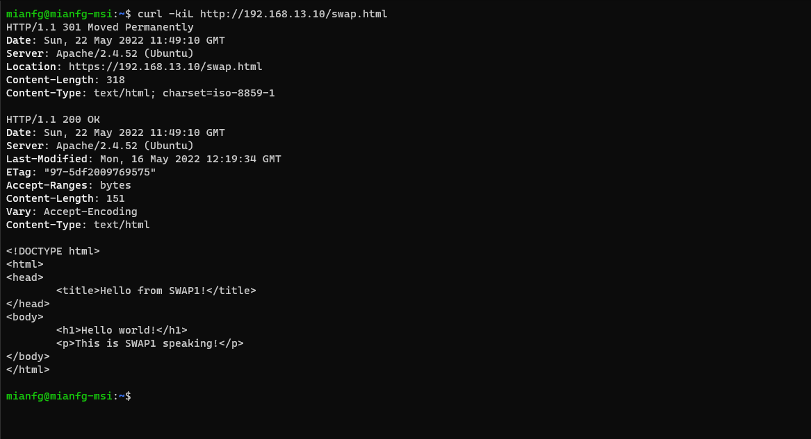

#### Replicar configuración en SWAP2

Nos falta que esta configuración también se encuentre en SWAP2.

### Nginx como balanceador para peticiones HTTPS

### Certificado Let's Encrypt (`certbot`)

> En este apartado:
>
> * Sustitución del certificado generado anteriormente por uno de Let's Encrypt
> * Repetición del procedimiento anterior para instalarlo en SWAP1, SWAP2 y SWAP3

## IPTABLES

### Configuración de IPTABLES

### Persistencia de IPTABLES

## Conclusiones
