# Práctica 4. Asegurar la granja web

> Alumno: Miguel Ángel Fernández Gutiérrez

## Objetivos

En esta práctica, aseguraremos la granja web de dos maneras: primero, mediante la instalación
de un certificado SSL, y más adelante mediante la configuración de un cortafuegos.

Como siempre, recordamos la configuración de red de los diversos servidores.

| Nombre de VM | SWAP1 | SWAP2 | SWAP3 |
| --- | --- | --- | --- |
| Hostname | `m1-mianfg` | `m2-mianfg` | `m3-mianfg` |
| IP `enp0s3` (NAT) | 192.168.0.3/24 | 192.168.0.4/24 | 192.168.0.5/24 |
| IP `enp0s8` (Host-Only) | 192.168.13.10/24 | 192.168.13.20/24 | 192.168.13.30/24 |
| Nombre usuario | `mianfg` | `mianfg` | `mianfg` |
| Contraseña | `Swap1234` | `Swap1234` | `Swap1234` |

> Nota: ya no usaremos más la máquina SWAP3zev.

## Preliminares

Para comenzar esta práctica, activaremos el balanceador de carga Nginx, y desactivaremos el
resto de balanceadores que instalamos en la práctica anterior. La configuración que usaremos
es la básica (round-robin).

## Configuración de SSL

### Certificado autofirmado SSL

> En este apartado:
>
> * Creación de instalación de certificado autofirmado SSL
> * Creación especificando los valores en el comando
> * Creación usando un archivo de configuración de OpenSSL
> * Verificaciones: datos certificado, consistencia SSL, correspondencia entre certificado y clave

Vamos a generar el certificado mediante `openssl`. Desde SWAP1 ejecutamos el siguiente comando:

```
mianfg@m1-swap$ sudo openssl req -x509 -noenc -days 365 -newkey rsa:2048 -subj "/C=ES/ST=Granada/L=Granada/O=SWAP/OU=P4/CN=mianfg/emailAddress=mianfg@correo.ugr.es" -keyout ~/selfsigned_mianfg.key -out ~/selfsigned_mianfg.crt
```

Veamos qué significan cada una de las opciones del comando:

* `req` nos indica que administraremos una petición de firma de certificado (Certificate Signing Request, CSR) de tipo PKCS#10 X.509.
* `-x509` genera un certificado en lugar de una petición, lo cual normalmente se usa para generar certificados de prueba (como vamos a hacer ahora).
* `-noenc` (antes de OpenSSL 3.0, `-nodes`) hace que, al crear la clave privada, ésta no esté encriptada (bien para pruebas, pero no deberíamos hacer esto en entornos de producción).
* `-days 365` indica que el certificado será válido durante 365 días (por defecto son 30 días si no se especifica esta opción).
* `-newkey rsa:2048` genera una nueva clave privada RSA de 2048 bytes (que es el valor por defecto de RSA, sería equivalente a `-newkey rsa`). Hay otros algoritmos que podríamos usar, como `dsa`, `ec` o `gost2001`.
* `-keyout ~/selfsigned_mianfg.key` indica que la clave privada se escribirá en `~/selfsigned_mianfg.key`.
* `-out ~/selfsigned_mianfg.crt` indica que el certificado se escribirá en `~/selfsigned_mianfg.out`.
* `-subj` nos permite pasar las opciones del certificado. Las opciones se pasan de la forma `/type0=value0/type1=value1/type2=...`. Esto nos permite insertar las opciones inmediatamente, sin tener que escribirlas al ejecutar el comando. En la siguiente tabla aparece la correspondencia entre los _types_ y las opciones que aparecen en el asistente.

| Nombre en asistente | type | Valor proporcionado |
| --- | --- | --- |
| Country Name (2 letter code) | `/C` | ES |
| State or Province Name (full name) | `/ST` | Granada
| Locality Name (eg, city) | `/L` | Granada |
| Organization Name (eg, company) | `/O` | SWAP |
| Organizational Unit Name (eg, section) | `/OU` | P4 |
| Common Name (e.g. server FQDN or YOUR name) | `/CN` | mianfg |
| Email Address | `/emailAddress` | mianfg@correo.ugr.es |

Tenemos otra forma de generar el certificado, que es mediante un archivo de configuración, mediante el siguiente comando:

```
mianfg@m1-swap$ sudo openssl req -x509 -config ~/selfsigned_mianfg.conf -keyout ~/selfsigned_mianfg_conf.key -out ~/selfsigned_mianfg_conf.crt
```

Dicho archivo de configuración, que almacenaremos en `selfsigned_mianfg.conf`, es como sigue:

```
[req]
default_bits=2048
encrypt_key=no
days=365
distinguished_name=req_subj

[req_subj]
countryName="Country Name (2 letter code)"
stateOrProvinceName="State Name (full name)"
localityName="Locality Name (e.g., city)"
organizationName="Organization Name (e.g., company)"
organizationalUnitName="Organizational Unit Name (e.g., section)"
commonName="Fully Qualified Domain Name (FQDN)"
emailAddress="Administrative Email Address"

# modifica estos campos
countryName_default=ES
stateOrProvinceName_default=Granada
localityName_default=Granada
organizationName_default=SWAP
organizationalUnitName_default=P4
commonName_default=mianfg
emailAddress_default="mianfg@correo.ugr.es"
```

En este caso, será necesario pulsar Enter (dado que hemos establecido los valores por defecto) hasta que se genere el certificado.

Vamos a generar los certificados de ambas formas, para luego verificarlos con `openssl s_client`. Generaremos los certificados `selfsigned_mianfg` y `selfsigned_mianfg_conf`, que serán diferentes (luego eliminaremos `selfsigned_mianfg_conf` y usaremos `selfsigned_mianfg` de aquí en adelante):


Ahora realizaremos diversas comprobaciones.

#### Ver datos del certificado

Podremos ver los datos del certificado con:

```
openssl x509 -in <certificado>.crt -text -noout
```


#### Verificar consistencia SSL

Para verificar la clave SSL y su consistencia hacemos:

```
sudo openssl rsa -in <certificado>.key -check
```


#### Verificar que coinciden certificado y clave

Para hacer esto debemos comparar dos _checksums_. Si coinciden, hemos verificado la correspondencia.

```
openssl x509 -noout -modulus -in <certificado>.crt | openssl md5
sudo openssl rsa -noout -modulus -in <certificado>.key | openssl md5
```


### Apache con certificado SSL

> En este apartado:
>
> * Instalación de certificado autofirmado SSL en Apache (SWAP1 y SWAP2)
> * Redirección de HTTP a HTTPS

Para instalar el certificado en Apache, primero habilitamos `ssl` con `a2enmod`, reiniciamos Apache y a continuación movemos el certificado `selfsigned_mianfg` a `/etc/apache2/ssl`.

```
mianfg@m1-mianfg$ sudo a2enmod ssl
mianfg@m1-mianfg$ sudo service apache2 restart
mianfg@m1-mianfg$ sudo mkdir /etc/apache2/ssl
mianfg@m1-mianfg$ sudo cp selfsigned_mianfg.* /etc/apache2/ssl/
```


A continuación, modificamos el archivo de configuración `/etc/apache2/sites-available/default-ssl.conf` y, bajo `SSLEngine on` agregamos las rutas de los certificados:

```
SSLCertificateFile /etc/apache2/ssl/selfsigned_mianfg.crt
SSLCertificateKeyFile /etc/apache2/ssl/selfsigned_mianfg.key
```


Activamos `default-ssl` y reiniciamos Apache:

```
mianfg@m1-swap$ sudo a2ensite default-ssl
mianfg@m1-swap$ sudo service apache2 reload
```

Ahora podremos entrar en `https://192.168.13.10/swap.html`, y veremos que el certificado no es de confianza. Esto es normal, dado que es un certificado que hemos creado nosotros (no está firmado por ninguna entidad de verificación).


Más adelante veremos cómo crear un certificado válido, pero ahora nos encargaremos de cierta configuración avanzada.

#### Redireccionar HTTP a HTTPS

Hay muchas formas de redirigir el tráfico de `http://192.168.13.10` a `https://192.168.13.10`. Una de ellas puede ser mediante la edición de `VirtualHost`. Sin embargo, aquí me remitiré a modificar el `.htaccess`. Modificamos el archivo `/var/www/html/.htaccess` para que contenga la siguiente configuración:

```apache
RewriteEngine on
RewriteRule ^swap$ swap.html [NC]
RewriteCond %{HTTPS} off
RewriteRule ^(.*)$ https://%{HTTP_HOST}%{REQUEST_URI} [R=301,L]
```

Veamos qué significan las dos reglas que hemos insertado:

* `RewriteCond %{HTTPS} off` nos indica que la siguiente regla se ejecutará si no usa el protocolo HTTPS.
* `RewriteRule ^(.*)$ https://%{HTTP_HOST}%{REQUEST_URI} [R=301,L]` realiza la redirección a `https`, concatenando `https://` con el host (`HTTP_HOST`) y la dirección (`REQUEST_URI`). Finalmente vemos las opciones `R=301` que indica que la petición devolverá el código HTTP **301 Moved Permanently** (es una redirección permanente), y `L` dice que si la regla coincide, no se usará ninguna de las reglas posteriores (en nuestro caso no hay más reglas, pero se suele colocar esta configuración para este tipo de redirecciones).

Si hacemos un `curl` con las opciones `-k` (realiza la petición incluso si el certificado es inseguro), `-i` (incluye las cabeceras HTTP en la salida) y `-L` (sigue la redirección), podemos ver cómo la configuración ha sido satisfactoria:


#### Replicar configuración en SWAP2

Nos falta que esta configuración también se encuentre en SWAP2. Para ello, copiamos los archivos `.crt` y `.key` mediante `scp` al home de SWAP2.

```
mianfg@m1-mianfg$ scp /home/mianfg/selfsigned_mianfg.crt SWAP2:/home/mianfg/selfsigned_mianfg.crt
mianfg@m1-mianfg$ sudo scp /home/mianfg/selfsigned_mianfg.key mianfg@192.168.13.20:/home/mianfg/selfsigned_mianfg.key
```

> Nótese que, como para copiar el `.key` es necesario ser `sudo` (no vamos a encargarnos de modificar los permisos del archivo ahora), debemos de ejecutar `scp` desde `sudo`, pero dado que el hostname `SWAP2` no está en la configuración ssh de `root`, debemos especificar el host manualmente en ese caso.

Ahora basta repetir la configuración anterior en SWAP2. Realicemos `curl` ahora a SWAP2 y veremos cómo funciona también la redirección:

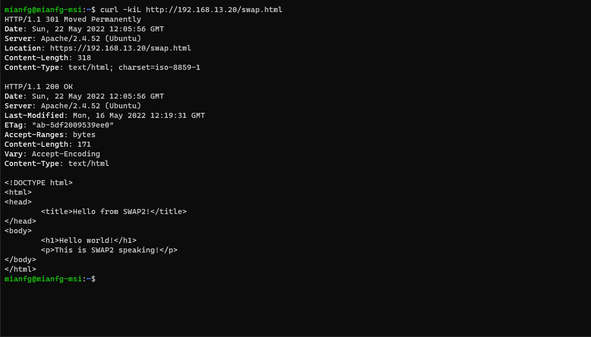

### Nginx como balanceador para peticiones HTTPS

> En este apartado:
> * Instalación del certificado autofirmado en el balanceador Nginx
> * Redirección de HTTP a HTTPS en el _frontend_
> * Buenas prácticas de seguridad en configuración del balanceador con HTTPS

Primero, repetimos desde SWAP1 el procedimiento para copiar los archivos del certificado a SWAP3.

```
mianfg@m1-mianfg$ scp /home/mianfg/selfsigned_mianfg.crt SWAP3:/home/mianfg/selfsigned_mianfg.crt
mianfg@m1-mianfg$ sudo scp /home/mianfg/selfsigned_mianfg.key mianfg@192.168.13.30:/home/mianfg/selfsigned_mianfg.key
```

A continuación, incorporamos la siguiente configuración básica en `/etc/nginx/conf.d/default.conf`:

```
server {
    # ...

    listen 443 ssl;
    # ssl on;
    ssl_certificate     /home/mianfg/selfsigned_mianfg.crt;
    ssl_certificate_key /home/mianfg/selfsigned_mianfg.key;
}
```

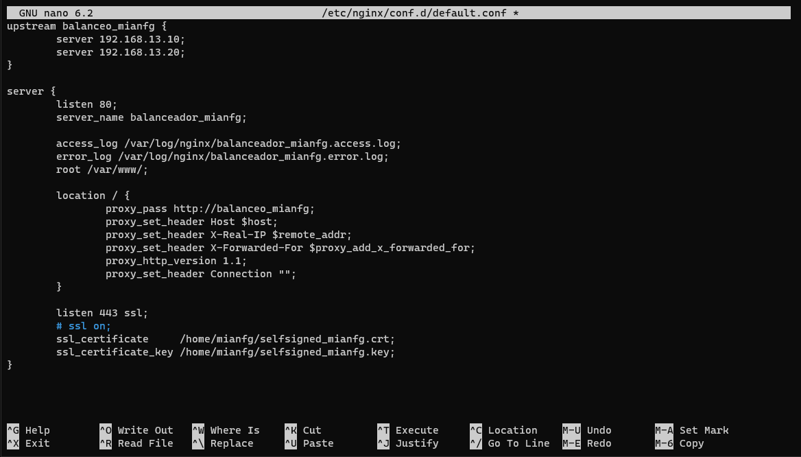

> Nota: he comentado la directiva `ssl on`, dado que `nginx -t` devolvía el warning _the "ssl" directive is deprecated, use the "listen ... ssl" directive instead_.

Sin embargo, encontramos un fallo con la configuración llevada a cabo hasta el momento: entramos en un bucle de redirecciones al hacer una petición a `https://192.168.13.30/swap.html`.

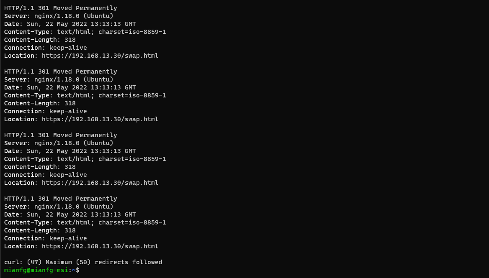

Para poder evitar esto, eliminaremos las reglas de `RewriteEngine` que insertamos anteriormente en SWAP1 y SWAP2, de modo que si hacemos la petición al balanceador con HTTPS devolverá la página web del servidor del backend correspondiente en HTTPS, y análogamente con HTTP. No olvides reiniciar el servicio `apache2` al eliminar las reglas. Vemos ahora que el `curl` funciona:

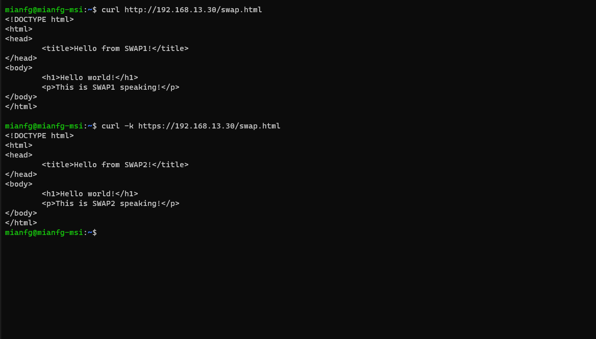

#### Redirección de HTTP a HTTPS

Dado que la idea es que nuestros usuarios accedan al _backend_ desde el balanceador (_frontend_), tendrá sentido que en los servidores SWAP1 y SWAP2 no haya ninguna redirección en Apache, sino que la redirección esté en SWAP3. Configuraremos tal redirección.

Para ello, separaremos la parte de SSL de la parte no SSL (el `listen 80` del `listen 443`), y pondremos una regla de redirección permanente en `listen 80`. El archivo `/etc/nginx/conf.d/default.conf` quedaría como:

```nginx
upstream balanceo_mianfg {
    server 192.168.13.10;
    server 192.168.13.20;
}

server {
    listen 443 ssl;
    server_name balanceador_mianfg;

    access_log /var/log/nginx/balanceador_mianfg.access.log;
    error_log /var/log/nginx/balanceador_mianfg.error.log;
    root /var/www/;

    location / {
        proxy_pass http://balanceo_mianfg;
        proxy_set_header Host $host;
        proxy_set_header X-Real-IP $remote_addr;
        proxy_set_header X-Forwarded-For $proxy_add_x_forwarded_for;
        proxy_http_version 1.1;
        proxy_set_header Connection "";
    }

    ssl_certificate     /home/mianfg/selfsigned_mianfg.crt;
    ssl_certificate_key /home/mianfg/selfsigned_mianfg.key;
}

server {
    listen 80;
    server_name balanceador_mianfg;

    return 301 https://$host$request_uri;
}
```

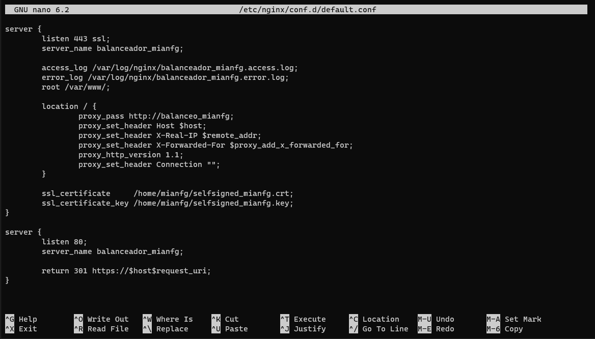

Vemos que las peticiones a HTTP son redirigidas a HTTPS convenientemente. Además, no tenemos un bucle de redirecciones al realizar directamente la petición por HTTPS.

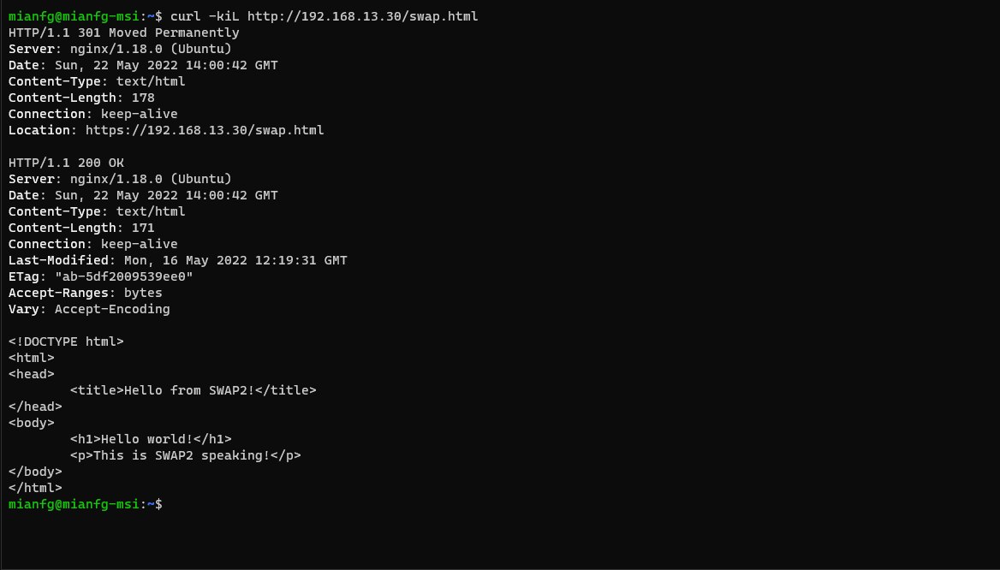
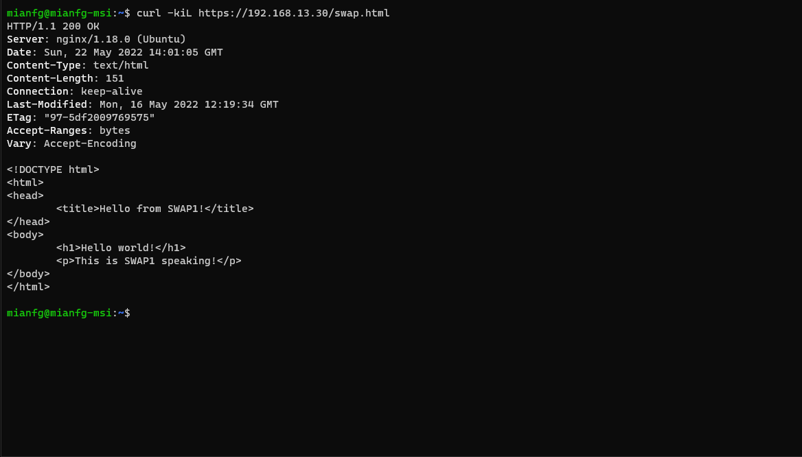

#### Buenas prácticas

Para eliminar vulnerabilidades con cifrados y protocolos más antiguos, incorporaremos la siguiente configuración a `/etc/nginx/conf.d/default.conf`:

```nginx
# ...

server {
    listen 443 ssl;
    server_name balanceador_mianfg;

    # ...

    ssl_certificate     /home/mianfg/selfsigned_mianfg.crt;
    ssl_certificate_key /home/mianfg/selfsigned_mianfg.key;
    ssl_session_cache   shared:SSL:20m;
    ssl_session_timeout 10m;
    ssl_prefer_server_ciphers on;
    ssl_protocols       TLSv1 TLSv1.1 TLSv1.2;
    ssl_ciphers         ECDH+AESGCM:DH+AESGCM:ECDH+AES256:DH+AES256:ECDH+AES128:DH+AES:ECDH+3DES:DH+3DES:RSA+AESGCM:RSA+AES:RSA+3DES:!aNULL:!MD5:!DSS;

    add_header Strict-Transport-Security "max-age=31536000";
}

# ...
```

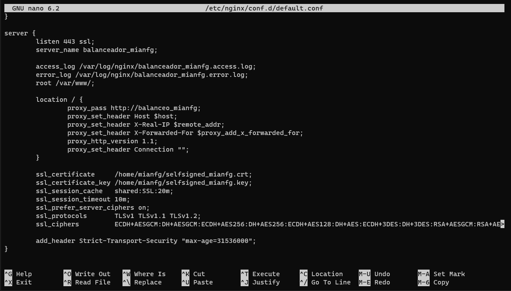

Veamos qué quieren decir tales opciones:

* Con `ssl_session_cache` incrementamos el rendimiento de las webs HTTPS. Habilitamos una caché de tamaño 20MB con esta directiva, y con `ssl_session_timeout` especificamos que el tiempo de vida de la caché será de 10 minutos.
* En las tres líneas siguientes, con `ssl_prefer_server_ciphers`, `ssl_protocols` y `ssl_ciphers`, especificamos los protocolos y cifrados a usar en la conexión. Omitimos SSLv2 e inhabilitamos cifrados inseguros como MD5 y DSS.
* Con `add_header` incorporamos _Strict Transport Security_, que instruye a todos los navegadores web que lo soporten a usar únicamente HTTPS.

Finalmente, volvemos a hacer `curl` y notamos la presencia de la cabecera `Strict-Transport-Security` con el `maxage` definido.

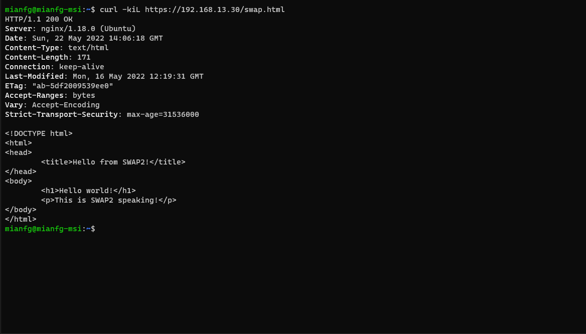

## IPTABLES

> En este apartado:
> * Permitir y denegar tráfico
> * Abrir puertos, configuración básica de servidor web
> * Solo acceso a M1 y M2 a través de M3
> * Acceso a SSH
> * ping y DNS a la red interna

### Configuración de IPTABLES

`iptables` es una utilidad que nos permitirá realizar ajustes de cortafuegos (_firewall_) en nuestros servidores.

La política se implementa mediante la ejecución de comandos `iptables`. Vamos a configurar dos IPTABLES diferentes: una para el _backend_ (SWAP1 y SWAP2) y otra para el _frontend_ (SWAP3). Almacenaremos los IPTABLES como scripts de bash en `~/.iptables/swap.sh`.

`iptables` ya se encuentra en ejecución y, por defecto, con las reglas siguientes:

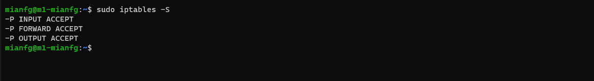

#### IPTABLES en _backend_

* Denegamos todo el tráfico, tanto de entrada como de salida (a continuación diremos cuál es el tráfico que permitimos).
* Permitimos cualquier acceso desde `lo` (interfaz de _localhost_).
* Permitimos acceso SSH.
* Permitimos el tráfico de entrada desde M3 hacia los puertos 80 y 443 (servidor web). Nótese que usamos las direcciones IP de la subred 192.168.13.0/24, dado que hemos configurado el balanceo en estas direcciones.
* Permitimos tráfico de salida hacia M3 desde los puertos 80 y 443.
* Permitimos ping y DNS únicamente desde la red interna, es decir, 192.168.0.0/24.

```bash
#!/bin/bash

# resetear configuración
iptables -F
iptables -X

# bloquear tráfico de entrada y salida
iptables -P INPUT DROP
iptables -P FORWARD DROP
iptables -P OUTPUT DROP

# permitir cualquier acceso desde lo (interfaz de localhost)
iptables -A INPUT -i lo -j ACCEPT
iptables -A OUTPUT -o lo -j ACCEPT

# permitir conexiones
iptables -A INPUT -m state --state ESTABLISHED,RELATED -j ACCEPT
iptables -A OUTPUT -m state --state NEW,ESTABLISHED,RELATED -j ACCEPT

# permitir acceso SSH
iptables -A INPUT -p tcp --dport 22 -j ACCEPT
iptables -A OUTPUT -p udp --sport 22 -j ACCEPT

# permitir tráfico de entrada desde M3 hacia los puertos 80 y 443
iptables -A INPUT -m state --state NEW -p tcp --dport 80 -s 192.168.13.30 -j ACCEPT
iptables -A INPUT -m state --state NEW -p tcp --dport 443 -s 192.168.13.30 -j ACCEPT

# permitir tráfico de salida hacia M3 desde los puertos 80 y 443
iptables -A OUTPUT -p tcp --sport 80 -s 192.168.13.30 -j ACCEPT
iptables -A OUTPUT -p tcp --sport 443 -s 192.168.13.30 -j ACCEPT

# permitir ping y DNS únicamente desde la red interna
iptables -A INPUT -p icmp --icmp-type echo-request -s 192.168.0.0/24 -j ACCEPT
iptables -A OUTPUT -p icmp --icmp-type echo-reply -s 192.168.0.0/24 -j ACCEPT
iptables -A INPUT -m state --state NEW -p udp --dport 53 -s 192.168.0.0/24 -j ACCEPT
iptables -A INPUT -m state --state NEW -p tcp --dport 53 -s 192.168.0.0/24 -j ACCEPT
```

#### IPTABLES en _frontend_

* Denegamos todo el tráfico, tanto de entrada como de salida (a continuación diremos cuál es el tráfico que permitimos).
* Permitimos cualquier acceso desde `lo` (interfaz de _localhost_).
* Permitimos acceso SSH.
* Permitimos el tráfico de entrada desde cualquier IP hacia los puertos 80 y 443 (servidor web). Nótese que usamos las direcciones IP de la subred 192.168.13.0/24, dado que hemos configurado el balanceo en estas direcciones.
* Permitimos tráfico de salida hacia M1 y M2 desde los puertos 80 y 443.
* Permitimos ping y DNS únicamente desde la red interna, es decir, 192.168.0.0/24.

```bash
#!/bin/bash

# resetear configuración
iptables -F
iptables -X

# bloquear tráfico de entrada y salida
iptables -P INPUT DROP
iptables -P FORWARD DROP
iptables -P OUTPUT DROP

# permitir cualquier acceso desde lo (interfaz de localhost)
iptables -A INPUT -i lo -j ACCEPT
iptables -A OUTPUT -o lo -j ACCEPT

# permitir conexiones
iptables -A INPUT -m state --state ESTABLISHED,RELATED -j ACCEPT
iptables -A OUTPUT -m state --state NEW,ESTABLISHED,RELATED -j ACCEPT

# permitir acceso SSH
iptables -A INPUT -p tcp --dport 22 -j ACCEPT
iptables -A OUTPUT -p udp --sport 22 -j ACCEPT

# permitir tráfico de entrada hacia los puertos 80 y 443
iptables -A INPUT -m state --state NEW -p tcp --dport 80 -j ACCEPT
iptables -A INPUT -m state --state NEW -p tcp --dport 443 -j ACCEPT

# permitir tráfico de salida hacia M1 y M2 desde los puertos 80 y 443
iptables -A OUTPUT -p tcp --sport 80 -s 192.168.13.10 -j ACCEPT
iptables -A OUTPUT -p tcp --sport 443 -s 192.168.13.10 -j ACCEPT
iptables -A OUTPUT -p tcp --sport 80 -s 192.168.13.20 -j ACCEPT
iptables -A OUTPUT -p tcp --sport 443 -s 192.168.13.20 -j ACCEPT

# permitir ping y DNS únicamente desde la red interna
iptables -A INPUT -p icmp --icmp-type echo-request -s 192.168.0.0/24 -j ACCEPT
iptables -A OUTPUT -p icmp --icmp-type echo-reply -s 192.168.0.0/24 -j ACCEPT
iptables -A INPUT -m state --state NEW -p udp --dport 53 -s 192.168.0.0/24 -j ACCEPT
iptables -A INPUT -m state --state NEW -p tcp --dport 53 -s 192.168.0.0/24 -j ACCEPT
```

#### Comprobación de la configuración de IPTABLES

Ejecutemos los scripts en las máquinas correspondientes:

* El script de _backend_ en SWAP1 y en SWAP2.
* El script de _frontend_ en SWAP3.

Realizaremos las comprobaciones "manuales" de cada una de las condiciones, lo cual creo que es más ilustrativo que mostrar únicamente la salida de `netstat`.

Cualquier acceso desde `lo` es posible. Veamos, por ejemplo, que funciona `ping` (lo vemos a continuación en SWAP1, ocurre igual en el resto).

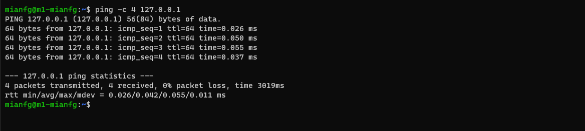

El acceso SSH es posible desde cualquier máquina, y en concreto desde el _host_ (i.e. SSH a SWAP3).

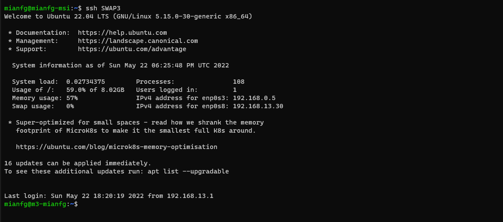

Veamos que sólo podemos acceder a SWAP1 y SWAP2 a través del balanceador SWAP3. Si desde el _host_ intentamos hacer `curl` a SWAP1 o a SWAP2, ninguna de ambas máquinas responderá.

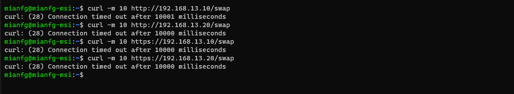

Sin embargo, si hacemos `curl` a SWAP3, la conexión será satisfactoria.

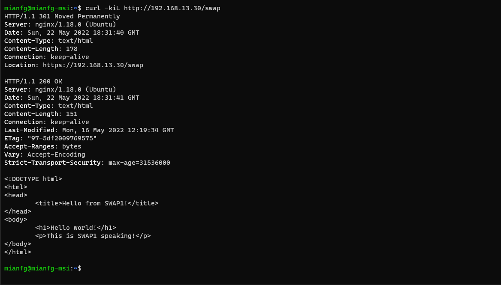

Observemos que la conexión está aun más restringida. Por poner un ejemplo, SWAP3 sólo puede hacer `curl` a SWAP1 o a SWAP2 (en un entorno de producción es más que probable que queramos que SWAP3 pueda hacer peticiones a más servidores, pero sirve a modo ilustrativo.)

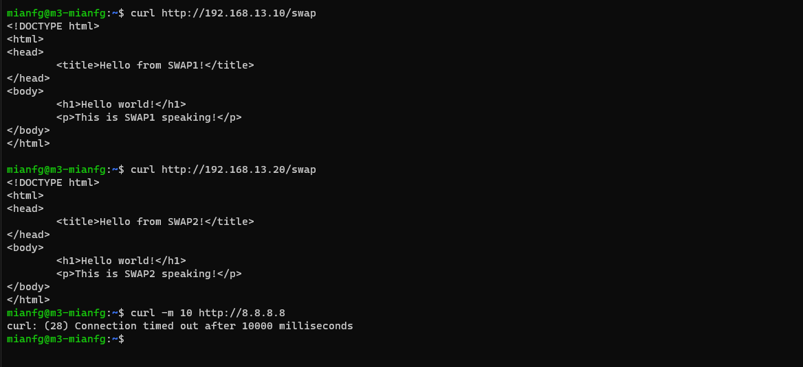

Finalmente, para comprobar las restricciones sobre ping y DNS, nos limitaremos a comprobar ping (deberíamos configurar bien un servidor DNS para hacer las pruebas). Veamos qué ocurre antes de configurar las IPTABLES.

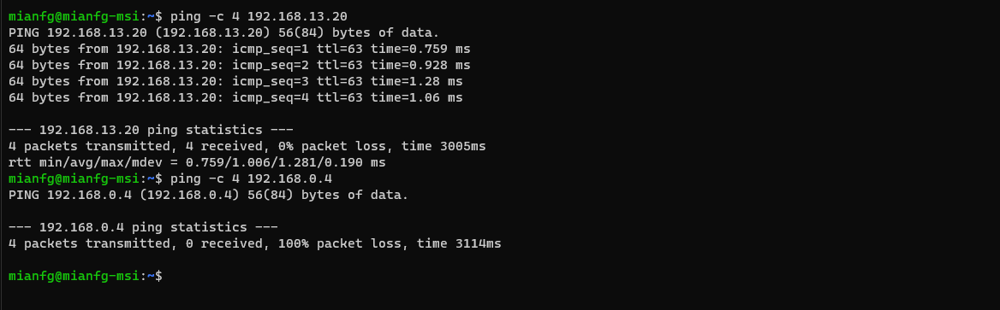

Podíamos hacer ping a la IP correspondiente a la red Host-Only pero no a la red NAT, lo cual es el comportamiento esperado. A continuación vemos que, tras implementar las IPTABLES, no podemos hacer ping a Host-Only dado que únicamente permitimos el ping a la dirección de la red NAT (la cual únicamente es accesible entre las máquinas).

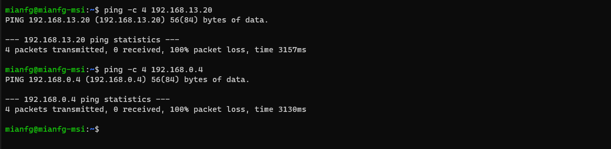

Sin embargo, sí que podemos hacer ping desde SWAP1 a SWAP2 mediante la dirección correspondiente a la red NAT, lo cual es justamente el comportamiento deseado.

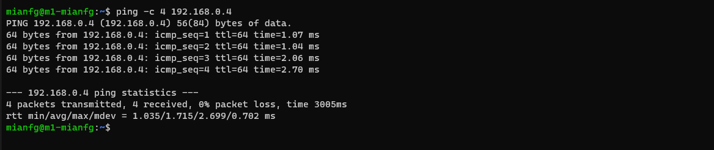

### Persistencia de IPTABLES

> En este apartado:
> * Habilitar la persistencia de IPTABLES mediante `systemd`.

Finalmente, añadiremos la persistencia de IPTABLES. Para ello, usaremos `systemd`. Creamos en primer lugar el servicio `iptables-swap`, para ello creamos el archivo `/etc/systemd/system/iptables-swap.service` con el siguiente contenido:

```ini
[Unit]
Description=Populate iptables with swap.sh

[Service]
ExecStart=/bin/bash /home/mianfg/.iptables/swap.sh

[Install]
WantedBy=multi-user.target
```

Activamos el nuevo servicio con

```
$ sudo systemctl enable iptables-swap
```

Lo ejecutamos y vemos su estado

```
$ sudo systemctl start iptables-swap
$ sudo systemctl status iptables-swap
```

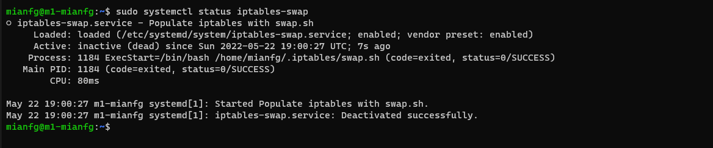

Es normal que aparezca como `inactive`, dado que termina su ejecución. Si reiniciamos la máquina, veremos cómo las reglas de `iptables` han sido inicializadas con `swap.sh`:

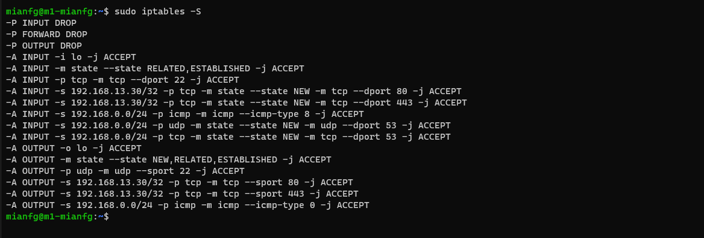

Aplicamos esta configuración también a SWAP2 y a SWAP3, y habremos conseguido la persistencia de nuestras IPTABLES.

## Conclusiones

En esta práctica, hemos conseguido configurar SSL y un cortafuegos básico en nuestros servidores. Esto nos permite una mayor protección de nuestros servicios.
