# Práctica 5. Replicación de bases de datos MySQL

> Alumno: Miguel Ángel Fernández Gutiérrez

## Objetivos

En esta práctica, replicaremos las bases de datos de nuestros servidores LAMP, para que ambas
sean exactamente iguales. De este modo, podremos recuperarnos en caso de caída y conseguiremos
que la información que devuelven ambos servidores sea la misma (con lo cual el usuario no notaría
el balanceo de carga que implementamos en la tercera práctica).

Al principio, SWAP1 actuará de maestro y SWAP2 de esclavo, de modo que las operaciones de lectura
puedan realizarse en ambas pero las de escritura solo las realice SWAP1. A continuación, haremos
que mantener la coherencia sea más sencillo al hacer SWAP2 maestro (maestro-maestro).

En esta práctica únicamente utilizaremos las máquinas SWAP1 y SWAP2.

| Nombre de VM | SWAP1 | SWAP2 |
| --- | --- | --- |
| Hostname | `m1-mianfg` | `m2-mianfg` |
| IP `enp0s3` (NAT) | 192.168.0.3/24 | 192.168.0.4/24 |
| IP `enp0s8` (Host-Only) | 192.168.13.10/24 | 192.168.13.20/24 |
| Nombre usuario | `mianfg` | `mianfg` |
| Contraseña | `Swap1234` | `Swap1234` |

## La base de datos MySQL

> En este apartado:
> 
> * Crear, insertar y bloquear tablas y datos por comandos
> * Opciones avanzadas: crear usuarios y administrar privilegios

Al instalar el stack LAMP en la primera práctica, tenemos una instalación funcional de MySQL. Para
iniciar sesión, basta ejecutar el comando:

```
mianfg@m1-mianfg$ sudo mysql -u root -p
```

A continuación, crearemos la tabla e insertaremos valores. Para crear la tabla primero crearemos una base de datos que llamaremos `estudiante`.

```sql
create database estudiante;
use estudiante;
```

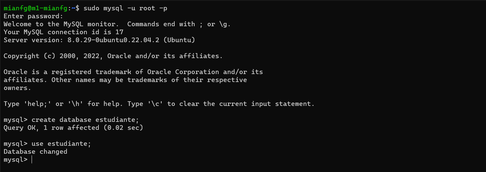

Creamos una nueva tabla.

```sql
create table datos (
    nombre      varchar(100),
    apellidos   varchar(100),
    usuario     varchar(100),
    email       varchar(100)
);
```

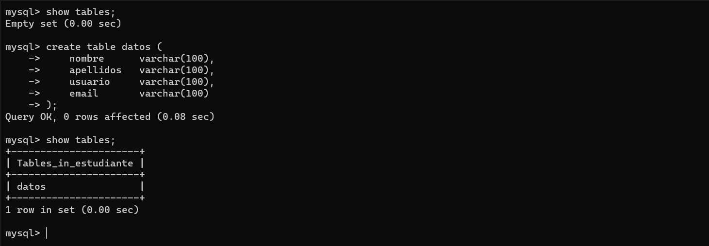

E insertamos una nueva fila en la tabla.

```sql
insert into datos(nombre, apellidos, usuario, email) values (
    "Miguel Ángel",
    "Fernández Gutiérrez",
    "mianfg",
    "mianfg@correo.ugr.es"
);
```

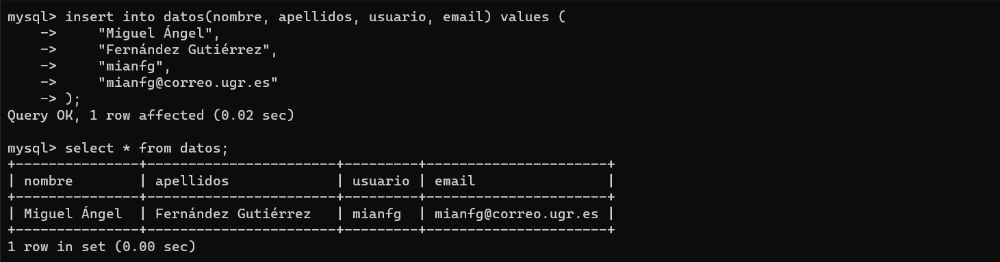

Una utilidad avanzada para administrar nuestras bases de datos MySQL es `PRIVILEGES`, que nos permite gestionar los privilegios de la base de datos en función a los usuarios. Veamos los usuarios de la BD con:

```sql
use mysql;
select user from user;
```

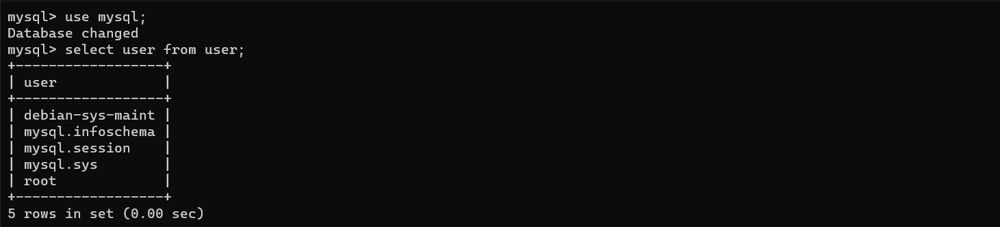

Para insertar un usuario basta hacer:

```sql
create user 'newuser'@'localhost' identified by 'password';
```

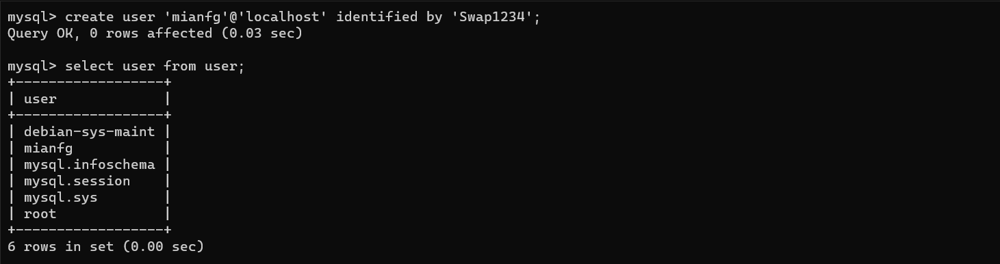

Para modificar los privilegios de un usuario en la base de datos usamos:

```sql
grant type_of_permission on database_name.table_name to 'username'@'localhost';
flush privileges;
```

Siendo los privilegios posibles:

* `ALL PRIVILEGES`: acceso completo a una base de datos (o si no se selecciona ninguna base de datos, a todo el sistema).
* `CREATE`: permite crear nuevas tablas o bases de datos.
* `DROP`: permite eliminar tablas o bases de datos.
* `DELETE`: permite eliminar filas de las tablas.
* `INSERT`: permite insertar filas en las tablas.
* `SELECT`: permitir usar el comando `SELECT` para consultas.
* `UPDATE`: permitir usar el comando `UPDATE` para modificaciones.
* `GRANT OPTION`: permite otorgar o eliminar privilegios de otros usuarios.

Por ejemplo, daremos sólo permisos de lectura a `mianfg` en la tabla `estudiante.datos`.

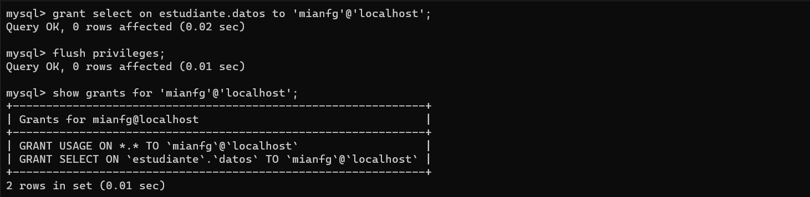

Para bloquear la base de datos, de modo que solo se permita su lectura (para todos los usuarios), podemos usar:

```sql
flush tables with read lock;
```

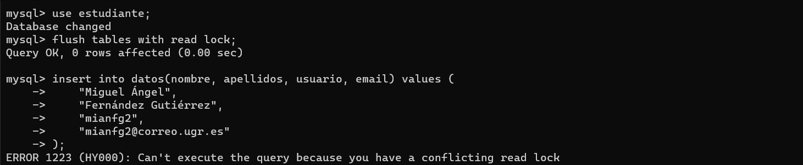

Esto nos permite hacer _backups_ consistentes (nos asegura de que la información no cambiará al usar `mysqldump`). Podemos desbloquear con:

```sql
unlock tables;
```

## Copias de seguridad en MySQL

> En este apartado:
> 
> * Crear copia de seguridad de una base de datos y restaurarla

Para poder realizar una copia de seguridad, podemos usar el comando `mysqldump` como sigue:

```
mianfg@m1-mianfg$ sudo mysql -u root -p estudiante > /home/mianfg/estudiante.sql
```

Ahora podemos hacer `scp` para copiar la base de datos a SWAP2, donde la restauraremos.

```
mianfg@m1-mianfg$ scp /home/mianfg/estudiante.sql SWAP2:/home/mianfg/estudiante.sql
```

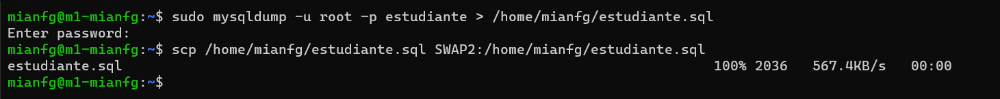

Para restaurar los datos en SWAP2, iniciamos sesión, creamos la base de datos `estudiante` en MySQL y ejecutamos el comando:

```
mianfg@m2-mianfg$ sudo mysql -u root -p estudiante < /home/mianfg/estudiante.sql
```


Vemos cómo la base de datos de SWAP1 se ha replicado a SWAP2.

## Replicación maestro-esclavo

> En este apartado:
> 
> * Configuración maestro-esclavo
> * Detallando las diversas opciones

El procedimiento para replicar los datos de SWAP1 (maestro) a SWAP2 (esclavo) es sencillo:

1. En **SWAP1** editamos `/etc/mysql/mysql.conf.d/mysqld.cnf` y:
    1. Comentamos `bind-address` (más información [aquí](https://dev.mysql.com/doc/refman/8.0/en/server-system-variables.html#sysvar_bind_address)).
    2. Establecemos `server-id` a 1, el identificador de la máquina para la replicación (el de SWAP2 será 2).
    3. Nos aseguramos de que `log_error` y `log_bind` están descomentados.
2. En **SWAP1** reiniciamos MySQL con `service mysql restart`.
3. Realizamos los pasos 1 y 2 de nuevo en SWAP2 con `server-id = 2`.
4. Crearemos un usuario en el maestro (SWAP1) y le daremos permisos para la replicación. En **SWAP1** ejecutamos las sentencias:
    ```sql
    --crear usuario
    create user esclavo_mianfg identified with mysql_native_password by 'Swap1234';
    --añadir permisos de replicación en todas las databases
    grant replication slave on *.* to 'esclavo_mianfg'@'%';
    --aplicar cambios
    flush privileges;
    flush tables;
    --bloquear tablas
    flush tables with read lock;
    ```
5. Vamos a comprobar que hemos hecho esto adecuadamente. En **SWAP1** comprobamos el estado con:
   ```sql
   show master status;
   ```
   
   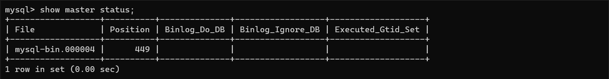

   Vemos que el archivo está en `mysql-bin.000004` y `Position` es 1033.
6. En **SWAP2**, configuraremos el esclavo. Para ello, le daremos los datos del maestro mediante el comando:
    ```sql
    change master to master_host='192.168.0.3', master_user='esclavo_mianfg', master_password='Swap1234', master_log_file='mysql-bin.000004', master_log_pos=449, master_port=3306;
    ```
7. En **SWAP2** arrancamos el esclavo.
   ```sql
   start slave;
   ```
8. En **SWAP1**, volvemos a activar las tablas para que puedan meterse datos.
   ```sql
   unlock tables;
   ```

Finalmente, vemos el estado del esclavo. Para ello, en **SWAP2**, usamos:

```sql
show slave status\G;
```

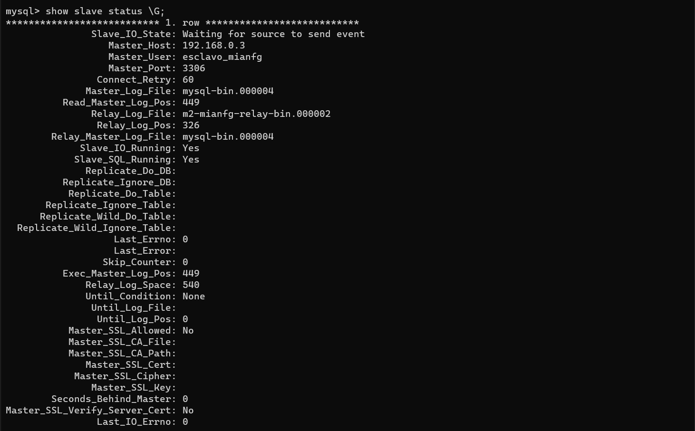

Vemos las dos líneas principales que nos indican que el esclavo está funcionando:

* Vemos que `Slave_IO_State` tiene el valor `Waiting for source to send event`.
* Vemos que `Seconds_Behind_Master` es `0` (está 0 segundos por detrás de _master_, es decir, se encuentra sincronizado).

### Dificultades encontradas

A continuación, un breve apunte respecto a las dificultades encontradas al realizar la configuración de esclavo.

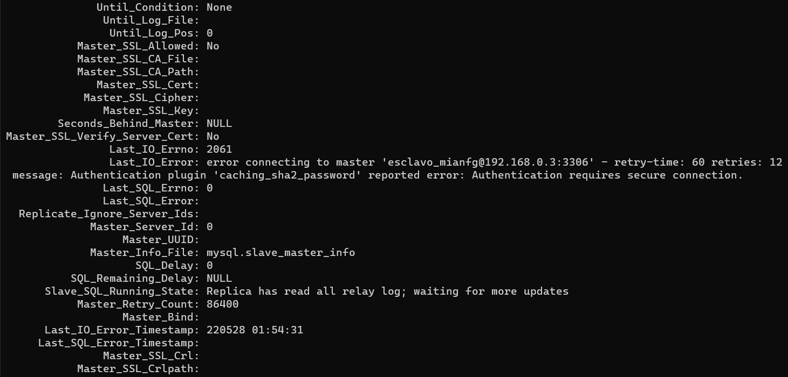

En caso de que la configuración sea errónea, en `Seconds_Behind_Master` veremos el valor `NULL`. En `Last_IO_Errno` y `Last_IO_Error` tenemos el código de error y el mensaje de error, respectivamente.

En este error, vemos un problema con la autenticación. Este problema se resolvió modificando el usuario de modo que la contraseña sea del tipo

```sql
... identified with mysql_native_password by 'Swap1234';
```

## Replicación maestro-maestro

> En este apartado:
> 
> * Configuración maestro-maestro
> * Detallando las diversas opciones

Para finalizar la configuración, haremos que SWAP1 sea esclavo de SWAP2, consiguiendo la comunicación bidireccional. Para ello basta con seguir los últimos pasos del tutorial anterior.

1. Crearemos un usuario en el maestro (SWAP2) y le daremos permisos para la replicación. En **SWAP2** ejecutamos las sentencias:
    ```sql
    --crear usuario
    create user esclavo_mianfg identified with mysql_native_password by 'Swap1234';
    --añadir permisos de replicación en todas las databases
    grant replication slave on *.* to 'esclavo_mianfg'@'%';
    --aplicar cambios
    flush privileges;
    flush tables;
    --bloquear tablas
    flush tables with read lock;
    ```
2. Vamos a comprobar que hemos hecho esto adecuadamente. En **SWAP2** comprobamos el estado con:
   ```sql
   show master status;
   ```
   
   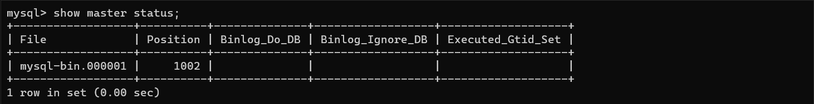

   Vemos que el archivo está en `mysql-bin.000001` y `Position` es 1002.
3. En **SWAP1**, configuraremos el esclavo. Para ello, le daremos los datos del maestro mediante el comando:
    ```sql
    change master to master_host='192.168.0.3', master_user='esclavo_mianfg', master_password='Swap1234', master_log_file='mysql-bin.000001', master_log_pos=1002, master_port=3306;
    ```
4. En **SWAP1** arrancamos el esclavo.
   ```sql
   start slave;
   ```
5. En **SWAP2**, volvemos a activar las tablas para que puedan meterse datos.
   ```sql
   unlock tables;
   ```

Finalmente, vemos el estado del esclavo. Para ello, en **SWAP1**, usamos:

```sql
show slave status\G;
```

Una vez hecho esto, tendremos la configuración maestro-maestro y al introducir nuevos valores se actualizarán en el otro.


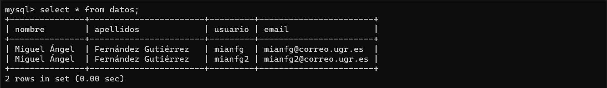

## Configuración de IPTABLES

> En este apartado:
> 
> * Configuración de IPTABLES para solo permitir conexiones de SWAP1 y SWAP2

La configuración de IPTABLES para permitir las conexiones únicamente de SWAP1 y SWAP2 se realizará aceptando únicamente el tráfico de entrada y de salida por el puerto 3306.

A los script de IPTABLES de la práctica anterior añadimos, en el caso de SWAP1:

```
iptables -A INPUT -p tcp -d 192.168.0.4 --dport 3306 -j ACCEPT
iptables -A OUTPUT -p tcp -d 192.168.0.4 --sport 3306 -j ACCEPT
```

El caso de SWAP2 es análogo sustituyendo la IP por `192.168.0.3` (la de SWAP1).

## Conclusiones

Mediante esta práctica, hemos asegurado la persistencia de los datos entre SWAP1 y SWAP2: al modificar alguna de las tablas de uno, los cambios se efectuarán en el otro.
