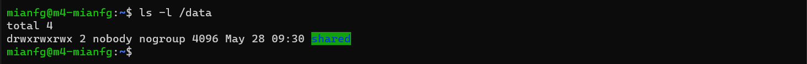
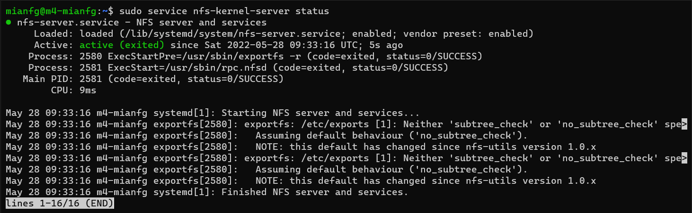
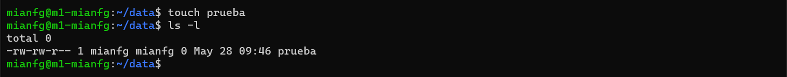
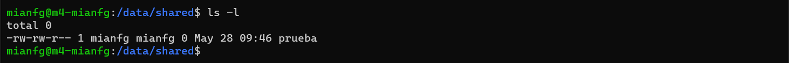
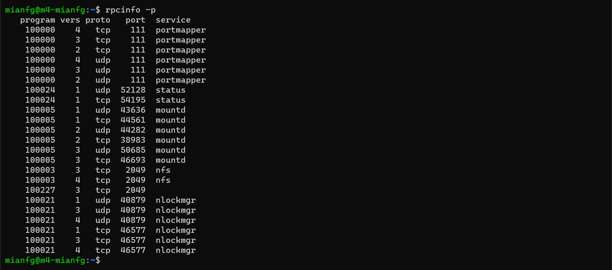
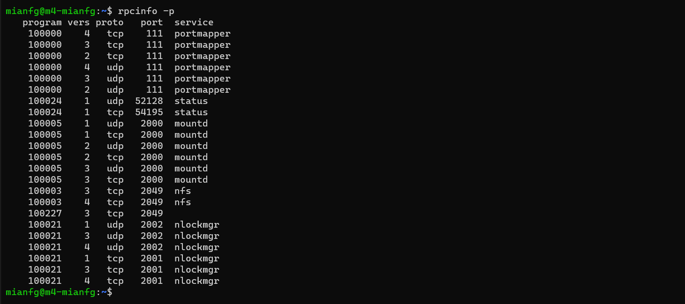

# Práctica 6. Servidor de disco NFS

> Alumno: Miguel Ángel Fernández Gutiérrez

## Objetivos

En esta última práctica, compartiremos archivos entre los diversos servidores a través de nuestra red. Usaremos NFS (Network File System), que nos permite compartir carpetas y crear sistemas de archivos que podemos montar en los dispositivos como si se tratase de uno físico.

En esta práctica, crearemos una nueva máquina, SWAP4.

| Nombre de VM | SWAP1 | SWAP2 | SWAP4 |
| --- | --- | --- | --- |
| Hostname | `m1-mianfg` | `m2-mianfg` | `m4-mianfg` |
| IP `enp0s3` (NAT) | 192.168.0.3/24 | 192.168.0.4/24 | 192.168.0.6/24 |
| IP `enp0s8` (Host-Only) | 192.168.13.10/24 | 192.168.13.20/24 | 192.168.13.40/24 |
| Nombre usuario | `mianfg` | `mianfg` | `mianfg` |
| Contraseña | `Swap1234` | `Swap1234` | `Swap1234` |

## Preliminares

Instalaremos de nuevo Ubuntu Server en SWAP4 con la configuración de red que aparece arriba. El procedimiento es análogo al de la primera práctica. Otra forma rápida es clonar SWAP3 en SWAP4 y deshabilitar el servicio `nginx`.

## Servidor NFS

> En este apartado:
> 
> * Crear servidor NFS
> * Montar carpeta exportada por el servidor NFS
> * Configuración permanente al arranque
> * Ver puertos asociados a `mountd` y `nlockmgr`

### Configuración del servidor

Vamos a crear la carpeta a compartir en el servidor NFS, SWAP4. 

Primero, instalamos las herramientas necesarias.

```
mianfg@m4-mianfg$ sudo apt-get install nfs-kernel-server nfs-common rpcbind
```

Para ello, creamos la carpeta y configuramos sus permisos.

```
mianfg@m4-mianfg$ sudo mkdir -p /data/shared
mianfg@m4-mianfg$ sudo chown nobody:nogroup /data/shared
mianfg@m4-mianfg$ sudo chmod -R 777 /data/shared
```



Damos permisos a SWAP1 y SWAP2 añadiendo la línea siguiente a `/etc/exports`:

```
/data/shared 192.168.0.3(rw) 192.168.0.4(rw)
```

Finalmente, reiniciamos el servicio `nfs-kernel-server` y comprobamos su estado.



Vemos que el servicio está iniciado adecuadamente. Podemos ver el mensaje `Neither 'subtree_check' or 'no_subtree_check' specified for export ...`, pero esto es esperable dado que asumimos `no_subtree_check` (comprobar para cada petición NFS qué archivos están siendo solicitados para únicamente solicitar éstos).

### Configuración de los clientes

Configuraremos el cliente en SWAP1. La configuración para SWAP2 es análoga.

Instalamos en primer lugar los paquetes necesarios.

```
mianfg@m1-mianfg$ sudo apt install nfs-common rpcbind
```

A continuación crearemos el punto de montaje para la carpeta, en `/home/mianfg/datos`. Le damos los permisos necesarios.

```
mianfg@m1-mianfg$ mkdir ~/data
mianfg@m1-mianfg$ chmod -R 777 ~/data
```

Finalmente, montamos el sistema de archivos con `mount`:

```
mianfg@m1-mianfg$ sudo mount 192.168.0.6:/data/shared /home/mianfg/data
```

Vamos a comprobar que la persistencia funciona. Añadiremos un archivo en SWAP1 y veremos que se sincroniza en SWAP2.





### Persistencia

Como ocurre con todos los puntos de montaje, al reiniciar SWAP1 o SWAP2 habría que volver a ejecutar `mount`. Esto puede resolverse añadiendo la línea siguiente en `/etc/fstab`:

```
192.168.0.6:/data/shared /home/mianfg/data/ nfs auto,noatime,nolock,bg,nfsvers=3,intr,tcp,actimeo=1800 0 0
```

Los servicios `mountd` y `nlockmgr` usan puertos dinámicos. Podemos comprobar los puertos con `rpcinfo`:



Vemos que `mountd` usa el puerto 2000 (con TCP y UDP) y `nlockmgr` usa los puertos 49400 (UDP) y 42061 (TCP).

## Seguridad en NFS

> En este apartado:
> 
> * Añadir regla IPTABLES
> * Sólo aceptar tráfico en los puertos de los servicios `mountd` y `nlockmgr`

Para configurar IPTABLES de modo que solo acepte el tráfico de los servicios `nfs`, `portmapper`, `mountd`, y `nlockmgr` tenemos en cuenta que:

* `nfs` usa el puerto 2049.
* `portmapper` usa el puerto 111.
* `mountd` y `nlockmgr` usan puertos dinámicos, como hemos visto anteriormente.

Primeramente, modificaremos la configuración de `mountd` y `nlockmgr` para que use puertos estáticos. No usaremos los puertos que aparecieron anteriormente, sino que usaremos otros más claros:

* `mountd` usará el puerto 2000.
* `nlockmgr` usará el puerto 2001 (TCP) y 2002 (UDP).

En el caso de `mountd`, modificamos el archivo `/etc/default/nfs-kernel-server` y modificamos la línea:

```
RPCMOUNTDOPTS="--manage-gids -p 2000"
```

Para `nlockmgr`, creamos el archivo `/etc/sysctl.d/swap-nfs-ports.conf` con las opciones:

```
fs.nfs.nlm_tcpport = 2001
fs.nfs.nlm_udpport = 2002
```

En el caso de este servicio, reiniciaremos el servicio con dicha configuración:

```
mianfg@m4-mianfg$ sudo sysctl --system
mianfg@m4-mianfg$ sudo service nfs-kernel-server restart
```

Veamos que la configuración se ha aplicado correctamente con `rpcinfo`:



Finalmente, deberemos de crear las reglas de IPTABLES convenientes para la conexión con SWAP4. El _script_ será, en este caso:

```bash
#!/bin/sh

# resetear configuración
iptables -F
iptables -X
iptables -Z

# bloquear tráfico de entrada y salida
iptables -P INPUT DROP
iptables -P OUTPUT ACCEPT
iptables -P FORWARD DROP

# permitir conexiones
iptables -A INPUT -m state --state ESTABLISHED,RELATED -j ACCEPT

# permitir cualquier acceso desde lo (interfaz de localhost)
iptables -A INPUT -i lo -j ACCEPT
iptables -A OUTPUT -o lo -j ACCEPT

# permitir acceso SSH
iptables -A INPUT -p tcp --dport 22 -j ACCEPT
iptables -A OUTPUT -p udp --sport 22 -j ACCEPT

# permitir tráfico en puerto 2049 (nfs), SWAP1 y SWAP2, TCP y UDP
iptables -A INPUT -p tcp -s 192.168.56.102 --dport 2049 -j ACCEPT
iptables -A INPUT -p udp -s 192.168.56.102 --dport 2049 -j ACCEPT
iptables -A INPUT -p tcp -s 192.168.56.101 --dport 2049 -j ACCEPT
iptables -A INPUT -p udp -s 192.168.56.101 --dport 2049 -j ACCEPT

# permitir tráfico en puerto 111 (portmapper), SWAP1 y SWAP2, TCP y UDP
iptables -A INPUT -p tcp -s 192.168.56.102 --dport 111 -j ACCEPT
iptables -A INPUT -p udp -s 192.168.56.102 --dport 111 -j ACCEPT
iptables -A INPUT -p tcp -s 192.168.56.101 --dport 111 -j ACCEPT
iptables -A INPUT -p udp -s 192.168.56.101 --dport 111 -j ACCEPT

# permitir tráfico en puerto 2000 (mountd), SWAP1 y SWAP2, TCP y UDP
iptables -A INPUT -p tcp -s 192.168.56.102 --dport 2000 -j ACCEPT
iptables -A INPUT -p udp -s 192.168.56.102 --dport 2000 -j ACCEPT
iptables -A INPUT -p tcp -s 192.168.56.101 --dport 2000 -j ACCEPT
iptables -A INPUT -p udp -s 192.168.56.101 --dport 2000 -j ACCEPT
# permitir tráfico para puertos 2001 en TCP y 2002 en UDP (nlockmgr), SWAP1 y SWAP2
iptables -A INPUT -p tcp -s 192.168.56.102 --dport 2001 -j ACCEPT
iptables -A INPUT -p udp -s 192.168.56.102 --dport 2002 -j ACCEPT
iptables -A INPUT -p tcp -s 192.168.56.101 --dport 2001 -j ACCEPT
iptables -A INPUT -p udp -s 192.168.56.101 --dport 2002 -j ACCEPT
```

Una vez hecho esto, veremos cómo el servidor NFS sigue funcionando perfectamente.

## Conclusiones

Hemos configurado y asegurado un servidor NFS, una solución conveniente para compartir archivos en red que nos permite modificar los archivos como si se tratase de archivos locales.
